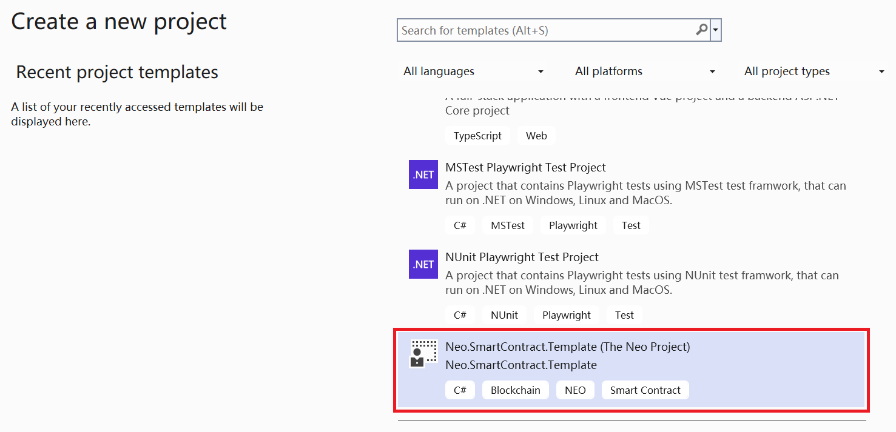

# Neo Devpack Dotnet

Neo Devpack Dotnet is a developer's toolkit for developing Neo contracts using .net, mainly containing contract project templates and compiler.

The basic process is: 
- installing a project template
- creating a project using templates
- writing a contract
- compiling the contract
- deploying and testing it

When installing project templates and compilers, be sure to install templates and compilers with the same version or the latest version!

If you haven't updated the templates and compiler in a long time, update both when you use them again.

## Neo.SmartContract.Template

Neo.SmartContract.Template is a project template used when developing Neo smart contracts. After installing the template, you can create a Neo smart contract project from the Terminal or Visual Studio.

### Install Template

```
dotnet new install Neo.SmartContract.Template
```

### List all dotnet templates

```
dotnet new list
```

### Uninstall Template

```
dotnet new uninstall Neo.SmartContract.Template
```

### Update Template

```
dotnet new update Neo.SmartContract.Template
```

## Creating a project using templates (Terminal)

```
dotnet new neocontract
```

The project name defaults to the name of the current directory, you can also specify the project name with `-n, --name <name>`, e.g. `dotnet new neocontract -n MyFirstContract`.

### Creating projects using templates (Visual Studio)

Create a new project, Neo.SmartContract.Template




## Neo.Compiler.CSharp

### Install Compiler

```

### Compiling contract file (Terminal)

Run the following command to build your contract：

```
dotnet build
```

or

```
nccs
```

Related contract files are outputted under `bin\sc` path in the contract project directory.

### Compiling contract file (Visual Studio)

Buuid, Build Solution (Ctrl + Shift + B)

## Versioning tips

After creating the project, please open the project and check if the version of the NuGet package `Neo.SmartContract.Framework` is the same as the version of the `Neo.Compiler.CSharp`, if the compiler is the latest version and Neo.SmartContract.Framework is not, please manually update the Neo.SmartContract.Framework to ensure the project compiles correctly.

If you have a contract project from a long time ago, compile it with the corresponding version of the compiler.

If you are updating a contract project from a long time ago, please update the NuGet package `Neo.SmartContract.Framework` and the compiler to the latest version, and also slightly modify the contract code.

For the most up-to-date way of writing contract code, please refer to this document or [GitHub](https://github.com/neo-project/neo-devpack-dotnet/tree/master/examples). 
Among other things, the example contracts in GitHub may contain code corresponding to the next (unreleased) version of the template and compiler.

## Reference: 

[NuGet (Neo.SmartContract.Template)](https://www.nuget.org/packages/Neo.SmartContract.Template)

[NuGet (Neo.Compiler.CSharp)](https://www.nuget.org/packages/Neo.Compiler.CSharp)

[GitHub (Neo-Devpack-Dotnet)](https://github.com/neo-project/neo-devpack-dotnet)

[GitHub (example contracts)](https://github.com/neo-project/neo-devpack-dotnet/tree/master/examples)

Contract template for community maintenance:

- [Neo3.SmartContract.Templates](https://www.nuget.org/packages/Neo3.SmartContract.Templates) by: shuaishuimen

- [NeoEvents.SmartContract.Templates](https://www.nuget.org/packages/NeoEvents.SmartContract.Templates) by: cschuchardt