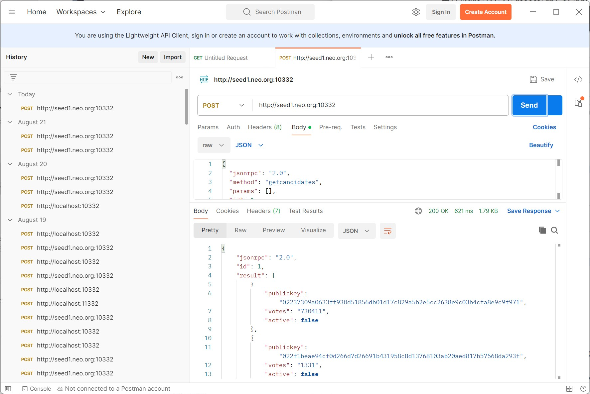
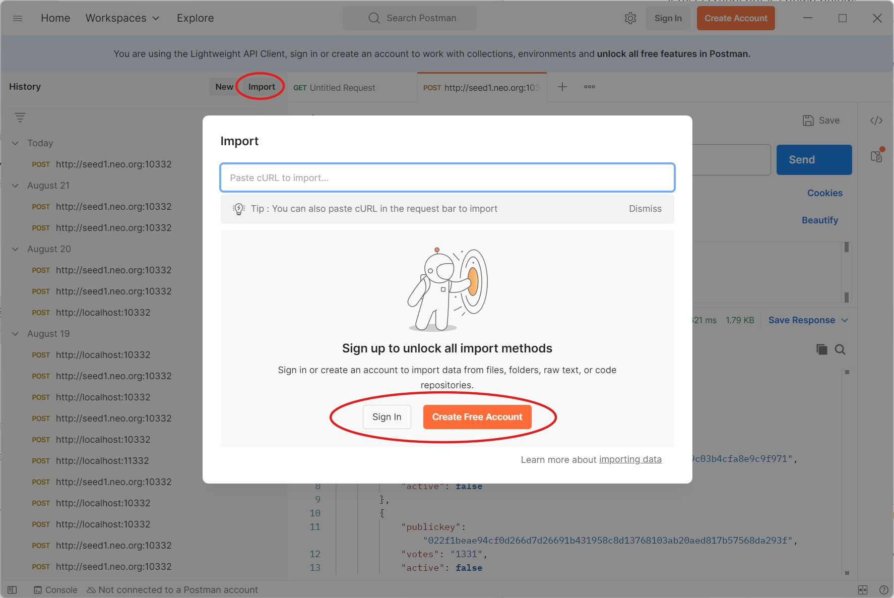
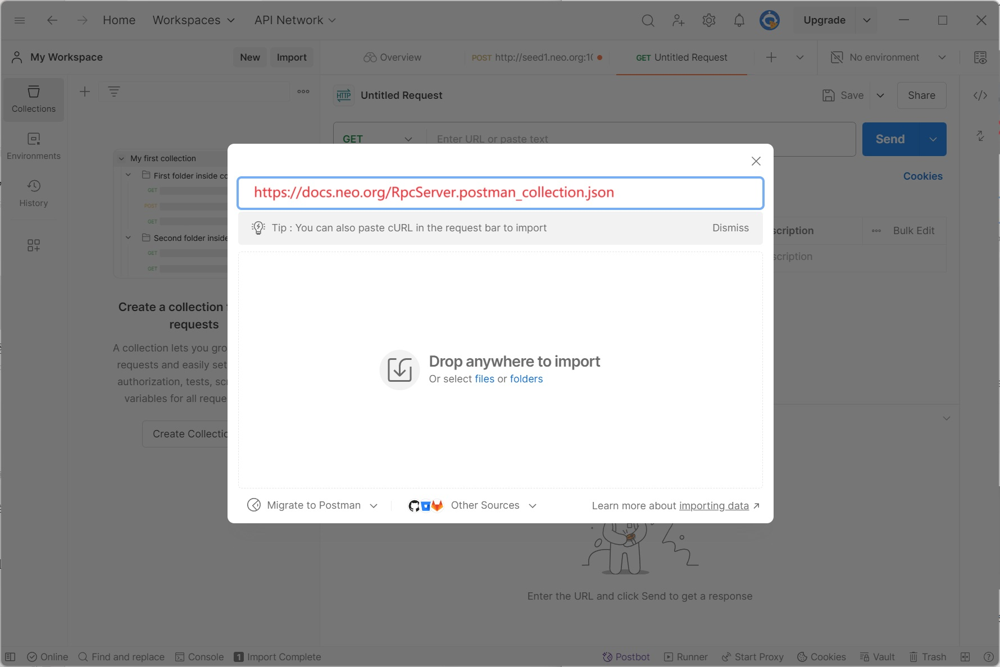

# API Reference

Each NEO-CLI node provides an API interface for obtaining blockchain data from it, making it easy to develop blockchain applications. The interface is provided via [JSON-RPC](http://wiki.geekdream.com/Specification/json-rpc_2.0.html), and the underlying protocol uses HTTP/HTTPS for communication. 

To start a node that provides an RPC service, you must install the plugin [RpcServer](https://github.com/neo-project/neo-modules/releases). Refer to [Installing plugins](../../node/cli/config#installing-plugins) for instructions. No need to add an argument when starting Neo-CLI.

:::note

If the desired version of file is not found during installation, it is because the corresponding version of RpcServer plug-in has not been released yet. In that case, you can compile the project [neo-modules](https://github.com/neo-project/neo-modules) by yourself:

1. Create the folder Plugins under the directory where neo-cli.dll locates.
2. Put the RpcServer file you has complied in the Plugins folder and then restart Neo-CLI.

:::

## Listening ports

After the JSON-RPC server is started, it will listen to the TCP port. By default it is the port 10332 of the local address (127.0.0.1), which is

```
http://127.0.0.1:10332/
```

You can modify the port in config.json in the RpcServer folder.

## Command Lists

### Blockchain

| Method                                        | Parameter                              | Description                                                  |
| --------------------------------------------------- | -------------------------------------- | ------------------------------------------------------------ |
| [getbestblockhash](getbestblockhash.md) |                                          | Gets the hash of the latest block in the blockchain. |
| [getblock](getblock.md)              | <hash \| index\> [verbose=0]                  | Returns the block information with the specified hash value or index. |
| [getblockcount](getblockcount.md)    |                                          | Gets the block count of the blockchain. |
| [getblockhash](getblockhash.md)      | <index\>                                 | Returns the block hash with the specified index. |
| [getblockheader](getblockheader.md) | <hash \| index\> [verbose=0] | Returns the information of the block header with the specified script hash or index. |
| [getcommittee](getcommittee.md) | | Gets the public key list of current Neo committee members. |
| [getnativecontracts](getnativecontracts.md)         |                              | Gets the list of native contracts.    |
| [getnextblockvalidators](getnextblockvalidators.md) |                              | Gets the validators list of the next block. |
| [getcontractstate](getcontractstate.md) | <script_hash\>                           | Returns information of the contract with the specified script hash. |
| [getrawmempool](getrawmempool.md)    | [shouldGetUnverified=0]         | Gets a list of confirmed transactions in memory. If the value is 1 it gets all the transactions including both confirmed and unconfirmed transactions. |
| [getrawtransaction](getrawtransaction.md) | <txid\> [verbose=0]                      | Returns the transaction information with the specified hash value. |
| [getstorage](getstorage.md)          | <script_hash\>  <key\>                   | Returns the value with the contract script hash and the key. |
| [gettransactionheight](gettransactionheight.md) | <txid\> | Returns the transaction height with the specified transaction hash. |
| [findStorage](findStorage.md) | <script_hash / contract_id\> \<storage key prefix\> | Finds storage items by contract ID or script hash and prefix. |


### Node

| Method                                       | Parameter                              | Description                                                  |
| --------------------------------------------------- | -------------------------------------- | ------------------------------------------------------------ |
| [getconnectioncount](getconnectioncount.md) |                                          | Gets the current connection count of the node. |
| [getpeers](getpeers.md)              |                                          | Gets a list of nodes that are currently connected/disconnected by this node. |
| [getversion](getversion.md)          |                                          | Gets the version information of the node. |
| [sendrawtransaction](sendrawtransaction.md) | <hex\> | Broadcasts a transaction over the network. |
| [submitblock](submitblock.md) | <hex\> | Submits a new block to the network.<br/\>**Note**: Need to be a validator |

### Smart Contract

| Method                                       | Parameter                              | Description                                                  |
| --------------------------------------------------- | -------------------------------------- | ------------------------------------------------------------ |
| [getunclaimedgas](getunclaimedgas.md) | <address\> | Get unclaimed gas of the specified address. |
| [invokefunction](invokefunction.md) | <script_hash\>  <operation\>  \[params] \[sender] \[signers] | Invokes a smart contract with the specified script hash, passing in the method name and its params. |
| [invokescript](invokescript.md) | <script\> \[sender] \[signers] | Runs a script through the virtual machine and returns the results. |
| [traverseiterator](traverseiterator.md) | `<session>` `<iterator id>` `<count>` | Gets the Iterator type data. |

### Tool

| Method                                       | Parameter                              | Description                                                  |
| --------------------------------------------------- | -------------------------------------- | ------------------------------------------------------------ |
| [listplugins](listplugins.md) | | Returns a list of plugins loaded by the node. |
| [validateaddress](validateaddress.md) | <address\>                              | Verifies whether the address is a valid NEO address. |

### Wallet

| Method                                       | Parameter                              | Description                                                  |
| --------------------------------------------------- | -------------------------------------- | ------------------------------------------------------------ |
| [calculatenetworkfee](calculatenetworkfee.md) | <tx\> | Calculates network fee for the specified transaction. |
| [closewallet](closewallet.md) |  | Closes the current wallet. |
| [dumpprivkey](dumpprivkey.md) | <address\>                              | Exports the private key of the specified address. |
| [getnewaddress](getnewaddress.md) |  | Creates a new address. |
| [getwalletbalance](getwalletbalance.md) | <asset_id\> | Returns the balance of the corresponding asset in the wallet. |
| [getwalletunclaimedgas](getwalletunclaimedgas.md) |  | Gets the amount of unclaimed GAS in the wallet. |
| [importprivkey](importprivkey.md) | <key\> | Imports the private key to the wallet. |
| [invokecontractverify](invokecontractverify.md) | <script_hash\>   \[params] \[signers] | Invokes the verification method of contract. |
| [listaddress](listaddress.md) |  | Lists all the addresses in the current wallet. |
| [openwallet](openwallet.md) | <path\> <password\> | Opens the specified wallet. |
| [sendfrom](sendfrom.md) | <asset_id\><from\><to\><value\> | Transfers from the specified address to the destination address. |
| [sendmany](sendmany.md) | <outputs_array\> \[signers] | Initiates multiple transfers to multiple addresses in a transaction. |
| [sendtoaddress](sendtoaddress.md) | <asset_id\><address\><value\> \[signers] | Transfers to the specified address. |

### ApplicationLogs plugin

| Method                                       | Parameter                              | Description                                                  |
| --------------------------------------------------- | -------------------------------------- | ------------------------------------------------------------ |
| [getapplicationlog](getapplicationlog.md) | <txid\> | Returns the contract event information based on the specified txid. |

### TokensTracker plugin

| Method                                       | Parameter                              | Description                                                  |
| --------------------------------------------------- | -------------------------------------- | ------------------------------------------------------------ |
| [getnep11balances](getnep11balances.md) | <address\> | Returns the balance of all NEP11 assets in the specified address. |
| [getnep11properties](getnep11properties.md) | <contract_hash\><tokenId\> | Returns the customized properties of NEP-11 assets. |
| [getnep11transfers](getnep17transfers.md) | <address\>[timestamp] | Returns all the NEP11 transaction information occurred in the specified address. |
| [getnep17balances](getnep17balances.md) | <address\> | Returns the balance of all NEP17 assets in the specified address. |
| [getnep17transfers](getnep17transfers.md) | <address\>[timestamp] | Returns all the NEP17 transaction information occurred in the specified address. |

### StateService plugin

| Method                                  | Parameter                                       | Description                                                  |
| --------------------------------------- | ----------------------------------------------- | ------------------------------------------------------------ |
| [getstateroot](getstateroot.md)     | <index\>                                        | Queries the state root by the block height.                  |
| [getproof](getproof.md)             | <roothash\><scripthash\><key\>                  | Gets proof by querying root hash, contract hash, and storage key. |
| [verifyproof](verifyproof.md)       | <roothash\><proof\>                             | Verifies using the root hash and proof, and gets the value of the storage corresponding to the key. |
| [getstateheight](getstateheight.md) |                                                 | Queries the stateroot height.                                |
| [getstate](getstate.md)             | <roothash\><scripthash\><key\>                  | Queries `state` with the `root hash`, `contract hash` and `storage key`. |
| [findstates](findstates.md)         | <roothash\><scripthash\><prefix\> [key] [count] | Queries `state` with the prefix of `root hash`, `contract hash` and `storage key`. |

:::note

For RPC API, all the return values related to the amount such as fees, NEP-17 asset balance, wallet balance, transfer amount, etc. are unsigned integer, which are automatically converted according to the asset decimal when requested by [RpcClient](https://github.com/neo-project/neo-modules/tree/master/src/RpcClient) (C# light node SDK). If you write the request by yourselves, you need to convert the amount manually. For example, if the return value is 1234560 and the asset decimal is 8, the  actual amount is 0.0123456.
:::

## GET request example

The format of a typical JSON-RPC GET request is as follows:

Here is an example of how to get the number of blocks in the block chain.

Request URL:

```
http://127.0.0.1:10332?jsonrpc=2.0&method=getblockcount&params=[]&id=1
```

After sending the request, you will get the following response:

```json
{
  "jsonrpc": "2.0",
  "id": 1,
  "result": 909129
}
```

## POST request example

The format of a typical JSON-RPC Post request is as follows:

Here is an example of how to get the number of blocks in the block chain.

Request URL:

```
http://127.0.0.1:10332
```

Request Body：

```json
{
  "jsonrpc": "2.0",
  "method": "getblockcount",
  "params":[],
  "id": 1
}
```

After sending the request, you will get the following response：

```json
{
  "jsonrpc": "2.0",
  "id": 1,
  "result": 909122
}
```

:::note
To make sure you get the latest result synchronize your client to the latest block height before you use the API.
:::

## Use Postman and Import data

We recommend that you use [Postman](https://www.postman.com) to use the API

After sign in or sign up a Posmtan account, you can directly import the Postman file we created https://docs.neo.org/RpcServer.postman_collection.json






Reference: [Import data into Postman](https://learning.postman.com/docs/getting-started/importing-and-exporting/importing-data/). 
