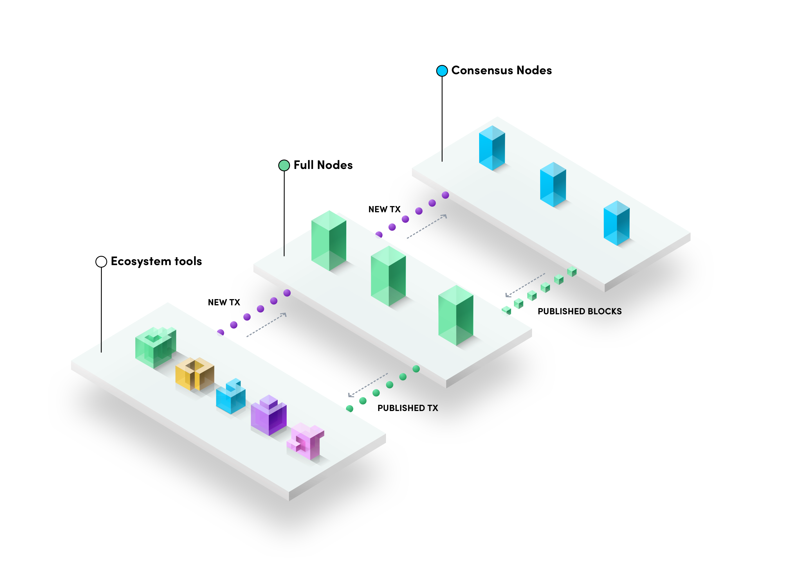

# 1. Prologue

This tutorial will cover the basic structure of a decentralized application running on the Neo blockchain. It’s designed to be a brief survey of all aspects of development including architecture, contract development, backend logic, and front-end.

We’ll install a basic toolset, deploy a simple `Hello World` contract example, and interface with it.

Future tutorials will cover individual tools in detail as well as deep-dives into more complex concepts. This one is simply meant to get us up and running with a basic development and testing environment, highlighting some key technical concepts along the way.


## The Neo Ecosystem
Neo, originally Anthshares, is a globally supported blockchain platform for smart contract development. The platform has two native tokens: NEO and GAS. NEO is a token which entitles a holder to vote on the decision making nodes on the platform. There is a total supply of 100 Million NEO. The second token, GAS is distributed to NEO holders through claims of realized GAS generation which are calculated by integrating an address' NEO holdings over the blocks. GAS is distributed to user when they execute a transaction on the network.



<b>Neo can be broken out into 3 layers by intent:</b>

* <b>Consensus Nodes:</b> At the core of the network, we have consensus nodes. This nodes are responsible for committing transactions to new blocks for minting. Comparatively, there are very few consensus nodes relative the the next layer.

* <b>Full Nodes:</b> Full nodes are technically identical to consensus nodes, but serve a different purpose in the network. They are meant to propagate published transactions to the rest of the network and relay new transactions to the consensus nodes. Through voting, a full node may be elected into the role of consensus node. For a list of publicly available full nodes, look [here](https://dora.coz.io/monitor)

* <b>Ecosystem Tools:</b> Ecosystem tools (like wallets, trackers, and other dApps) are built on top of the full-node infrastructure. They interface will full nodes to push transactions into the network and receive published transaction data. In Neo, the primary interface mechanic is via HTTP/RPC, however, interfacing may also be made via TCP/IP

>*<b>Note:</b>* This is a simplified model.


## DApp Structure
`DApp` is short for decentralized application. In the Distributed Ledger Technology(DLT) context, a dApp has an integral component of its functionality operating in a decentralized way.  In the purest case, this means the application is interfacing with the distributed ledger directly without any active involvement by the application developer. Applications exist on a spectrum of decentralization and in many cases, projects take a hybrid approach in order to ensure a good user experience.


The diagram above outlines the DApp we're going to build. Throughout this tutorial we'll see the contract implemented and then deployed locally to our own Neo PrivateNet.


# 2. Tools Overview and Installation

It's important to highlight that DLT is a novel technology that is very dynamic. Neo is no different, and its tools are always changing in pace with the technology. This may cause version conflicts among tools, what may be a nuisance for the incoming developer.

We'll make an effort to keep dojo tutorials as up to date as possible. If you happen to find any issues with installation and compatibility in our tutorials, please join our [forum](https://forum.coz.io/). We'll be glad to help you, and will try our best to fix any broken instructions.

When defining tools in this overview, we will provide links to their respective documentation for further learning. Make sure to have your notebook available since a lot of information will be introduced.

<b>For this tutorial, you will need the following tools:</b>

 1. <b>boa:</b> Boa is a platform that allows us to quickly write, compile, and test smart contracts for the Neo blockchain using python.

    * [<b>Install boa</b>](https://dojo.coz.io/neo3/boa/getting-started.html#installation)

    * <b>Installation Notes:</b> You’ll need Python 3.7 or later.


 2. <b>Neo-Express:</b> A private blockchain network optimized for development scenarios. It locally mimics the behavior of the Neo network. We’ll use it as a development tool to deploy and interact with our smart contracts as if they were running on Neo’s MainNet, but without paying GAS for each interaction.

    * [<b>install Neo Express</b>](https://github.com/neo-project/neo-express)

    * <b>Installation Notes:</b> Pay attention to MacOS and Linux dependencies on GitHub repository. Also, during migration to N3, the correct preview version is not yet automatically installed. We wrote this tutorial running: `dotnet tool install -g Neo.Express --version 2.0.23-preview`

 3. <b>neon.js:</b> (Optional) A powerful JavaScript SDK for the Neo blockchain that provides a lightweight library focused on blockchain interactions.

    * [<b>install neon.js</b>](https://dojo.coz.io/neo3/neon-js/docs/en/installation.html)

    * <b>Installation Notes:</b> For this tutorial we'll import neon-js directly as a web library in our HTML interface. So you don't really need to install it right now, but we encourage you to do so if you plan to go further than a Hello World example.


# 3. Development Environment Setup

## Folder Structure
`hello_world/` : root folder for our DApp. We'll create separate folders for *backend* and *frontend* files, and keep our local blockchain instance in this root folder. All command line inputs displayed from here on will have this folder as root reference.

`../smart_contract/` : will hold the  *backend* files of our DApp. In our case, a python source file, the files generated after compilation and used for contract deployment, and a json file for invoking the contract.

`../html/` will hold the html *frontend* of our DApp, a simple HTML file for this tutorial.

## PrivateNet configuration

On a terminal, navigate to the root folder(hello_world) and create a new instance of Neo-Express with `neoxp create` :

```
$ neoxp create
```

><b>Note:</b> Refer to the installation instructions in the previous section if you encounter issues

You should get a confirmation message:

```
Created 1 node privatenet at .../hello_world/default.neo-express
```

A `.json` file will also be created in our root folder with the configuration for our single node privatenet

## Running Your PrivateNet

In our root folder, let's start our blockchain with `neoxp run`:

```
$ neoxp run
```


Your terminal will start running the blockchain, and it should look something like this:

```
07:48:37.38 ConsensusService Info Sending Commit
07:48:37.41 ConsensusService Info Sending Block: height=1 hash=0xd8494d2f26388c46f1f6cf768a57786052c2552870f60d46e1e69024377ac5ff tx=0
07:48:37.45 ConsensusService Info Persisted Block: height=1 hash=0xd8494d2f26388c46f1f6cf768a57786052c2552870f60d46e1e69024377ac5ff tx=0
07:48:37.45 ConsensusService Info Initialize: height=2 view=0 index=0 role=Primary
07:48:52.40 ConsensusService Info Sending PrepareRequest: height=2 view=0
07:48:52.57 ConsensusService Info Sending Commit
07:48:52.57 ConsensusService Info Sending Block: height=2 hash=0xce1ff9eb91bdd5396f661ee5795b3e4c542374dae056fc99d4e5072b5dc200ce tx=0
07:48:52.60 ConsensusService Info Persisted Block: height=2 hash=0xce1ff9eb91bdd5396f661ee5795b3e4c542374dae056fc99d4e5072b5dc200ce tx=0
07:48:52.60 ConsensusService Info Initialize: height=3 view=0 index=0 role=Primary
```

You can see the `height` property increasing with the creation of each new block. By default, this happens every 15 seconds, similar to the actual Neo blockchain. This can be changed every time we start our private blockchain using the `neoxp run -s {{BLOCK_DURATION}` command, making it faster or slower depending on our testing purposes.

For now we can leave it as it is. Open a new terminal window for further command line inputs, as this one will be locked in this process of running the network.

This concludes the basic setup of our development environment. Let's proceed to writing our DApp's smart contract.

# 4. Hello World Smart Contract

Smart contracts are a tool used by developers to run user-defined software on the blockchain. They enable projects to perform many operations in a decentralized manner like:
  * creating tokens and defining their behavior
  * fair debt management
  * Performing decentralized value exchange
  * Managing sovereign user identity
  * Operating as non-custodial storage
  * Implementing democratic systems

Smart contract logic can range from very straightforward, like a simple token definition (or a illustrative Hello World example), to extensively intricate, powering automated decentralized applications. Some DApps are composed of more than one smart contract, that interact with each other based on elaborate sets of automation rules defined in the contracts themselves.

For our example we'll quickly build the simplest smart contract possible using boa.

## hello_world.py

Let's go into our `hello_world/smart_contract/` folder and create a blank `hello_world.py` file.

First thing to do is import the `boa` methods that we'll need.

```python
from boa3.builtin import public
from boa3.builtin.interop.storage import put, get
```

`public` allows us to define functions that can be called from outside our contract, either by other smart contracts or by front-end interactions.

`put` is a method to put things in the contract's storage, using a key-value pair.

Every contract has its own storage that uses a key-value map. This is used extensively on complex DApp architectures, but for now we'll use it just to hold our Hello World key-value pair. Go ahead and write our two functions. One `init` will load the storage and the other `hello` will read from it.

```python
@public
def init() -> bool:
    put("Hello", "World")
    return True

@public
def hello() -> str:
    return bytes.to_str(get("Hello"))

```

And that's it. Your Contract should be under 15 lines long, depending on your appreciation for blank lines, and we can proceed to compiling.

## Compiling

We need to transpile our python code to NeoVM readable byte code. Fortunately, boa also supports this functionality.
+
On the terminal, activate the Python Virtual Environment where you installed neo3-boa. Then simply run the command:

```
$ neo3-boa path/to/your/file.py
```

If the compilation is successful, three files should be created in the same folder as `hello_world.py`:

- `hello_world.manifest.json`
- `hello_world.nef`
- `hello_world.nefdbgnfo`

And our contract is ready. The next step is to use the generated `.nef` file to deploy our smart contract.

<!--
//TODO this needs to be implemented
## A glimpse of the deployed contract

Below is an example of a front-end interaction with this exact smart contract deployed to Neo Testnet. 

<p align="center">
  
</p>

> Note: Placeholder image. The example is still on hold for MVP release. Let's see how far we get.

When clicking the button, a neon-js function call uses the key "Hello" to retrieve the string "World" from our contract's storage, and also asks for the current number of blocks on Neo N3 TestNet.
-->

We are going to set up a local test network and develop this same front-end HTML interaction. On the way, we'll cover some basic technical aspects of the blockchain network.

# 5. Deployment

To deploy our Hello World smart contract we'll need to pay for it using GAS.

If you're familiar with blockchain basic structure, you can probably skip the next section and jump straight for the commands used in Neo Express for wallet creation, token transfer and contract deployment. 

If not, stick with us for a little tour, and don't worry about understanding everything right away.

## Transactions and the Neo Blockchain (or Don't Panic)
Neo is a decentralized network that processes transactions between a nearly infinite number of addresses which are derived from a private key using the secp256r1 elliptic curve cryptography. Every interaction that is published "on chain" is a **transaction**.

A transaction is required for all state changes to the contract. Many smart contract methods (like our `hello` method) are read-only and do not change the state of the contract.  In these scenarios, we don't require a transaction.  These interactions are referred to as `test invokes` for historical reasons.

Contracts deployed to the blockchain are addressed for interfacing using the hash of their contents.

Let's fall back to our local blockchain running in the terminal. You'll see that on each block's information there's the number of transactions contained in it, depicted by the value of `tx`.

```
07:48:37.45 ConsensusService Info Persisted Block: height=1 hash=0xd8494d2f26388c46f1f6cf768a57786052c2552870f60d46e1e69024377ac5ff tx=0
```

In our case every block should show `tx=0`, because our one-node network hasn't processed any transactions yet. The value of `tx` is going to change together with the transactions we make in our next steps.  This is an indicator that the transactions have been minted to a block on the chain.

To deploy our smart contract, we'll need a wallet with funds to pay for it. In Neo, there are two kinds of tokens: NEO and GAS. The latter are the ones we need for paying network fees.

Contract deployment costs are dependent on their logical complexity. This isnt critical knowledge for our development environment where we control all the tokens, but is highly important to regard when developing real world DApps.

Just like in the real Neo blockchain, the total supply of NEO was minted to the genesis wallet on the first block of the chain.  That's were we will acquire the NEO (and GAS) to deploy and execute our smart contract.

## Deploying the Contract.

In a new terminal window, starting from our root folder let's create a new wallet. We're naming it `coz`.

```
$ neoxp wallet create coz
```

and you'll get a confirmation displaying the wallet's name and address.

```
coz
    {{YOUR_WALLET_ADDRESS}}
```

Then let's make our first transaction, to transfer an amount of GAS from `genesis` to `coz`

```
$ neoxp transfer 10000 GAS genesis coz
```

You'll get the confirmation displaying transaction hash.

```
Transfer Transaction 0xf59f14f4ab49b24ad20bf161530f88d007160a260806ec3ab15eb94c3a5b92d5 submitted
```

You can also check the `tx=1` popping up in the latest block of our other terminal window. This ensures that our one node network has reached consensus on approving our transaction and has added it to the latest block of the blockchain.

And finally, with funds in our wallet, we can deploy our smart contract using the compiled `hello_world.nef` file.

```
$ neoxp contract deploy {{PATH_TO_NEF_FILE}} coz
```

Another confirmation, and `tx=1` on the latest block, confirming our deployment transaction.  The transaction may take a few seconds to relay depending on the block time you configured.

```
Deployment Transaction 0x8f147767cc29a54a77b7e7458bc6d3098b6c000315f643a827d506ba9e926597 submitted
```

Let's check our contract by asking to see all contracts deployed to our network.

```
$ neoxp contract list
````

You'll see a list of all the native contracts deployed in our Neo Express instance, with our `hello_world` at the end.

```
NameService (0x7a8fcf0392cd625647907afa8e45cc66872b596b)
OracleContract (0xfe924b7cfe89ddd271abaf7210a80a7e11178758)
RoleManagement (0x49cf4e5378ffcd4dec034fd98a174c5491e395e2)
PolicyContract (0xcc5e4edd9f5f8dba8bb65734541df7a1c081c67b)
GasToken (0xd2a4cff31913016155e38e474a2c06d08be276cf)
NeoToken (0xef4073a0f2b305a38ec4050e4d3d28bc40ea63f5)
LedgerContract (0xda65b600f7124ce6c79950c1772a36403104f2be)
CryptoLib (0x726cb6e0cd8628a1350a611384688911ab75f51b)
StdLib (0xacce6fd80d44e1796aa0c2c625e9e4e0ce39efc0)
ContractManagement (0xfffdc93764dbaddd97c48f252a53ea4643faa3fd)
hello_world (0xb1ed87a9ce71dcc465a2ed41348c6cc8494ab9b5)
```

You'll notice that every native tool of the blockchain is a deployed smart contract. Even NEO and GAS tokens are actually smart contracts, just like our Hello World example.

We'll cover these different smart contract use cases in specific articles and tutorials.

For now, we just need to take note of our **contract script hash**, which is the long number in brackets right after it's name. This is the encrypted public address of our contract.

```
hello_world ({{CONTRACT_SCRIPT_HASH}})
```

We'll use it to invoke the contract, calling the functions we've written.  Our first invoke will target the `init` method which will create a storage map of "Hello" -> "World". Then we will invoke the `hello` method to return mapped value from storage.

## Invoking the Contract

To invoke a contract, we need to build a simple json file, that points to the contract's hash, declares which method to call, and which arguments to pass to it.

In our `../smart_contract/` folder create a blank `hello_world_invoke.json` file, and structure it like this:

```json
[
  {
    "contract": "{{CONTRACT_SCRIPT_HASH}}",
    "operation": "init",
    "args": []
  }
]
```

Fill in the fields:

- `contract:` use the contract hash we got after deployment.
- `operation:` the method we'll invoke ("init").
- `args:` leave it blank, since our function requires no arguments.

Save the file, go back to our terminal window and let's invoke our contract. 

All we need to do is point to our `hello_world_invoke.json` file, and declare the account that's going to pay the fees for the operation, in this case, `coz`.

```
$ neoxp contract invoke smart_contract/hello_world_invoke.json coz
```

Check for confirmation and `tx=1`.

```
Deployment Transaction 0xe8ded02454876d98085b9729012ee7a64ca3b7271fbe7718279cce6c6112432f submitted
```

 This may seem repetitive, but transaction confirmation actually plays a big part in blockchain development.

Now let's check our contract's storage

```
$ neoxp contract storage hello_world
```

You'll see the key-value pair displayed in hex format.

````
key:        0x48656c6c6f
  value:    0x576f726c64
````

You can use any online Hex-to-String translator to verify the strings "Hello" and "World" from the above output.

Since every node of a blockchain network has to store a copy of every single transaction and every smart contract deployed, data is highly optimized for reduced file size.

Congratulations! You've just deployed your first smart contract and invoked it!  Now lets see how to interface with it in a way that scales to a production environment!

In the next section, we'll leverage neon.js to interface with the blockchain and aid in data processing.


# 6. Interfacing using neon.js

The interaction between smart contracts deployed to the blockchain and its users can happen in many different devices and platforms.

For our example, we'll use neon.js to interface with the chain and expose the results in a simple user interface. Bear in mind that neon.js can be used in any javascript environment to interface with the Neo network.

## Getting the Node URL

Before we proceed with integrating Neo with our interface, we need to retrieve one last piece of information: the URL of our single node so we can connect to it ourside of the neo-express environment.

On a public network like MainNet or TestNet, we would use the URL of a public full-node.  A list of available full nodes for these networks can be found on [dora](https://dora.coz.io/monitor). For our development environment, we'll connect to a specific localhost URL pointing to a local port of our machine.

To get this address, open the file `default.neo-express`, located in our root folder, in any text editor.

Somewhere in the first ten lines you'll see the list of ports used by our Neo-Express instance.

```
"tcp-port": 50013,
"ws-port": 50014,
"rpc-port": 50012,
```

We want the `rpc-port`(default: 50012).

## HTML Scaffold

As shown in the beginning of this tutorial, we'll create a simple web page, with a button that triggers a function. This function will:
- Connect to our local blockchain; 
- Access our smart contract using it's Hash;
- Invoke the method "hello" which will read the value of the "Hello" key from contract storage;
- Ask for the current number of blocks in the Network;
- Return all this data to our page.

The structure bellow is the scaffold we'll start from. Copy it to a blank `HTML`file in our `../html/` folder.


```html
<!--import neon-js-->
<script src="https://unpkg.com/@cityofzion/neon-js@next"></script>

<script>
  const nodeURL = "http://localhost:50012"

  const contractHash = "0xb1ed87a9ce71dcc465a2ed41348c6cc8494ab9b5"

  async function helloNeoBlockchain() {
    <!--Interface Function-->
  }
</script>
  
<button onclick="helloNeoBlockchain();">
    Hello
</button>

<div id="storage"></div>

<div id="block"></div>
```

## helloNeoBlockchain() function

So far we've just imported `neon.js`, populated the page with our Hello button and two `divs`that will receive the storage value and the block height of the network.

We'll proceed to writing our function inside the second script tag of the file, just bellow the `<!--Interface Function-->` comment.

Note that we started by declaring two constants, representing the values we need to feed to our front end so it can properly connect with everything we have set up so far. Let's populate them.

```javascript
const nodeURL = "http://localhost:50012"

const contractHash = "0xb1ed87a9ce71dcc465a2ed41348c6cc8494ab9b5"
```

Next let's use those constants for building our `helloNeoBlockchain()` function. This is the complete thing.

```javascript
async function helloNeoBlockchain() {

  //define our invocation
  const intent = {
    scriptHash: contractHash,
    operation: "hello",
    params: [],
  }

  //define how we will connect to the network
  const facade = await Neon.api.NetworkFacade.fromConfig({
    node: nodeURL,
  })

  //invoke our smart contract and decode the result
  const res = await facade.invoke(intent)
  const value = Neon.u.HexString.fromBase64(res.stack[0].value).toAscii()

  //get the current block-height
  const height = await facade.getRpcNode().getBlockCount()

  //present the result on the interface
  document.getElementById("storage").innerHTML = value
  document.getElementById("block").innerHTML = height
}
```

Let's check it step by step.

First, we define the method we want to invoke, the contract hash, and params in an `intent`.
```javascript
  const intent = {
    scriptHash: contractHash,
    operation: "hello",
    params: [],
  }
```

Then, we create a `NetworkFacade`, which gives us the connection to our blockchain network by using our `nodeURL`constant previously declared.

```javascript
  const facade = await Neon.api.NetworkFacade.fromConfig({
    node: nodeURL,
  })
```

Next, we'll execute our contract invocation and decode the base64 response (which should be "Hello"):
```javascript
  const res = await facade.invoke(intent)
  const value = Neon.u.HexString.fromBase64(res.stack[0].value).toAscii()
```

Finally, we ask for the networks blockheight using:

```javascript
const height = await facade.getRpcNode().getBlockCount()
```

And now we just populate each constant into their respective div. the `value` to the `storage` div and the `height` to the `block` div:

```javascript
document.getElementById("storage").innerHTML = value
document.getElementById("block").innerHTML = height
```

## The complete Front-End HTML

Here's the complete code, with comments and some bonus styling just to make it look neat.

```html
<!--import neon-js-->
<script src="https://unpkg.com/@cityofzion/neon-js@next"></script>

<script>
  const nodeURL = "http://localhost:50012"

  const contractHash = "0xb1ed87a9ce71dcc465a2ed41348c6cc8494ab9b5"


  async function helloNeoBlockchain() {

    //define our invocation
    const intent = {
      scriptHash: contractHash,
      operation: "hello",
      params: [],
    }

    //define how we will connect to the network
    const facade = await Neon.api.NetworkFacade.fromConfig({
      node: nodeURL,
    })

    //invoke our smart contract and decode the result
    const res = await facade.invoke(intent)
    const value = Neon.u.HexString.fromBase64(res.stack[0].value).toAscii()

    //get the current block-height
    const height = await facade.getRpcNode().getBlockCount()

    //present the result on the interface
    document.getElementById("storage").innerHTML = value
    document.getElementById("block").innerHTML = height
  }
</script>

<button onclick="helloNeoBlockchain();">
    Invoke
</button>

<div id="storage"></div>

<div id="block"></div>
```

And with this we conclude our panoramic view of a complete DApp in the Neo blockchain.

# 7. Epilogue

We've covered many complementary aspects of a blockchain application, but it's worth noting that this was a surveyor tutorial and there are many more complex interactions that are possible using more advanced ecosystem features..

You'll notice our contract interface is a read-only and doesn't actually make any changes to the blockchain. We also didn't have to deal with the delicate dynamic of private and public keys for transaction signing in the network, which is one of the most important aspects of blockchain applications.

These will all be covered in future articles.

The setup we've shown here is just meant to be the foundation for further and more useful experimentation, providing us with an environment ready for quick local development and testing.
