# Real-world Tokens: Building and deploying a NEP-17 Token


Pre-requisites
--------------

You will need the following software to follow along with this tutorial:

*   **.NET SDK 5.0** — [https://dotnet.microsoft.com/download](https://dotnet.microsoft.com/download)  
    We’ll write the smart contract code using the C# programming language. The .NET SDK is required to compile the C# code.
*   **Visual Studio Code** — [https://code.visualstudio.com/download](https://code.visualstudio.com/download)  
    This is a very popular code editor; the Neo Blockchain Toolkit builds on top of VS Code.
*   **Neo Blockchain Toolkit Visual Studio Code extension** — [https://marketplace.visualstudio.com/items?itemName=ngd-seattle.neo-blockchain-toolkit](https://marketplace.visualstudio.com/items?itemName=ngd-seattle.neo-blockchain-toolkit)  
    This will add support to VS Code for visualizing Neo blockchains, running private blockchain instances and debugging Neo smart contracts.

For a step-by-step walkthrough showing how to install the above pre-requisites, see: [Quick Start video 1](./quickstart1.html).

This 6-minute video demonstrates how to setup a new machine for N3 smart contract development.

*   **C# Visual Studio Code extension** — [https://marketplace.visualstudio.com/items?itemName=ms-dotnettools.csharp](https://marketplace.visualstudio.com/items?itemName=ms-dotnettools.csharp)  
    This will add support to VS Code for editing and building C# source code.
*   **Neo C# smart contract compiler** — [https://github.com/neo-project/neo-devpack-dotnet](https://github.com/neo-project/neo-devpack-dotnet)  
    This tool allows you to convert compiled C# code into bytecode suitable for execution by the Neo virtual machine.

For a step-by-step walkthrough showing how to install the C# VS Code extension and the Neo C# compiler, see: [Quick Start video 4](./quickstart4.html).

This 11-minute video demonstrates how to setup your machine to compile C# smart contracts and walks through a trivial example.

All of the software listed above is freely available and cross-platform (you can follow along on Windows, Mac or Linux).

Create a private blockchain
---------------------------

First, we’ll create a new empty folder—registrar—for our project. We’ll call our fictional token “XYZ” and store all files related to the token in a folder called `xyz-token`.

Load a new Visual Studio Code window, click on “Open Folder” and then use the folder selection dialog to create a new folder called `xyz-token` and then open that folder:

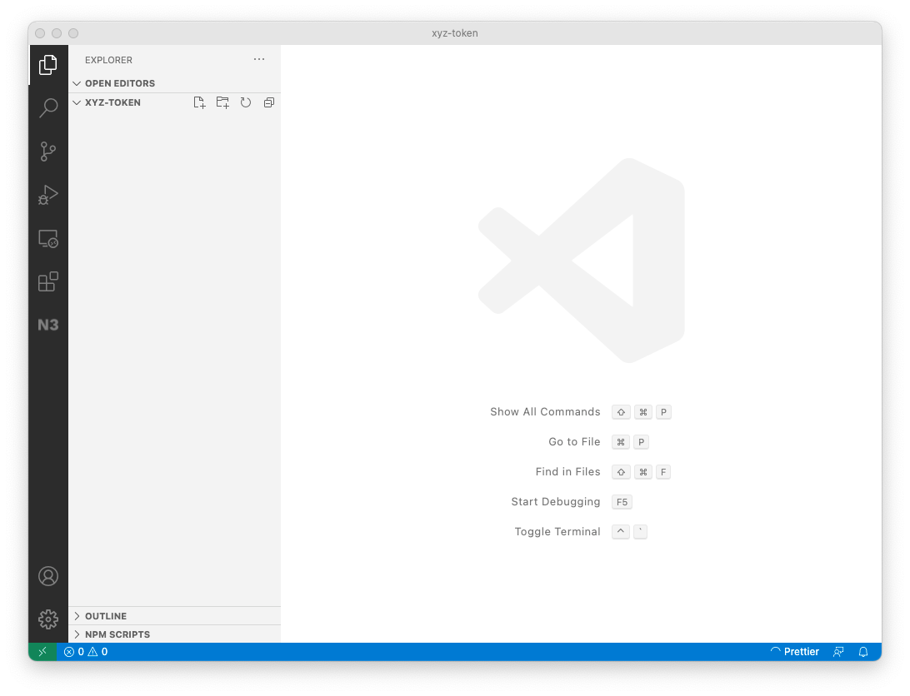

The first thing we will do is use Neo Express to create a private blockchain. This will allow us to deploy and invoke our contract while we are developing it without spending any real GAS.

Click the N3 icon in the tool bar to open the N3 Visual DevTracker:


Next, use the button in the Quick Start panel to create a new Neo Express Instance:

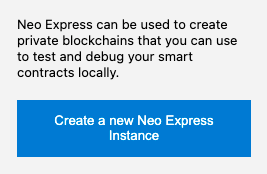

(Alternatively, you could select the “Create private blockchain” menu option from the context menu in the Blockchains panel.)

You’ll be asked how many consensus nodes that you want your private blockchain to have. For this example, one node is sufficient and will enable us to get the most out of Neo Express (some functionality—such as creating checkpoints—is disabled for multi-node blockchains).

When asked for a filename for the Neo Express configuration, we’ll use the name `xyz-token.neo-express` and save the file in the empty `xyz-token` folder.

Your screen should now look like this:

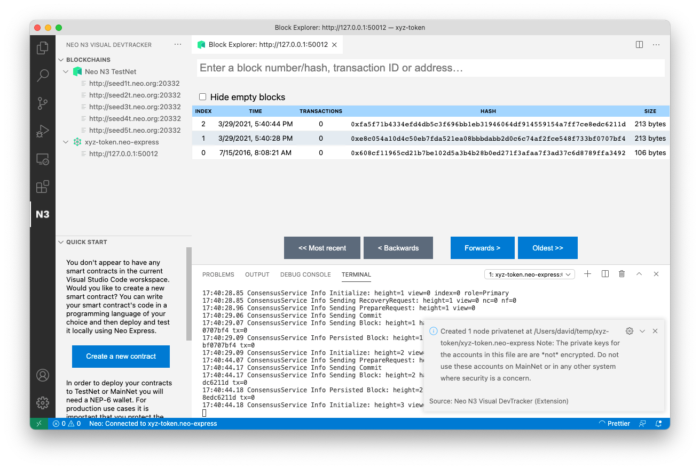

You can dismiss the message about the node being created (take note of the security warning, your `xyz-token.neo-express` file will contain private keys, but those keys should only be used for local testing as they are not securely stored). You can also close the Terminal panel showing Neo Express output if you wish—your blockchain will continue to run in the background and you’ll see new blocks appear in the Block Explorer panel about once every 15 seconds.

You can also check the “Hide empty blocks” checkbox so that only blocks containing transactions are shown. Initially you’ll only see the very first block but this will make it easier to identify our transactions later.

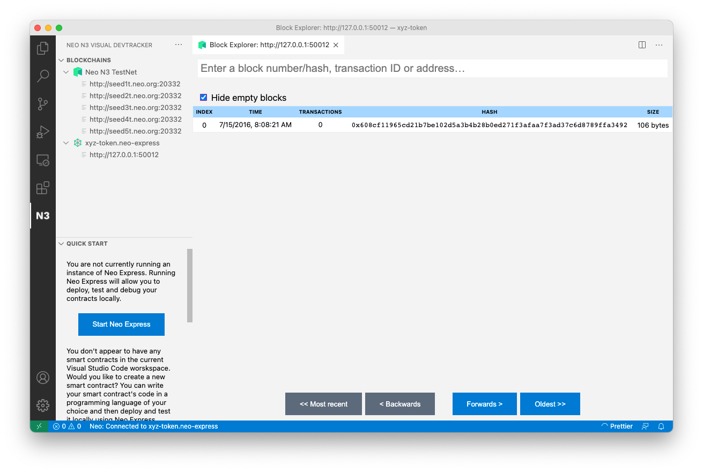

Create a wallet
---------------

Next, we’ll create a wallet to use with our private blockchain. We'll use this wallet to deploy our smart contract to the blockchain, and will write the smart contract code so that the XYZ tokens minted when the contract is first deployed are transferred to the wallet that performed the deployment.

Right click on `xyz-token.neo-express` in the Blockchains panel and click on the “Create wallet” menu option. When asked for a wallet name, type `owner`. You’ll see a message confirming that the wallet was created:

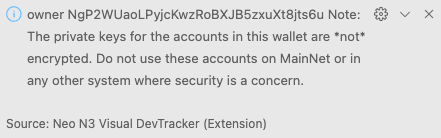

We now have a wallet for the smart contract owner, but that wallet doesn’t contain any assets. Deploying a smart contract to a Neo blockchain has a fee associated with it; the fee varies based on the size of the contract but is always paid in GAS.

Each Neo Express instance has a special wallet called “genesis” that is initially given the entire supply of NEO and GAS (the two assets native to the Neo blockchain). Let’s transfer some GAS from the genesis wallet to our owner wallet.

Right click on `xyz-token.neo-express` in the Blockchains panel and click on the “Transfer assets” menu option. When prompted, select GAS as the asset. Enter 100,000 as the amount to transfer (this is more than enough to do multiple deployments of the contract we will later develop). Choose “genesis” as the source wallet and “owner” for the destination. You’ll see a message confirming that the transfer transaction was submitted:

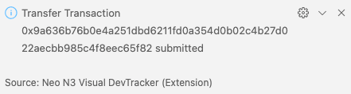

Shortly after you’ll see a new non-empty block appear in your Block Explorer panel. You can click on that block to see a list of transactions in the block (there will only be one). You can click on the transaction to see the details.

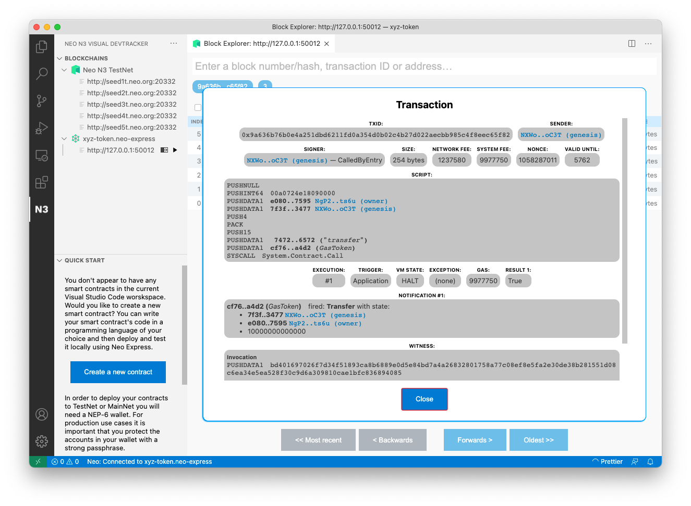

Create a contract
-----------------

Now we’re ready to write the code for our smart contract.

Click the “Create a new contract” button in the Quick Start panel:

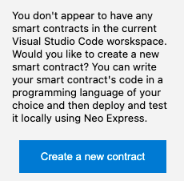

(Alternatively, you could select the “Create contract” menu option from the context menu in the Blockchains panel.)

When asked which programming language you would like to use, select `csharp`.

When asked for the contract name, enter `XyzToken`. A new file called `XyzToken.cs` will be created and opened—this is our smart contract code. It has been pre-populated with some example code, but we’ll shortly remove and replace most of that…

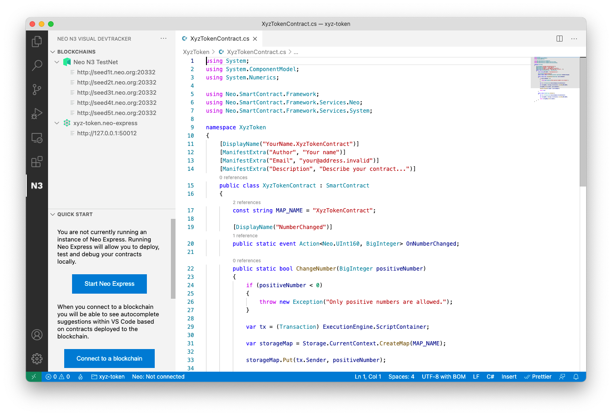

You can also see in the Explorer pane in VS Code that various other files have been created:

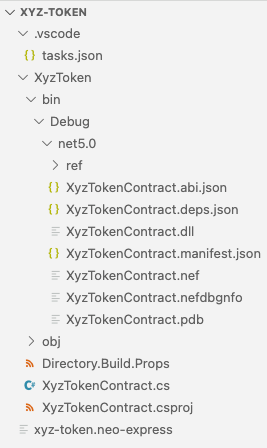

The `XyzToken.csproj` file is an MS Build C# project configuration file; it tells the .NET SDK tooling how to build your project.

The `tasks.json` file is a Visual Studio Code configuration file that will allow you to build your code within Visual Studio Code. VS Code will have already built the sample code and the various files produced by the build are in the `XyzToken/bin/debug/net5.0` folder. You can rebuild your contract after making changes by choosing the “Run build task…” option in the “Terminal” menu in VS Code.

Let’s remove the sample code and fill out some contract metadata, then we’ll be ready to write our own smart contract code…

The `XyzTokenContract.cs` file contains a single class; it is called `XyzTokenContract` and extends the `SmartContract` class (from the `Neo.SmartContract.Framework` package) to signify that it is a smart contract. The class has various attributes that are used to provide metadata that will be deployed to the N3 blockchain along with the contract:

```
[DisplayName("YourName.XyzTokenContract")]
[ManifestExtra("Author", "Your name")]
[ManifestExtra("Email", "[[email protected]](/cdn-cgi/l/email-protection)")]
[ManifestExtra("Description", "Describe your contract...")]
```

Let’s replace these with real values…

The `DisplayName` will be used to refer to your contract from within wallet software and other tools, it is common practice to provide a string consisting of an identifier for you (e.g. your GitHub ID, or company abbreviation) followed by a dot and then the contract name.

For the `ManifestExtra` attributes, replace the example values with real information. You can also remove the `OnNumberChanged` event and the `ChangeNumber` and `GetNumber` methods from the example contract:

```csharp
using System;
using System.ComponentModel;
using System.Numerics;

using Neo;
using Neo.SmartContract.Framework;
using Neo.SmartContract.Framework.Native;
using Neo.SmartContract.Framework.Services;

namespace XyzToken
{
    [DisplayName("djnicholson.XyzTokenContract")]
    [ManifestExtra("Author", "David Nicholson")]
    [ManifestExtra("Email", "[[email protected]](/cdn-cgi/l/email-protection)")]
    [ManifestExtra("Description", "Controls issuance of the XYZ token")]
    public class XyzTokenContract : SmartContract
    {
      const string MAP\_NAME = "XyzTokenContract";
    }
}
```

You can rebuild your contract now to verify that it still builds. Our contract doesn’t do anything useful yet, though; next we’ll code the various methods and events mandated by the NEP-17 standards.

NEP-17 requirements
-------------------

The NEP-17 standard mandates that we implement various methods and events in our contract:

*   Token information:
    *   A `totalSupply` method that returns the total amount of tokens in our contract (initially we’ll use a fixed issuance of 1,000,000 XYZ tokens).
    *   A `symbol` method that returns the name of our token (“XYZ”).
    *   A `decimals` method that returns the number of decimals used (we’ll use 8 decimal places).
*   Token transfer mechanism:
    *   A `transfer` method that allows XYZ tokens to be transferred between Neo wallets.
    *   A `balanceOf` method that reports the current XYZ token balance for an account.
    *   A `Transfer` event that will fire whenever tokens are transferred.

We’ll go through and implement each of the above requirements one-by-one…

Token information methods
-------------------------

The first few methods that we’ll implement are pretty simple as they will all return constant values.

Let’s start with TotalSupply, this method returns a BigInteger representing the total amount of tokens in our contract. For now, we’ll return a constant (we’ll issue 1,000,000 at contract creation time) but later we may choose to implement something more complex (e.g. allow users to issue and buy tokens using NEO and/or GAS). We’ll create a constant for the value 1,000,000 as we will also need to refer to the same value later when initializing our contract.

```csharp
using System;
using System.ComponentModel;
using System.Numerics;

using Neo.SmartContract.Framework;
using Neo.SmartContract.Framework.Services.Neo;
using Neo.SmartContract.Framework.Services.System;

namespace XyzToken
{
    [DisplayName("djnicholson.XyzTokenContract")]
    [ManifestExtra("Author", "David Nicholson")]
    [ManifestExtra("Email", "[[email protected]](/cdn-cgi/l/email-protection)")]
    [ManifestExtra("Description", "Controls issuance of the XYZ token")]
    public class XyzTokenContract : SmartContract
    {
        const string MAP\_NAME = "XyzTokenContract";

        static readonly ulong InitialSupply = 1\_000\_000;

        public static BigInteger TotalSupply() => InitialSupply;
    }
}
```

The implementation of Symbol (we’ll return “XYZ”) and Decimals (we’ll return 8) will be equally as simple. There’s no need to define constants here as we won’t be reusing the same values elsewhere; we can just use inline literals:

```csharp
using System;
using System.ComponentModel;
using System.Numerics;

using Neo.SmartContract.Framework;
using Neo.SmartContract.Framework.Services.Neo;
using Neo.SmartContract.Framework.Services.System;

namespace XyzToken
{
    [DisplayName("djnicholson.XyzTokenContract")]
    [ManifestExtra("Author", "David Nicholson")]
    [ManifestExtra("Email", "[[email protected]](/cdn-cgi/l/email-protection)")]
    [ManifestExtra("Description", "Controls issuance of the XYZ token")]
    public class XyzTokenContract : SmartContract
    {
        const string MAP\_NAME = "XyzTokenContract";

        static readonly ulong InitialSupply = 1\_000\_000;

        public static BigInteger TotalSupply() => InitialSupply;
        
        public static string Symbol() => "XYZ";

        public static ulong Decimals() => 8;
    }
}
```

At this stage you should build your contract again to validate that you don’t have any syntax errors. However, our contract does not yet confirm to the NEP-17 standard; we still need to add support for token transfers…

Token transfer mechanism
------------------------

First, we need to implement the `Transfer` event. The NEP-17 standard tells us that we must trigger a `Transfer` event whenever tokens are transferred. In code we’ll call the event `OnTransfer`—as this is a common convention for events in C# code—and we’ll use a `DisplayName`attribute so that the Neo C# compiler knows that this is the `Transfer`event:

[DisplayName("Transfer")]
public static event Action<UInt160, UInt160, BigInteger> OnTransfer;

We’ll use our contract’s storage to keep track of the XYZ token balance for a specific address. This information can be encoded using a mapping from addresses to numerical values. In a Neo smart contract you can use the `StorageMap` class to create an object which will allow you to lookup values by key (addresses in our case) and set a value for a specific key. Any changes made to the storage map are persisted and also apply to subsequent contract invocations. Let’s add a helper property that we can use anywhere we need a reference to our mapping of token balances:

private static StorageMap Balances => new StorageMap(Storage.CurrentContext, MAP\_NAME);

To make our later code a bit cleaner, let’s also add some strongly typed methods for getting values out of the map and putting values in. We’ll use the `UInt160` type to represent addresses; this is a 160-but unsigned integer that can be safely casted to a byte array of length 20 (the length of Neo addresses). We’ll use the `BigInteger` type to represent token balances.

private static BigInteger Get(UInt160 key) => (BigInteger) Balances.Get(key);
private static void Put(UInt160 key, BigInteger value) => Balances.Put(key, value);

Now let’s add some helper methods that will allow us to increase or reduce the XYZ token balance for a specific address:
```csharp
private static void Increase(UInt160 key, BigInteger value)
{
    Put(key, Get(key) + value);
}

private static void Reduce(UInt160 key, BigInteger value)
{
    var oldValue = Get(key);
    if (oldValue == value)
    {
        Balances.Delete(key);
    }
    else
    {
        Put(key, oldValue - value);
    }
}
```

Note that the implementation of `Reduce` is slightly more complicated than `Increase`, this is because `Reduce` has an optimization that will slightly reduce the cost of invoking the smart contract in a way that reduces a balance to zero.

We’re finally ready to implement our `Transfer` method! NEP-17 states that the `Transfer` method has four arguments: The sender address, the recipient address, the amount to transfer and some optional arbitrary data. There is some validation that we need to do for each of the arguments:

*   We need to ensure that the sender and recipient are valid addresses (we can use the `IsValid` extension property on the `Uint160` class for this).
*   The amount must be greater than or equal to zero.
*   We need to verify that the transaction was signed by the owner of the sender address (we can use the `Runtime.CheckWitness(…)` helper method provided by the Neo Smart Contract Framework for this). However, this validation does not apply if the caller is a contract transferring its own XYZ tokens (we can use the `Runtime.CallingScriptHash`property to check for this).
*   The sender must have a balance greater than or equal to the amount being transferred.

Once validation has succeeded, we will perform the transfer (using the `Increase` and `Reduce` helper methods that we already created) and fire the `Transfer` event.

The NEP-17 standard also requires that we check whether the recipient address is a contract; if so, we must invoke the `onPayment` method of that contract (this gives the recipient contract the opportunity to abort the transaction if it does not want to receive the XYZ tokens). We can use the`ContractManagement.GetContract(…)` method provided by the Neo Smart Contract Framework to test for this.

The full implementation of our Transfer method is as follows:

```csharp
public static bool Transfer(UInt160 from, UInt160 to, BigInteger amount, object data)
{
    if (!from.IsValid || !to.IsValid)
    {
        throw new Exception("The parameters from and to should be 20-byte addresses");
    }

    if (amount < 0) 
    {
        throw new Exception("The amount parameter must be greater than or equal to zero");
    }

    if (!from.Equals(Runtime.CallingScriptHash) && !Runtime.CheckWitness(from))
    {
        throw new Exception("No authorization.");
    }
    
    if (Get(from) < amount)
    {
        throw new Exception("Insufficient balance");
    }

    Reduce(from, amount);
    Increase(to, amount);
    OnTransfer(from, to, amount);

    if (ContractManagement.GetContract(to) != null)
    {
        Contract.Call(to, "onPayment", CallFlags.None, new object[] { from, amount, data });
    }
    
    return true;
}

```
The NEP-17 standard also requires that we provide a contract method to retrieve the token balance for an arbitrary address:

```csharp
public static BigInteger BalanceOf(UInt160 account)
{
    return Get(account);
}
```

At this stage you should build your contract again to validate that you don’t have any syntax errors. Our contract is now technically compliant with the NEP-17 standard! However, it is still not ready for use as we don’t yet have any code that performs the initial issuance of 1,000,000 XYZ tokens; let’s remedy that…

Initial issuance
----------------

We need to issue our initial supply of 1,000,000 XYZ tokens whenever our contract is deployed to a Neo blockchain for the first time. Fortunately, Neo allows you to specify that certain code in a smart contract to be executed at deployment time; we do this by creating a special `_deploy` method.

The `_deploy` method will be called at deployment time by the Neo Virtual Machine and will be passed a Boolean indicating whether this is an update or not (this is important to us as we only want to issue the initial supply during initial deployment; we shouldn’t repeat the issuance if we update our contract).

We’ll issue all of the initial XYZ tokens to whichever wallet initially deploys the contract. The NEP-17 standard requires that we fire the transfer event for this initial allocation also (specifying `null` for the sender address).

The code for the deploy method will look like this:

```csharp
[DisplayName("_deploy")]
public static void Deploy(object data, bool update)
{
    if (!update)
    {
        var tx = (Transaction) Runtime.ScriptContainer;
        var owner = (Neo.UInt160) tx.Sender;
        Increase(owner, InitialSupply);
        OnTransfer(null, owner, InitialSupply);
    }
}
```

At this stage you should build your contract again to validate that you don’t have any syntax errors. Our contract is now ready to be deployed!

Contract deployment
-------------------

Right click on `xyz-token.neo-express` in the Blockchains panel and click on the “Deploy contract” menu option. When asked which account to use, select the “owner” wallet that you created earlier. When asked which contract to deploy, select `XyzToken.nef` (this file contains the Neo Virtual Machine bytecode for your contract). You’ll see a message confirming that the deployment transaction was submitted:

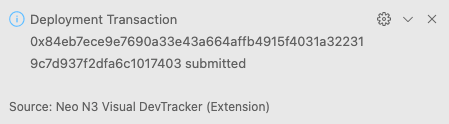

Shortly after you’ll see a new non-empty block appear in your Block Explorer panel. You can click on that block to see a list of transactions in the block (there will only be one). You can click on the transaction to see the details.

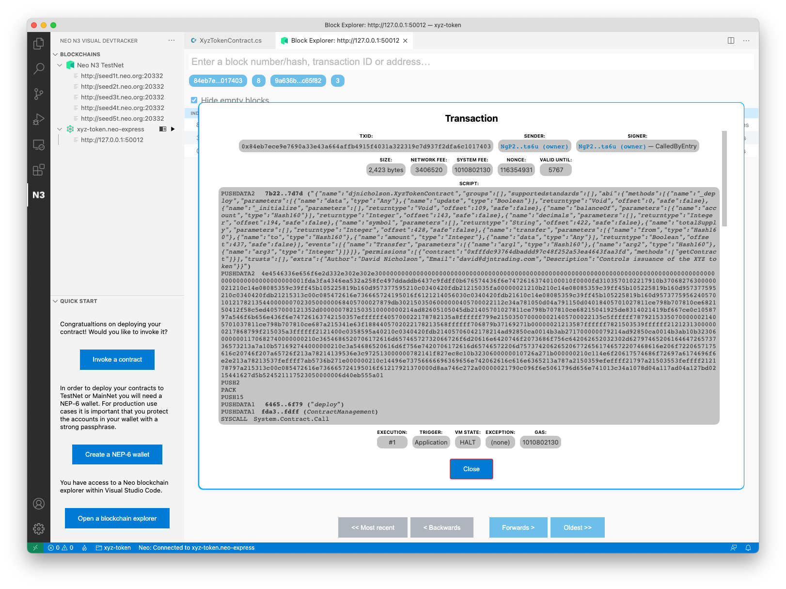

You’ll notice that this transaction is somewhat larger than the transactions that we created earlier (when transferring GAS from the genesis account to the owner account), that’s because this transaction contains the entire bytecode for your contract and all of its associated metadata! You can actually see the metadata in text format within the Block Explorer panel.

Your contract has now been deployed to your own private Neo blockchain. Next, we’ll experiment with transferring some assets…

Meet Alice
----------

Before we continue, let’s create one additional wallet so that we can simulate multiple people transferring XYZ tokens between each other. We’ll call this new wallet “alice”. The steps are identical to when we created the owner wallet earlier.

Right click on `xyz-token.neo-express` in the Blockchains panel and click on the “Create wallet” menu option. When asked for a wallet name, type `alice`. You’ll see a message confirming that the wallet was created:

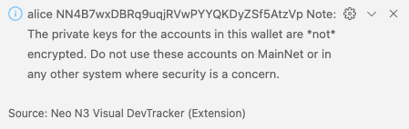

Now that we have a second wallet, let’s transfer some of the 1,000,000 XYZ tokens that were just issued to Alice…

Contract invocation
-------------------

Neo Express allows you to invoke any contract deployed to your private blockchain. To do so, you must provide an “[invoke file](https://github.com/ngdenterprise/design-notes/blob/master/NDX-DN12%20-%20Neo%20Express%20Invoke%20Files.md)”; an invoke file is a JSON file that specifies one or more contract methods that should be invoked.

Right click on `xyz-token.neo-express` in the Blockchains panel and click on the “Invoke contract” menu option. A new invoke file will be created for you and saved as `invoke-files/Untitled.neo-invoke.json`. By convention, invoke files use the `.neo-invoke.json` file extension, but you can rename the file to something more meaningful (e.g. `owner-to-alice.neo-invoke.json`) if you wish.

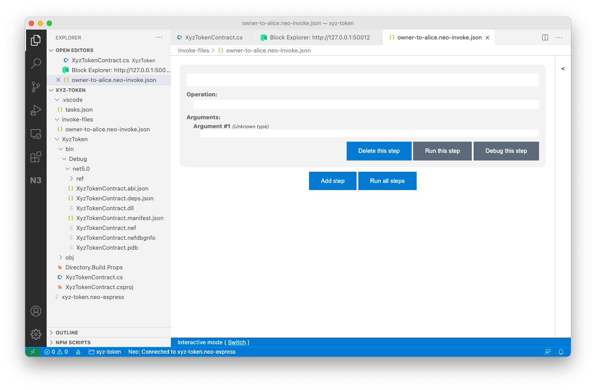

Invoke files can consist of multiple “steps”. The file created for you currently has one step, but all of the fields are currently empty. Let’s fill them out… Click into the first field and you will see a dropdown that lists all known contracts on your private blockchain:

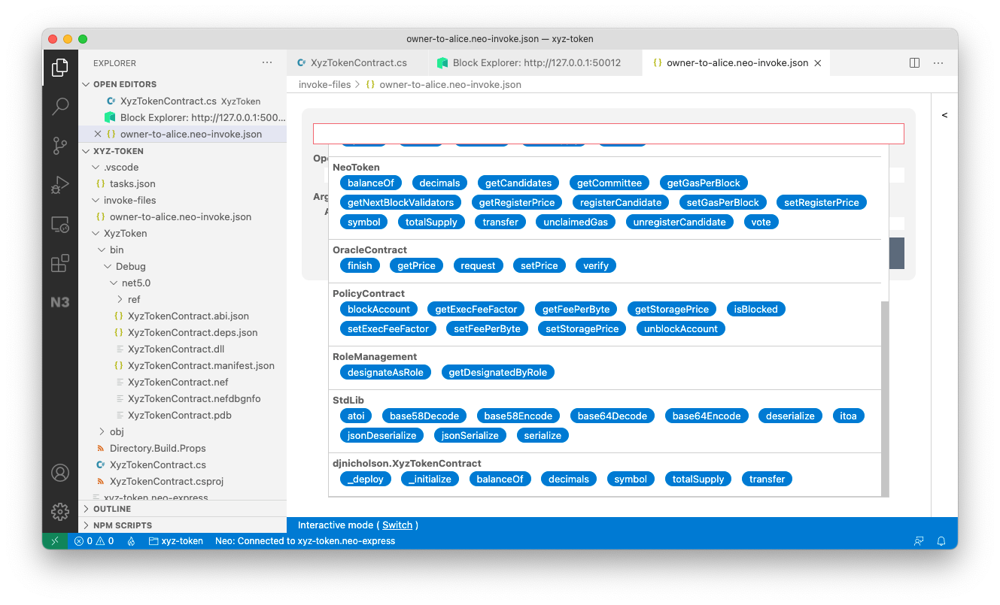

Select your `XyzTokenContract`, and then click into the “Operation” text box; you’ll see a list of all operations on your contract:

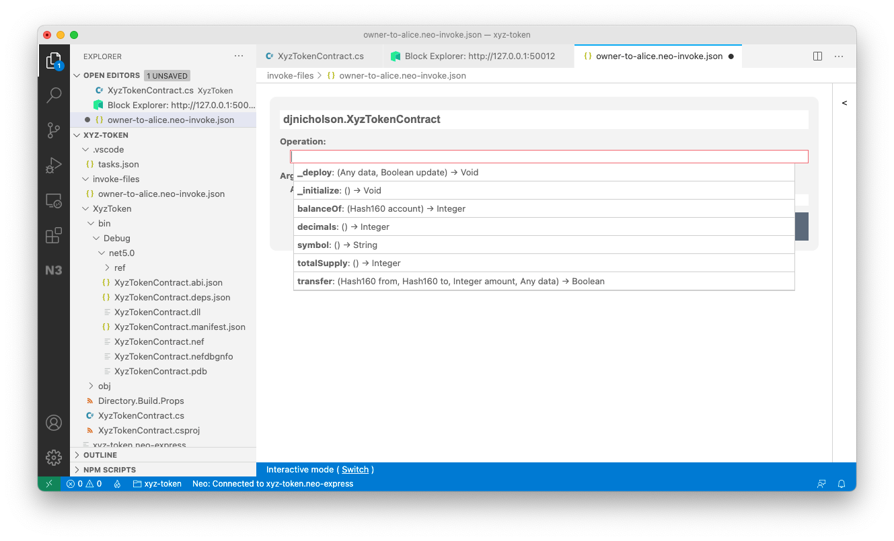

Select the “transfer” operation. You’ll notice that new text boxes appear for each of the arguments to the transfer method. Let's fill those out…

Neo Express allows you to refer to wallets by name, to do so you prefix the wallet name with an “@” symbol. Your invoke file will look something like this:

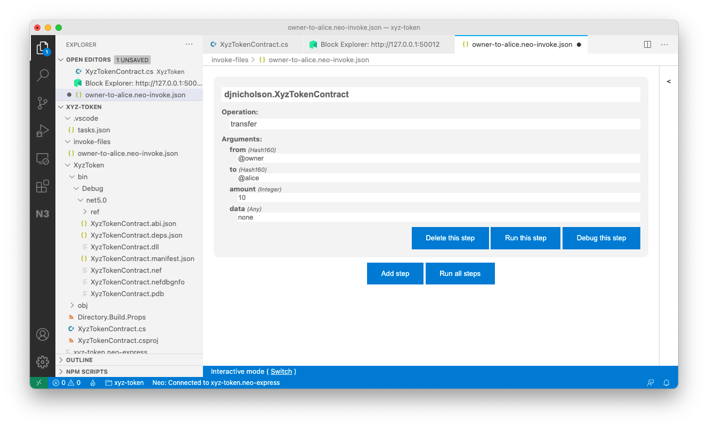

Click the “Run this step” button to invoke your contract and when prompted choose the owner account. You’ll see a “Transactions” pane appear within the invoke file editor, this shows you the most recent transactions that you have submitted using this editor window and there will only be one transaction right now. The transaction will initially show as “pending” and then change to “confirmed” when your transaction is included in a block (within 15 seconds).

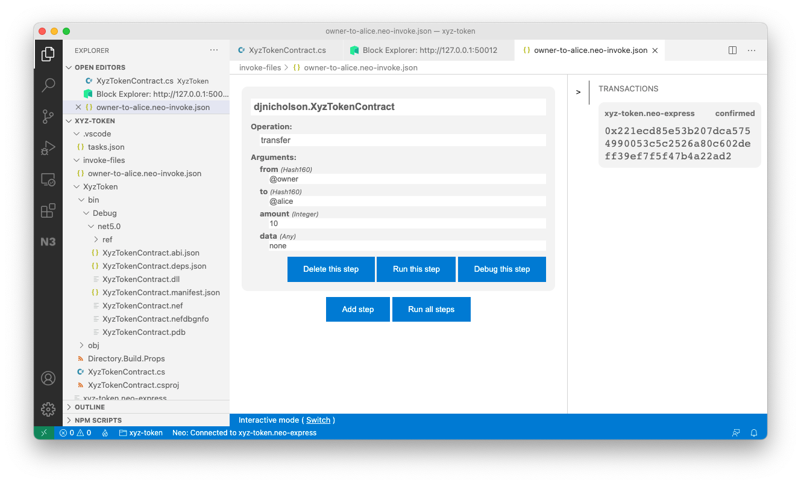

You can click on the transaction to see the same details that you would see if you found your transaction in the Block Explorer:

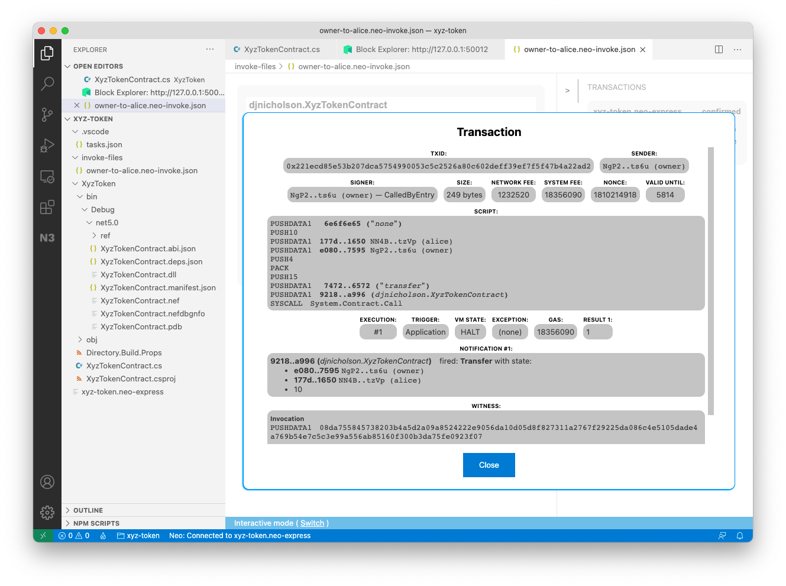

Congratulations, you just transferred XYZ tokens from the owner to Alice!

Exercise for the reader
-----------------------

Our contract has a fixed total supply of XYZ tokens—we mint 1,000,000 tokens at deployment time and then no more tokens are ever created. In a real-world scenario you may want to allow people to purchase tokens and mint new tokens as and when they are purchased.

As an exercise, you can modify the `XyzTokenContract` to support this functionality: Use contract storage (instead of a constant in the code) to record the total supply of XYZ tokens and then allow people to issue new XYZ tokens by paying a certain amount of NEO or GAS to the contract.

Source code listing
-------------------

Here is the complete smart contract source code:
```csharp
using System;
using System.ComponentModel;
using System.Numerics;

using Neo;
using Neo.SmartContract.Framework;
using Neo.SmartContract.Framework.Native;
using Neo.SmartContract.Framework.Services;

namespace XyzToken
{
    [DisplayName("djnicholson.XyzTokenContract")]
    [ManifestExtra("Author", "David Nicholson")]
    [ManifestExtra("Email", "[[email protected]](/cdn-cgi/l/email-protection)")]
    [ManifestExtra("Description", "Controls issuance of the XYZ token")]
    public class XyzTokenContract : SmartContract
    {
        const string MAP\_NAME = "XyzTokenContract";

        static readonly ulong InitialSupply = 1\_000\_000;

        public static BigInteger TotalSupply() => InitialSupply;
        
        public static string Symbol() => "XYZ";

        public static ulong Decimals() => 8;

        [DisplayName("Transfer")]
        public static event Action<UInt160, UInt160, BigInteger> OnTransfer;

        private static StorageMap Balances => new StorageMap(Storage.CurrentContext, MAP\_NAME);

        private static BigInteger Get(UInt160 key) => (BigInteger) Balances.Get(key);

        private static void Put(UInt160 key, BigInteger value) => Balances.Put(key, value);

        private static void Increase(UInt160 key, BigInteger value)
        {
            Put(key, Get(key) + value);
        }

        private static void Reduce(UInt160 key, BigInteger value)
        {
            var oldValue = Get(key);
            if (oldValue == value)
            {
                Balances.Delete(key);
            }
            else
            {
                Put(key, oldValue - value);
            }
        }

        public static bool Transfer(UInt160 from, UInt160 to, BigInteger amount, object data)
        {
            if (!from.IsValid || !to.IsValid)
            {
                throw new Exception("The parameters from and to should be 20-byte addresses");
            }

            if (amount < 0) 
            {
                throw new Exception("The amount parameter must be greater than or equal to zero");
            }

            if (!from.Equals(Runtime.CallingScriptHash) && !Runtime.CheckWitness(from))
            {
                throw new Exception("No authorization.");
            }
            
            if (Get(from) < amount)
            {
                throw new Exception("Insufficient balance");
            }

            Reduce(from, amount);
            Increase(to, amount);
            OnTransfer(from, to, amount);

            if (ContractManagement.GetContract(to) != null)
            {
                Contract.Call(to, "onPayment", CallFlags.None, new object[] { from, amount, data });
            }
            
            return true;
        }

        public static BigInteger BalanceOf(UInt160 account)
        {
            return Get(account);
        }

        [DisplayName("\_deploy")]
        public static void Deploy(object data, bool update)
        {
            if (!update)
            {
                var tx = (Transaction) Runtime.ScriptContainer;
                var owner = (Neo.UInt160) tx.Sender;
                Increase(owner, InitialSupply);
                OnTransfer(null, owner, InitialSupply);
            }
        }
    }
}
```