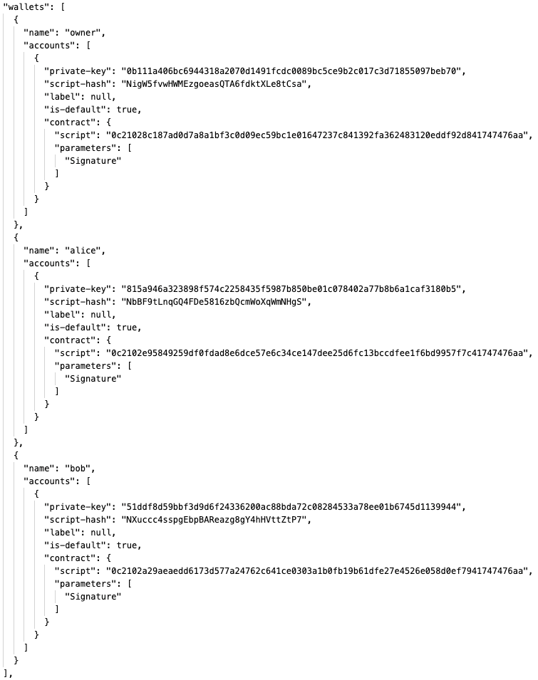
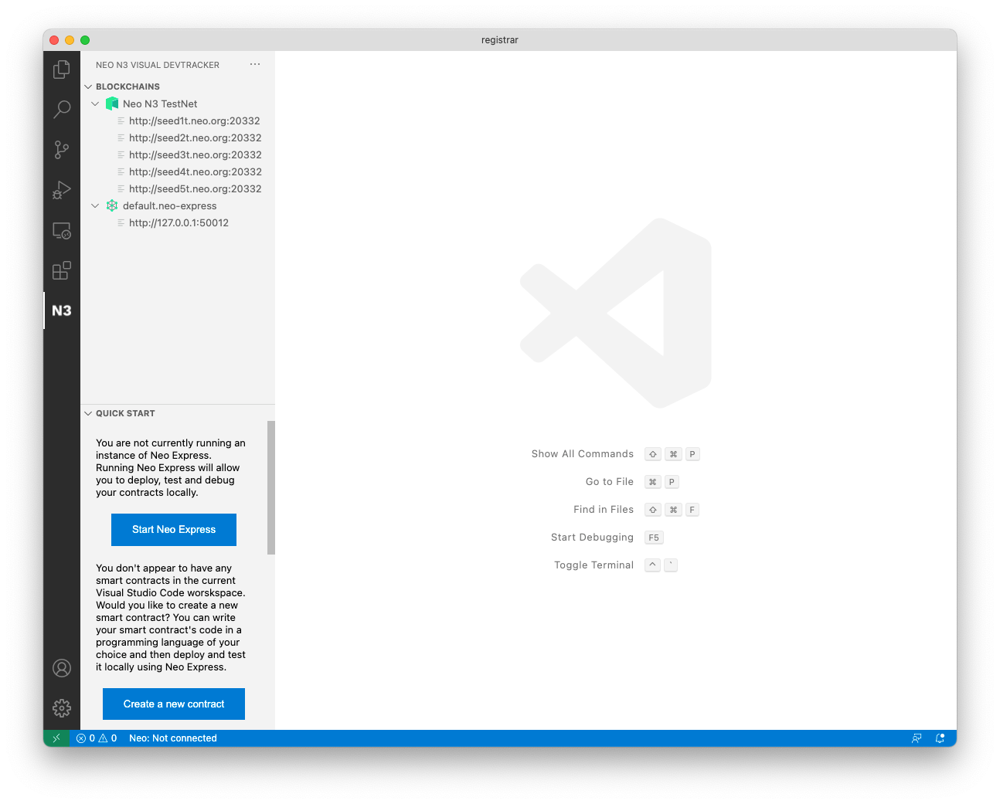
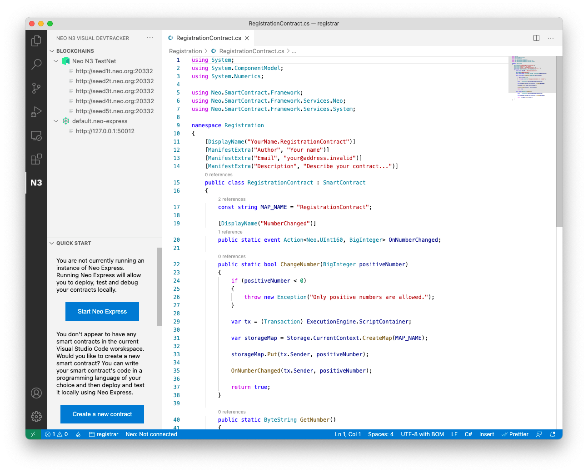
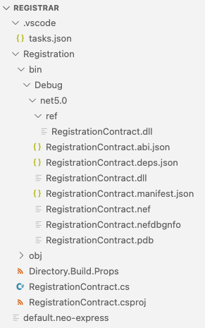

# Real-world Smart Contracts: Building and deploying a Simple Domain Registrar


You are currently viewing the command-line version of this tutorial. More comfortable using a graphical user-interface? [Click here for a UI version of this tutorial](./tutorial1-ui.html).

This tutorial was inspired by the [Neo N3 Fungible Token Sample Contract](https://github.com/ngdenterprise/neo-fungible-token-sample) project.

This tutorial will walk you through the process of creating real-world Neo Smart Contract using the Neo Blockchain toolkit. We will build a blockchain-based domain registration system.

Pre-requisites
--------------

You will need the following software to follow along with this tutorial:

*   **.NET SDK 5.0** — [https://dotnet.microsoft.com/download](https://dotnet.microsoft.com/download)  
    We’ll write the smart contract code using the C# programming language. The .NET SDK is required to compile the C# code.
*   **Visual Studio Code** — [https://code.visualstudio.com/download](https://code.visualstudio.com/download)  
    This is a very popular code editor; the Neo Blockchain Toolkit builds on top of VS Code.
*   **Neo Blockchain Toolkit Visual Studio Code extension** — [https://marketplace.visualstudio.com/items?itemName=ngd-seattle.neo-blockchain-toolkit](https://marketplace.visualstudio.com/items?itemName=ngd-seattle.neo-blockchain-toolkit)  
    This will add support to VS Code for visualizing Neo blockchains, running private blockchain instances and debugging Neo smart contracts.

For a step-by-step walkthrough showing how to install the above pre-requisites, see: [Quick Start video 1](./quickstart1.html).

This 6-minute video demonstrates how to setup a new machine for N3 smart contract development.

*   **C# Visual Studio Code extension** — [https://marketplace.visualstudio.com/items?itemName=ms-dotnettools.csharp](https://marketplace.visualstudio.com/items?itemName=ms-dotnettools.csharp)  
    This will add support to VS Code for editing and building C# source code.
*   **Neo C# smart contract compiler** — [https://github.com/neo-project/neo-devpack-dotnet](https://github.com/neo-project/neo-devpack-dotnet)  
    This tool allows you to convert compiled C# code into bytecode suitable for execution by the Neo virtual machine.

For a step-by-step walkthrough showing how to install the C# VS Code extension and the Neo C# compiler, see: [Quick Start video 4](./quickstart4.html).

This 11-minute video demonstrates how to setup your machine to compile C# smart contracts and walks through a trivial example.

*   **Neo Express** — [https://github.com/neo-project/neo-express](https://github.com/neo-project/neo-express)  
    This tool allows you to run a private instance of the Neo blockchain.

Neo Express can be installed using the following command:  
`$ dotnet tool install Neo.Express -g`

The .NET SDK must be installed first (see above).

On Linux and MacOS systems additional dependencies are required, see [Quick Start video 1](./quickstart1.html) or the [Neo Express documentation](https://github.com/neo-project/neo-express#ubuntu-installation) for more information.

All of the software listed above is freely available and cross-platform (you can follow along on Windows, Mac or Linux).

Create a private blockchain
---------------------------

First, we’ll create a new empty folder—registrar—for our project. We’ll store all files related to our domain registration service in this folder.

$ mkdir registrar
$ cd registrar

The first thing we will do is use Neo Express to create a private blockchain. This will allow us to deploy and invoke our contract while we are developing it without spending any real GAS.

$ neoxp create
Created 1 node privatenet at
/Users/neo/registrar/default.neo-express
    Note: The private keys for the accounts in this file are are \*not\* encrypted.
          Do not use these accounts on MainNet or in any other system where security is a concern.

Take note of the security warning, a `default.neo-express` file will have been created that contains private keys, but those keys should only be used for local testing as they are not securely stored.

You can now run your private blockchain:

$ neoxp run

In your terminal you’ll see the console output from Neo Express and will notice that about once every 15 seconds a new block is added to your blockchain. If you press Ctrl+C or close the terminal, you’re blockchain will stop. For now, leave Neo Express running and open a new terminal for the subsequent steps.

Create a wallet
---------------

Next, we’ll create a wallet to use with our private blockchain. This wallet will be used to deploy our smart contract to the blockchain. Initially we’ll make domain registration free-of-charge so the owner won’t have any involvement after initial deployment (you could imagine us later improving the contract to charge fees—in NEO or GAS—for domain registration though and have the owner able to redeem those fees).

$ neoxp wallet create owner
owner
    NigW5fvwHWMEzgoeasQTA6fdktXLe8tCsa
    Note: The private keys for the accounts in this wallet are \*not\* encrypted.
          Do not use these accounts on MainNet or in any other system where security is a concern.

We now have a wallet for the smart contract owner, but that wallet doesn’t contain any assets. Deploying a smart contract to a Neo blockchain has a fee associated with it; the fee varies based on the size of the contract but is always paid in GAS.

Each Neo Express instance has a special wallet called “genesis” that is initially given the entire supply of NEO and GAS (the two assets native to the Neo blockchain). Let’s transfer some GAS from the genesis wallet to our owner wallet.

$ neoxp transfer 100000 GAS genesis owner
Transfer Transaction 0x0acc8cab2dd88a3e4c73284a71edc94c77a03db62e46950ee6d42b60e22a9b9d submitted

Meet Alice and Bob
------------------

Let’s create two more wallets so that we can later experiment with registering and transferring domains. We’ll call the wallets `alice` and `bob` (it is convention when describing protocols to name the first two participants Alice and Bob!)

The steps aliceto create the wallets are exactly the same as above—when we created the owner wallet—just with different wallet names. Be sure to also transfer some GAS from the `genesis` wallet to Alice and Bob (as they will need some GAS to be able to invoke the registration contract that we will create).

The wallets that you have created are stored inside the `.neo-express` configuration file. If you open the file you should now see a wallets entry that looks something like this (your keys and addresses will be different, though):



Create a contract
-----------------

Now we’re ready to write the code for our smart contract.

We’ll use Visual Studio Code to write the code for our smart contract. Load a new VS Code window and open your `registrar` folder. The folder will contain a single file—`default.neo-express`—that was created by Neo Express to store your private blockchain configuration.

Click the N3 icon in the tool bar to open the N3 Visual DevTracker:




Click the “Create a new contract” button in the Quick Start panel:


(Alternatively, you could select the “Create contract” menu option from the context menu in the Blockchains panel.)

When asked which programming language you would like to use, select `csharp`.

When asked for the contract name, enter `Registration`. A new file called `RegistrationContract.cs` will be created and opened—this is our smart contract code. It has been pre-populated with some example code, but we’ll shortly remove and replace most of that…



You can also see in the Explorer pane in VS Code that various other files have been created:



The `RegistrationContract.csproj` file is an MS Build C# project configuration file; it tells the .NET SDK tooling how to build your project.

The `tasks.json` file is a Visual Studio Code configuration file that will allow you to build your code within Visual Studio Code. VS Code will have already built the sample code and the various files produced by the build are in the `Registration/bin/debug/net5.0` folder. You can rebuild your contract after making changes by choosing the “Run build task…” option in the “Terminal” menu in VS Code.

If you prefer to build using the command-line, you can delete the`tasks.json` file and instead run the `dotnet build` command within the `Registration` folder whenever you want to build:

$ cd Registration/
$ dotnet build
Microsoft (R) Build Engine version 16.8.3+39993bd9d for .NET
Copyright (C) Microsoft Corporation. All rights reserved.

  Determining projects to restore...
  All projects are up-to-date for restore.
  RegistrationContract -> /Users/neo/registrar/RegistrationContract/bin/Debug/net5.0/RegistrationContract.dll

Build succeeded.
    0 Warning(s)
    0 Error(s)

Time Elapsed 00:00:01.21

Let’s remove the sample code and fill out some contract metadata, then we’ll be ready to write our own smart contract code…

The `RegistrationContract.cs` file contains a single class; it is called `RegistrationContract` and extends the `SmartContract` class (from the `Neo.SmartContract.Framework` package) to signify that it is a smart contract. The class has various attributes that are used to provide metadata that will be deployed to the N3 blockchain along with the contract:

```csharp
[DisplayName("YourName.RegistrationContract")]
[ManifestExtra("Author", "Your name")]
[ManifestExtra("Email", "[[email protected]](/cdn-cgi/l/email-protection)")]
[ManifestExtra("Description", "Describe your contract...")]
```

Let’s replace these with real values…

The `DisplayName` will be used to refer to your contract from within wallet software and other tools, it is common practice to provide a string consisting of an identifier for you (e.g. your GitHub ID, or company abbreviation) followed by a dot and then the contract name.

For the `ManifestExtra` attributes, replace the example values with real information. You can also remove the `OnNumberChanged` event, the `MAP_NAME` constant and the `ChangeNumber` and `GetNumber` methods from the example contract:

```csharp
using System;
using System.ComponentModel;
using System.Numerics;

using Neo;
using Neo.SmartContract.Framework;
using Neo.SmartContract.Framework.Native;
using Neo.SmartContract.Framework.Services;

namespace Registration
{
    [DisplayName("djnicholson.RegistrationContract")]
    [ManifestExtra("Author", "David Nicholson")]
    [ManifestExtra("Email", "[[email protected]](/cdn-cgi/l/email-protection)")]
    [ManifestExtra("Description", "A domain registration service for Neo blockchains")]
    public class RegistrationContract : SmartContract
    {
    }
}
```

You can rebuild your contract now to verify that it still builds. Our contract doesn’t do anything useful yet, though; next we’ll code various methods to make it a fully functional domain registration service!

Domain registration interface
-----------------------------

For this example, we’ll say that a valid domain name is any non-empty string consisting only of the characters ‘a’ through ‘z’.

We’ll support the following behaviors:

*   Anyone can query whether a domain name is already registered (and if so, who owns it) using a `Lookup` method.
*   Any available name can be registered by calling a `Register` method (signing the transaction as the intended owner of the domain).
*   The existing owner of a domain can transfer it to someone else by invoking a `Transfer` method (providing the new owner as an argument and signing the transaction as the current owner).
*   The existing owner of a domain can delete their registration by invoking a `Delete` method (signing the transaction as the current owner).

We’ll also emit an event whenever ownership changes for a domain name.

Helper methods
--------------

First it would be useful to implement a couple of helper methods.

The first helper method will implement our validation logic; it will determine if an arbitrary string is a valid domain name according to our rules and throw an exception if not:
```csharp
static void Validate(string domain)
{
    var domainBytes = domain.ToByteArray();
    for (int i = 0; i < domain.Length; i++)
    {
        if (domainBytes[i] < 'a' || domainBytes[i] > 'z')
        {
            throw new Exception("Domains must only use lowercase a-z characters");
        }
    }

    if (domain.Length == 0)
    {
        throw new Exception("Domains must be non-empty");
    }
}
```
We’ll often need to know the current owner of a valid domain name, so let’s also add a helper method for that. We’ll use contract storage to keep track of which domain is owned by which address and will arrange for the method to return zero if a domain is unregistered.
```csharp
static UInt160 GetOwner(string domain)
{
    var value = Storage.Get(Storage.CurrentContext, domain);
    if (value == null)
    {
        return UInt160.Zero;
    }
    else
    {
        return (UInt160) value;
    }
}
```
We also need to declare the event that we will be emitting whenever domain name ownership changes:
```csharp
[DisplayName("ChangeOwner")]
public static event Action<string, UInt160> OnChangeOwner;
```
Domain name lookup
------------------

Our first operation will allow people to lookup the current owner of a domain name (a return value of zero will represent that the domain is currently unregistered):
```csharp
public static UInt160 Lookup(string domain)
{
    Validate (domain);
    return GetOwner(domain);
}
```
Note that we confirm the domain name is valid before doing any further processing; we will follow the same pattern for all of our contract operations.

Domain name registration
------------------------

Next, we need an operation to allow someone to register an available domain name:
```csharp
public static void Register(string domain)
{
    Validate(domain);

    if (!GetOwner(domain).IsZero)
    {
        throw new Exception("Already registered");
    }

    var tx = (Transaction) Runtime.ScriptContainer;
    Storage.Put(Storage.CurrentContext, domain, tx.Sender);
    OnChangeOwner(domain, tx.Sender);
}
```
Note that we first check that the domain is valid and available. We then extract the address used to sign the transaction and update the contract storage so the mapping from this domain name to this address is persisted.

Domain name transfer
--------------------

Now we need an operation for transferring domain names:
```csharp
public static void Transfer(string domain, UInt160 to)
{
    Validate(domain);

    var owner = GetOwner(domain);
    if (GetOwner(domain).IsZero)
    {
        throw new Exception("Not registered");
    }

    if (!to.IsValid || to.IsZero)
    {
        throw new Exception("Invalid transferee");
    }

    if (!Runtime.CheckWitness(owner))
    {
        throw new Exception("Not authorized");
    }
    
    Storage.Put(Storage.CurrentContext, domain, to);
    OnChangeOwner(domain, to);
}
```
We confirm that the domain is already registered, then we make sure that the destination address is valid and the signer of the transaction is the current owner of the domain name. If all these checks pass we update our contract storage and emit our ownership change event.

Domain name deletion
--------------------

Finally, we need an operation for domain name owners to delete their registration:
```csharp
public static void Delete(string domain)
{
    Validate(domain);

    var owner = GetOwner(domain);
    if (owner.IsZero)
    {
        throw new Exception("Not registered");
    }

    if (!Runtime.CheckWitness(owner))
    {
        throw new Exception("Not authorized");
    }

    Storage.Delete(Storage.CurrentContext, domain);
    OnChangeOwner(domain, UInt160.Zero);
}
```
We check that the domain is currently registered and the person it is registered to has signed the transaction; we then remove the relevant item from storage and emit our ownership change event (using an address of zero to signify that the domain has become available again).

Now we’re ready to deploy our contract to our private Neo blockchain!

Contract deployment
-------------------

When you build your smart contract code, one of the files emitted is`RegistrationContract.nef`; this contains the N3 Virtual Machine bytecode for your contract and is required for deployment. You can deploy your contract to your private blockchain as follows:

$ neoxp contract deploy Registration/bin/Debug/net5.0/RegistrationContract.nef owner
Deployment Transaction 0xc5f6b16350427e4bf0dfa01fc939ac192df45e39e703e60cd08db5c1a37e17a5 submitted

Your contract has now been deployed to your own private Neo blockchain. Next, we’ll experiment with registering some domains…

Registering a domain
--------------------

Neo Express allows you to invoke any contract deployed to your private blockchain. To do so, you must provide an “[invoke file](https://github.com/ngdenterprise/design-notes/blob/master/NDX-DN12%20-%20Neo%20Express%20Invoke%20Files.md)”; an invoke file is a JSON file that specifies one or more contract methods that should be invoked.

```csharp
Create a new text file and paste the following JSON into it:

[
  {
    "contract": "djnicholson.RegistrationContract",
    "operation": "register",
    "args": [ "widgets" ]
  }
]
```
Save the file as `alice-registration.neo-invoke.json` and then run the following command:

$ neoxp contract invoke alice-registration.json owner
Invocation Transaction 0xdbf3fa71a74fa0676d7513ded2e2f18ea6cf5b9f022a9b008b9b05bc36865217 submitted

This command submits a transaction to your private blockchain that invokes all of the steps in the invoke file (only one step in our case) using Alice’s wallet.

Congratulations, you just registered your first domain! `widgets` is now owned by Alice!

Transferring a domain
---------------------

Next let’s have Alice transfer the widgets domain to Bob.

Create a new invoke file called `alice-to-bob-transfer.neo-invoke.json` and populate it as follows:
```json
[
  {
    "contract": "djnicholson.RegistrationContract",
    "operation": "transfer",
    "args": [ "widgets", "@bob" ]
  }
]
```
Note that you can refer to wallet address in invoke files by prefixing the wallet name with an ‘@’ character.

Now run this invoke file the same was as before (again using Alice’s account to submit the transaction). Now Bob own’s the domain `widgets`!

You can verify this by trying to run the same invoke file again and verifying that the transaction results in an error (Alice is no longer the owner so our smart contract throws an exception).

Deleting a domain
-----------------

Finally, let’s delete the `widgets` domain.

Create a new invoke file called `delete-widgets.neo-invoke.json` and populate it as follows:
```json
[
  {
    "contract": "djnicholson.RegistrationContract",
    "operation": "delete",
    "args": [ "widgets" ]
  }
]
```
Now run this invoke file the same was as before, but this time use Bob’s account to submit the transaction. Now nobody own’s the domain`widgets` and it is available for registration again!

Exercise for the reader
-----------------------

Our contract allows anyone to register any domain free-of-charge (as long as they have enough GAS to pay to submit the invocation transactions). In a real-world you may want to charge fees when a user registers a domain; people could pay these fees in NEO, GAS or indeed any other NEP-17 asset.

As an exercise, you can modify the `RegistrationContract` to support this functionality: You can add an `OnPayment` method to your contract that will be called whenever someone pays assets to the contract. The `OnPayment` method provides the sender and amount of funds as arguments, you can determine what asset was paid by inspecting the `Runtime.CallingScriptHash` property provided by the runtime and you could make use of the optional `data` argument to allow the user to specify which name they would like to register. Within your `OnPayment` method you can reject the transaction—e.g., if the domain is unavailable or not enough funds were paid—by throwing an exception.

Source code listing
-------------------

Here is the complete smart contract source code:
```csharp
using System;
using System.ComponentModel;

using Neo;
using Neo.SmartContract.Framework;
using Neo.SmartContract.Framework.Native;
using Neo.SmartContract.Framework.Services;

namespace Registration
{
    [DisplayName("djnicholson.RegistrationContract")]
    [ManifestExtra("Author", "David Nicholson")]
    [ManifestExtra("Email", "[[email protected]](/cdn-cgi/l/email-protection)")]
    [ManifestExtra("Description", "A domain registration service for N3 blockchains")]
    public class RegistrationContract : SmartContract
    {
        [DisplayName("ChangeOwner")]
        public static event Action<string, UInt160> OnChangeOwner;

        static void Validate(string domain)
        {
            var domainBytes = domain.ToByteArray();
            for (int i = 0; i < domain.Length; i++)
            {
                if (domainBytes[i] < 'a' || domainBytes[i] > 'z')
                {
                    throw new Exception("Domains must only use lowercase a-z characters");
                }
            }

            if (domain.Length == 0)
            {
                throw new Exception("Domains must be non-empty");
            }
        }

        static UInt160 GetOwner(string domain)
        {
            var value = Storage.Get(Storage.CurrentContext, domain);
            if (value == null)
            {
                return UInt160.Zero;
            }
            else
            {
                return (UInt160) value;
            }
        }

        public static UInt160 Lookup(string domain)
        {
            Validate (domain);
            return GetOwner(domain);
        }

        public static void Register(string domain)
        {
            Validate (domain);

            if (!GetOwner(domain).IsZero)
            {
                throw new Exception("Already registered");
            }

            var tx = (Transaction) Runtime.ScriptContainer;
            Storage.Put(Storage.CurrentContext, domain, tx.Sender);
            OnChangeOwner(domain, tx.Sender);
        }

        public static void Transfer(string domain, UInt160 to)
        {
            Validate (domain);

            var owner = GetOwner(domain);
            if (GetOwner(domain).IsZero)
            {
                throw new Exception("Not registered");
            }

            if (!to.IsValid || to.IsZero)
            {
                throw new Exception("Invalid transferee");
            }

            if (!Runtime.CheckWitness(owner))
            {
                throw new Exception("Not authorized");
            }

            Storage.Put(Storage.CurrentContext, domain, to);
            OnChangeOwner (domain, to);
        }

        public static void Delete(string domain)
        {
            Validate (domain);

            var owner = GetOwner(domain);
            if (owner.IsZero)
            {
                throw new Exception("Not registered");
            }

            if (!Runtime.CheckWitness(owner))
            {
                throw new Exception("Not authorized");
            }

            Storage.Delete(Storage.CurrentContext, domain);
            OnChangeOwner(domain, UInt160.Zero);
        }
    }
}
```