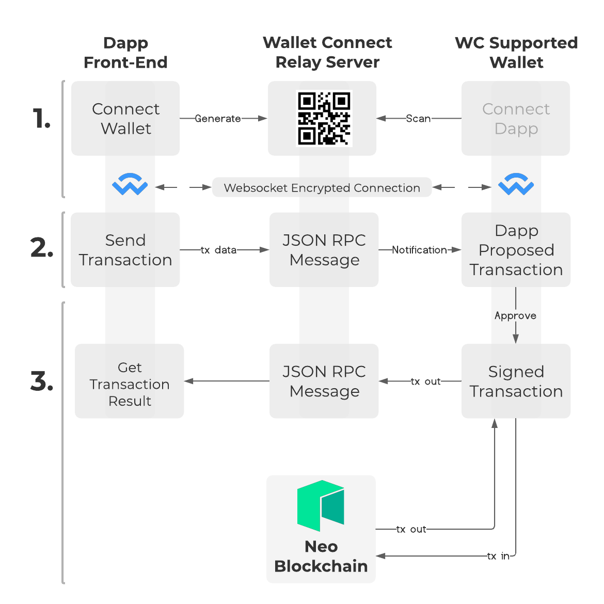

# 1. An Introduction:

This article covers implementation of **WalletConnect**, an open source protocol for communication between dApps and wallets. With it, a user can securely sign dApp proposed transactions directly from their personal wallet without exposing their private key to the application.

## Why do I need WalletConnect in my dApp?

Almost every decentralized application needs a user's authentication to send a signed transaction to the blockchain. From minting tokens to making a simple transfer, users must always sign their transactions whenever the client-side application needs to call a SmartContract method that requires the user's Account.

Without a solution like WalletConnect, the user would need to trust their private key to the dApp in order to sign. For obvious reasons, outside of testing environments, this is a huge security issue. The dApp could simply use the key to maliciously steal funds or sign something not approved by the user.


## The **WalletConnect 2.0** protocol:

[WalletConnect](https://walletconnect.org/) is an established chain-agnostic open source protocol for connecting decentralized applications to wallets. Whereas there are different options on how to safely implement such connection, WalletConnect is a widely supported standard across different wallets, chains and applications, and it's technical approach is simple, safe and proven.


## The **WalletConnect SDK**:

This article will present the usage of [`COZ's WalletConnect 2.0 SDK`](https://github.com/CityOfZion/wallet-connect-sdk), an auxiliary library built on top of [WalletConnect](https://github.com/WalletConnect/walletconnect-monorepo) which wraps the protocol for integration within the Neo ecosystem.

## And this is how it works:




1. The application generates a connection payload and presents it to the user (commonly as a QR code) to provide to their wallet. The QR code contains the wallet with the information required to create a secure communication channel between the requesting application and wallet via a relay server.

2. Now, the application will have the ability to send requests directly to the user's wallet.

3. When a request is received, the wallet will ask for the user to approve the transaction. It will then sign the transaction, send it to the network and respond back to the dApp with the response it gets from the blockchain.

# 2. Using WalletConnect

## Requirements

- A front-end application that needs to interact with smart contracts deployed to the blockchain;
- A wallet supporting N3 with WalletConnect integration.  For testing purposes, we recommend [aero](https://aero.coz.io).

## Choose your path

There are currently two packages available for [COZ's WalletConnect 2.0 SDK](https://github.com/CityOfZion/wallet-connect-sdk): the [Core SDK](https://github.com/CityOfZion/wallet-connect-sdk/tree/develop/packages/wallet-connect-sdk-core), that can be used with any front end framework, and a [React SDK](https://github.com/CityOfZion/wallet-connect-sdk/tree/develop/packages/wallet-connect-sdk-react), an example of a higher level implementation with a context provider that handles some state changes for us.

From here on, you will need to choose a path. Each upcoming section will briefly showcase the implementation of WalletConnect basic features using each of the packages.

# 2.a. The "Core" SDK

## Installation
Install the dependency on your client-side application
### NPM
```
npm i @cityofzion/wallet-connect-sdk-core
```
### YARN
To install using **YARN**, you need to add this to your `package.json` before running the command:
```
  "resolutions": {
    "@walletconnect/client": "2.0.0-beta.17",
    "@walletconnect/jsonrpc-utils": "1.0.0",
    "@walletconnect/qrcode-modal": "2.0.0-alpha.20",
    "@walletconnect/types": "2.0.0-beta.17",
    "@walletconnect/utils": "2.0.0-beta.17"
  }
```
And then:
```
yarn add @cityofzion/wallet-connect-sdk-core
```

## Setup
Initialize the client:
```js
import {WcSdk} from "@cityofzion/wallet-connect-sdk-core";

const wcInstance = new WcSdk()

await wcInstance.initClient(
  "debug", // logger: use 'debug' to show all log information on browser console, use 'error' to show only errors
  "wss://relay.walletconnect.org" // we are using walletconnect's official relay server
);
```
### Subscribe to Wallet Connect events

```js
wcInstance.subscribeToEvents({
    onProposal: (uri: string) => {
        // show the QRCode, you can use @walletconnect/qrcode-modal to do so, but any QRCode presentation is fine
        QRCodeModal.open(uri, () => {})
        // alternatively you can show Neon Wallet Connect's website, which is more welcoming
        window.open(`https://neon.coz.io/connect?uri=${uri}`, '_blank').focus();
    },
    onDeleted: () => {
        // here is where you describe a logout callback
        logout()
    }
})
```

### Load any existing connection, it should be called after the initialization, to reestablish connections made previously

```js
await wcInstance.loadSession()
```

## Recipes

### Check if the user has a Session and get its Accounts

```js
if (wcInstance.session) {
  console.log(wcInstance.accountAddress) // print the first connected account address
  console.log(wcInstance.chainId) // print the first connected account chain info
  console.log(wcInstance.session.state.accounts); // print all the connected accounts (with the chain info)
  console.log(wcInstance.session.peer.metadata); // print the wallet metadata
}
```

### Connect to the Wallet
Start the process of establishing a new connection, to be used when there is no `wcInstance.session`
```js
if (!wcInstance.session) {
  await wcInstance.connect({
    chains: ["neo3:testnet", "neo3:mainnet"], // the blockchains your dapp accepts to connect
    methods: [ // which RPC methods do you plan to call
      "invokeFunction",
      "testInvoke",
      "signMessage",
      "verifyMessage"
    ],
    appMetadata: {
      name: "MyApplicationName", // your application name to be displayed on the wallet
      description: "My Application description", // description to be shown on the wallet
      url: "https://myapplicationdescription.app/", // url to be linked on the wallet
      icons: ["https://myapplicationdescription.app/myappicon.png"], // icon to be shown on the wallet
    }
  })
  // the promise will be resolved after the connection is accepted or refused, you can close the QRCode modal here
  QRCodeModal.close()
  // and check if there is a connection
  console.log(wcInstance.session ? 'Connected successfully' : 'Connection refused')
}
```

### Disconnect
It's interesting to have a button to allow the user to disconnect it's wallet, call `disconnect` when this happen:
```js
await wcInstance.disconnect();
```

### Make a JSON-RPC call
Every request is made via JSON-RPC. You need to provide a method name that is expected by the wallet and listed on
the `methods` property of the [options object](#setup) as well as some additional `parameters`.

The JSON-RPC format accepts parameters in many formats. The rules on how to construct this request will depend
entirely on the blockchain you are using. The code below is an example of a request constructed for the Neo Blockchain:

```js
const result = await wcInstance.sendRequest({
  method: 'getapplicationlog',
  params: ['0x7da6ae7ff9d0b7af3d32f3a2feb2aa96c2a27ef8b651f9a132cfaad6ef20724c']
})

// the response format depends interely on the blockchain response format
if (resp.result.error && resp.result.error.message) {
    window.alert(resp.result.error.message);
}
```

### Invoking a SmartContract method on Neo Blockchain
To invoke a SmartContract method you can use `WcSdk.sendRequest` with `invokeFunction` as method, but WcSdk
has a shortcut: `WcSdk.invokeFunction`.

On the example below we are invoking the `transfer` method of the `GAS` token. Neo blockchain expect params with
`{ type, value }` format, and on `type` you should provide one of the types mentioned
[here](https://neon.coz.io/wksdk/core/interfaces/Argument.html).
WcSdk has some special types to facilitate: `Address` and `ScriptHash`.

For reference, developers should reference
the contract manifest on the contracts details pages on dora to understand the methods and argument types needed.
For this example: [GAS](https://dora.coz.io/contract/neo3/mainnet/0xd2a4cff31913016155e38e474a2c06d08be276cf)

Check it out:
```ts
const invocation: ContractInvocation = {
  scriptHash: '0xd2a4cff31913016155e38e474a2c06d08be276cf', // GAS token
  operation: 'transfer',
  args: [
    { type: 'Address', value: wcInstance.accountAddress },
    { type: 'Address', value: 'NbnjKGMBJzJ6j5PHeYhjJDaQ5Vy5UYu4Fv' },
    { type: 'Integer', value: 100000000 },
    { type: 'Array', value: [] }
  ]
}

const signer: Signer = {
  scope: WitnessScope.Global
}

const resp = await wcInstance.invokeFunction(invocation, signer)
```

### Calling TestInvoke will not require user acceptance
To retrieve information from a SmartContract without persisting any information on the blockchain you can use `WcSdk.sendRequest` with `testInvoke` as method, but WcSdk
has a shortcut: `walletConnectCtx.testInvoke`.

On the example below we are invoking the `balanceOf` method of the `GAS` token.

Is expected for the Wallets to not ask the user for authorization on testInvoke.

Check it out:
```ts
const invocation: ContractInvocation = {
  scriptHash: '0xd2a4cff31913016155e38e474a2c06d08be276cf', // GAS token
    operation: 'balanceOf',
    args: [
       {type: 'Address', value: wcInstance.accountAddress}
    ]
}

const signer: Signer = {
  scopes: WitnessScope.Global
}

const resp = await wcInstance.testInvoke(invocation, signer)

```

## Read the Docs
There is more information on the [documentation website](https://neon.coz.io/wksdk/core/modules.html)

# 2.b. The "React" SDK

## Installation
Install the dependency on your client-side application
### NPM
```
npm i @cityofzion/wallet-connect-sdk-react
```
### YARN
To install using **YARN**, you need to add this to your `package.json` before running the command:
```
  "resolutions": {
    "@walletconnect/client": "2.0.0-beta.17",
    "@walletconnect/jsonrpc-utils": "1.0.0",
    "@walletconnect/qrcode-modal": "2.0.0-alpha.20",
    "@walletconnect/types": "2.0.0-beta.17",
    "@walletconnect/utils": "2.0.0-beta.17"
  }
```
And then:
```
yarn add @cityofzion/wallet-connect-sdk-react
```

## Setup
Wrap WalletConnectContextProvider around your App by passing an options object as prop
```jsx
import {WalletConnectContextProvider} from "@cityofzion/wallet-connect-sdk-react";

const wcOptions = {
  chains: ["neo3:testnet", "neo3:mainnet"], // the blockchains your dapp accepts to connect
  logger: "debug", // use debug to show all log information on browser console
  methods: ["invokeFunction"], // which RPC methods do you plan to call
  relayServer: "wss://relay.walletconnect.org", // we are using walletconnect's official relay server 
  appMetadata: {
    name: "MyApplicationName", // your application name to be displayed on the wallet
    description: "My Application description", // description to be shown on the wallet
    url: "https://myapplicationdescription.app/", // url to be linked on the wallet
    icons: ["https://myapplicationdescription.app/myappicon.png"], // icon to be shown on the wallet
  }
};

ReactDOM.render(
  <>
    <WalletConnectContextProvider options={wcOptions}>
      <App />
    </WalletConnectContextProvider>
  </>,
  document.getElementById("root"),
);
```

## Usage
From now on, every time you need to use WalletConnect, you simply import it and call a method:
```ts
import {useWalletConnect} from "@cityofzion/wallet-connect-sdk-react";

export default function MyComponent() {
  const walletConnectCtx = useWalletConnect()
  // do something
}
```

## Recipes

### Login (Or "Connect Wallet")
On the following example we are showing a "Connect your Wallet" link, when clicked it will show a dialog with the QRCode
and proceed with the connection.

We are going to show "Loading Session" text while the session is loading.

And if the user already has a session it will show a list of connected addresses with a "Disconnect" link.
```tsx
const connectWallet = async () => {
  await walletConnectCtx.connect()
  // the wallet is connected after the promise is resolved
}

return <>
{walletConnectCtx.loadingSession
  ? "Loading Session"
  : !walletConnectCtx.session ? <a
        onClick={connectWallet}>Connect your Wallet</a>
  : <ul>
            {walletConnectCtx.accounts.map((account) => {
                const [namespace, reference, address] = account.split(":");
                return <li key={address}>
                    <span>{walletConnectCtx.session?.peer.metadata.name}</span>
                    <span>{address}</span>
                    <a onClick={walletConnectCtx.disconnect}>Disconnect</a>
                </li>
            })}
    </ul>
}
</>;

```

### Make a JSON-RPC call
very request is made via JSON-RPC. You need to provide a method name that is expected by the wallet and listed on
the `methods` property of the [options object](#setup), and some additional `parameters`.

The JSON-RPC format accepts parameters in many formats. The rules on how to construct this request will depend
entirely on the blockchain you are using. The code below is an example of a request constructed for the Neo Blockchain:

```js
const resp = await walletConnectCtx.sendRequest({
  method: 'rpcMethod',
  params: ['param', 3, true]
});

// the response format depends interely on the blockchain response format
if (resp.result.error && resp.result.error.message) {
    window.alert(resp.result.error.message);
}
```

### Invoking a SmartContract method on Neo Blockchain
To invoke a SmartContract method you can use `walletConnectCtx.sendRequest` with `invokeFunction` as method, but WcSdk
has a shortcut: `walletConnectCtx.invokeFunction`.

On the example below we are invoking the `transfer` method of the `GAS` token. Neo blockchain expect params with
`{ type, value }` format, and on `type` you should provide one of the types mentioned
[here](https://github.com/neo-project/neo/blob/master/src/neo/SmartContract/ContractParameterType.cs).
WcSdk has some special types to facilitate: `Address` and `ScriptHash`.

Check it out:
```js
const senderAddress = walletConnectCtx.getAccountAddress(0) ?? ''

const invocations: ContractInvocation[] = [{
  scriptHash: '0xd2a4cff31913016155e38e474a2c06d08be276cf', // GAS Token
  operation: 'transfer',
  args: [
    { type: 'Address', value: senderAddress },
    { type: 'Address', value: 'NbnjKGMBJzJ6j5PHeYhjJDaQ5Vy5UYu4Fv' },
    { type: 'Integer', value: 100000000 },
    { type: 'Array', value: [] }
  ]
}]

const signers: Signer[] = [{
  scopes: WitnessScope.CalledByEntry
}]

const resp = await walletConnectCtx.invokeFunction({invocations, signers});
```


### Calling TestInvoke will not require user acceptance
To retrieve information from a SmartContract without persisting any information on the blockchain you can use `walletConnectCtx.sendRequest` with `testInvoke` as method, but WcSdk
has a shortcut: `walletConnectCtx.testInvoke`.

On the example below we are invoking the `balanceOf` method of the `GAS` token.

Is expected for the Wallets to not ask the user for authorization on testInvoke.

Check it out:
```js
const targetAddress = walletConnectCtx.getAccountAddress(0) ?? ''

const invocations: ContractInvocation[] = [{
  scriptHash: '0xd2a4cff31913016155e38e474a2c06d08be276cf', // GAS Token
  operation: 'balanceOf',
  args: [
    { type: 'Address', value: targetAddress }
  ]
}]

const signers: Signer[] = [{
  scopes: WitnessScope.CalledByEntry
}]

const resp = await walletConnectCtx.testInvoke({invocations, signers});
```

# 3. How to test my dApp?
**Neon Wallet** already has integration with Wallet Connect, but you may find **Aero Wallet** easier to test applications.
- [Aero Wallet Stable Version](https://aero.coz.io/) - Tested and Approved
- [Aero Wallet Preview Version](https://aero.coz.io/) - Where new Features and Fixes comes first
- [Neon Wallet](https://neon.coz.io/)
