# A Demo of Neo N3 Core Components dApp

This tutorial describes an interactive demo to demonstrate the functionality and usage of NeoID (Neo Identity) as well as Neo Oracle and NeoFS (Neo File Storage) with an example use case — using an accommodation dApp to book a room.

## How it works

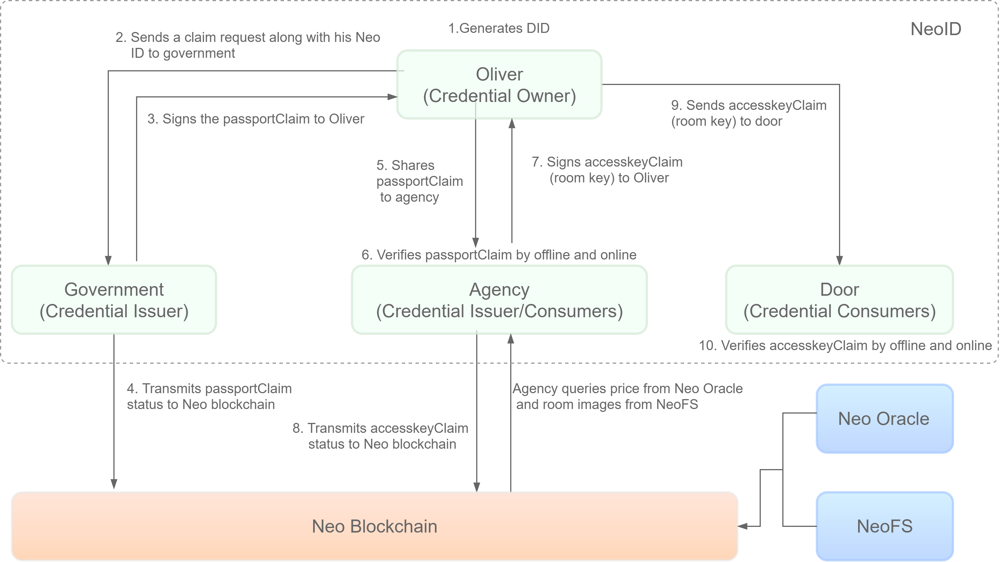

As shown in above figure, this demo involves the following major components:

- **NeoID**: 

  Decentralized identity tools provide much-needed solutions for user authentication in blockchain-based applications. 

  Neo ID allows users to create and manage decentralized identifiers, issue claims as a data verifier, users can tap into these verified credentials to gain access to applications without ever needing to share their private data, retaining full sovereignty and preventing its possible misuse.

  Here are the parties that are involved in the process.

  - `Credential owner` - has an Neo ID. This entity acquires a verifiable credential issued by another entity that is referred to as the credential issuer. 
  - `Credential issuer` - has an Neo ID. This entity issues credentials to endorse a target entity for certain qualifications or credentials. Credential issuers provide multi-dimensional authentication for entities that are part of the trust network. The authentication process and result are recorded on the Neo blockchain blockchain with data privacy protection. Credential issuers provide a standardized and credible authentication method for credential consumers to verify the credentials. Credential issuers play the role of a trust endorser.
  - `Credential consumers` - accept the user's verifiable credentials and initiate the credential verification process for the respective credentials. This includes many different scenarios, e.g., the employers who need to verify the interviewer's identity information/degree/industry skills. They play the role of trust buyer.

- **Neo Oracle**:

  Oracle is the system to obtain information from the external network off the blockchain. Oracle nodes in the Neo blockchain are required to separately verify the data fetched from the network to reach a consensus on the information retrieved from the outside world. In this way, the information retrieved is ensured for integrity. In our demo, the oracle is driven by a price-feeding smart contract, which launches oracle requests and record the responses.  

- **NeoFS**

  NeoFS is a distributed, decentralized object storage network. NeoFS nodes are organized in a peer-to-peer network that takes care of storing and distributing user's files. Any Neo user can participate in NeoFS network and get paid for providing storage resources to other users or store his data in NeoFS and pay a competitive price for it. Your files are stored as objects in containers created by you, and you can share your files in various ways. Images of public access is shared in this demo through an HTTP gateway, which responds the stored object with the given container ID and object ID. 

## Starting the dApp demo

The accommodation [Dapp](https://github.com/bettybao1209/Neo-ID) built on Neo blockchain is designed for the following usage scenario:

*Oliver* is looking for an accommodation. To make the reservation, the dApp requires Oliver to identify himself as an individual. Fortunately for Oliver, his *Government* has recently decided to implement a digital version of the national ID with the help of the Neo blockchain. Oliver needs to apply for a digital ID  by presenting his physical ID to a local authority. At the moment of booking, Oliver can identify himself to the dApp with his digital Passport. Once the identity is verified, the dApp issues an access key credential to Oliver. Among the other things, the access key contains a code that gives access to an automatic door to enter the accommodation. When Oliver arrives at his accommodation, he displays the booking confirmation to the *Door Lock*, an automatic door with a IoT device capable to verify Oliver's claim. Once the booking is verified, Oliver is finally able to enter the accommodation.

Now let's initialize the demo.

### Prerequisites

- [ ] Install the Neo node with the plugins [RpcServer](https://github.com/neo-project/neo-modules/releases/download/v3.0.0-rc3/RpcServer.zip) and [OracleService](https://github.com/neo-project/neo-modules/releases/download/v3.0.0-rc3/OracleService.zip). 

- [ ] Set up a private chain. Refer to [here](https://docs.neo.org/docs/en-us/node/cli/setup.html).

- [ ] Deploy the contracts [seraph-id-smart-contracts](https://github.com/neo-ngd/seraph-id-smart-contracts) and [PriceFeedsService](https://github.com/bettybao1209/PriceFeedsService). Refer to [here](https://docs.neo.org/docs/zh-cn/develop/deploy/deploy.html).

- [ ] Deploy [NeoFS node](https://github.com/nspcc-dev/neofs-node) 

  :::note
  NeoFS may need a proxy to solve the CORS problem.
  :::
  
- [ ] Set up the Oracle role, as follows:

  ```
  invoke 0x49cf4e5378ffcd4dec034fd98a174c5491e395e2 designateAsRole [{"type":"Integer","value":"8"},{"type":"Array","value":[{"type":"PublicKey","value":"YOUR ORACLE PUBLICKEYS"}]}] [invoker] [invoker_signature + consensus_signature]
  ```

  `0x49cf4e5378ffcd4dec034fd98a174c5491e395e2` is the contract hash of `NativeContract`.

### Building the dApp

Get the source code of the dapp demo from [Github](https://github.com/bettybao1209/Neo-ID). 

According to your private chain settings, modify the necessary parameters in the ` seraph-id-sdk/src/__tests__/test-data.json` file:  

```json
{
  "neoRpcUrl": "http://localhost:10332",
  "magic":5195086,
  "neoscanUrl": "http://localhost:4000/api/main_net",
  "network": "PrivateNet",
  "issuerScriptHash": "0x9f1bcc1c5c7dae36e6ea60c8c47068e0b1e85484",
  "issuerName": "SeraphID Issuer",
  "issuerDID": "did:neoid:priv:0x9f1bcc1c5c7dae36e6ea60c8c47068e0b1e85484",
  "issuerPublicKeys": ["03b1e60e7d8a751092a8e36b1b95cb0cb64b44f2c82668749e9a4e3f16ff0b138c"],
  "issuerPrivateKey": "KwoCZzfMoL3E7shgb3nPGXNTFYdALwfHt5NCVmQc7xF2hL5YVrfG",
  "existingSchema": {
    "name": "TestSchema",
    "attributes": [
      "firstName",
      "lastName",
      "age"
    ],
    "revokable": true
  },
  "claimAttributes": {
    "firstName": "Betty",
    "lastName": "Bao",
    "age": 30
  },
  "rotName": "SeraphID Trust Anchor",
  "rotDID": "did:neoid:priv:0xae2a7da19dee59c9973c81af367ca1cec221062e",
  "rotPrivateKey": "KwoCZzfMoL3E7shgb3nPGXNTFYdALwfHt5NCVmQc7xF2hL5YVrfG",
  "rotScriptHash": "0xae2a7da19dee59c9973c81af367ca1cec221062e",
  "walletName": "1.json",
  "walletPassword": "123",
  "walletOwnerPrivateKey": "KwoCZzfMoL3E7shgb3nPGXNTFYdALwfHt5NCVmQc7xF2hL5YVrfG",
  "ownerDID": "did:neoid:priv:NTfrPyZSGdBJs1yi3pUYhdWRdGY8pVSnFp",
  "timeToWaitForBlockConfirmation": 15000,
  "addedAdminKey": "03b1e60e7d8a751092a8e36b1b95cb0cb64b44f2c82668749e9a4e3f16ff0b138c"
}

```

 Modify the ` seraph-id-demo\demo\src\configs.ts` file as well:

```
import { DIDNetwork } from '@sbc/seraph-id-sdk'

export const NEO_RPC_URL = 'http://seed1t.neo.org:20332';
export const DID_NETWORK = DIDNetwork.TestNet;

export const GOVERNMENT_SCRIPT_HASH = '0xcdec7e3c578f6d9e5f0fc48368b69f5e3759c635';
export const AGENCY_SCRIPT_HASH = '0xcdec7e3c578f6d9e5f0fc48368b69f5e3759c635';

export const GOVERNMENT_ISSUER_PRIVATE_KEY = 'KwgorFpHTbfwCko4ZJ5dZ7Xt1heCJHsscKy3m36Du6bVrbpuSAup';
export const AGENCY_ISSUER_PRIVATE_KEY = 'KwgorFpHTbfwCko4ZJ5dZ7Xt1heCJHsscKy3m36Du6bVrbpuSAup';
export const FLAT_WALLET_ADDRESS = '0x5a4e405ed7fb167569199c46758105ecedd654f7';  

export const PRICE_FEED_SERVICE = '0x89d9839aa840a0bc55b64501faeac3ab037f471d';
export const OKEX_PROVIDER = '0x9a2a4fe4aef9453edb5b735792c5aac99bfedeb0';

export const CONTAINER_ID = 'AssBPkHiryqgSf5j96hje6rS2QJ8PMEkJx34iCXZWbsP';
export const OBJECT_ID1 = 'CWG5gTFYyAeFUQwj8XAHkMttk9z9fbn5sBJqN97LAvVF';
export const OBJECT_ID2 = '9FYG3a93v4tycaCc7w4QnnbM1EyDndNTGFB3QHoBs1oT';
export const OBJECT_ID3 = 'F9Z8NNx76drdzqufXc136dV8q1qxpXKkJvVNj3P1a72p';
export const OBJECT_ID4 = 'EFT77HCB8xMXCUyaDPBVvakJbEcu6SZXNcHNFbWogm5g';
export const OBJECT_ID5 = '6QGyCDfAV99fDMbMbc8Mv9EiNy57SrKHTE314LS5Ymmw';
export const OBJECT_ID6 = 'AaszehhYEUrc7ePGiGD8kYXjo3b6i8mJb8ZDsAactWL2';

export const PASSPORT_SCHEMA_NAME = 'Passport1';
export const ACCESS_KEY_SCHEMA_NAME = 'AccessKey1';
export const MAGIC = 844378958;

```

- `PRICE_FEED_SERVICE`: the contract hash PriceManager.

- `OKEX_PROVIDER:` the contract hash OkexProvider .
- `CONTAINER_ID:`  the container ID of NeoFS.
- `OBJECT_ID1-6:`  the hash of images stored Neo FS.

```
cd demo
npm install
cd ../
ts-node bootstrap/bootstrap.ts
cd demo
yarn start
```

When the demo is started successfully, visit http://localhost:3000/ to experience it.

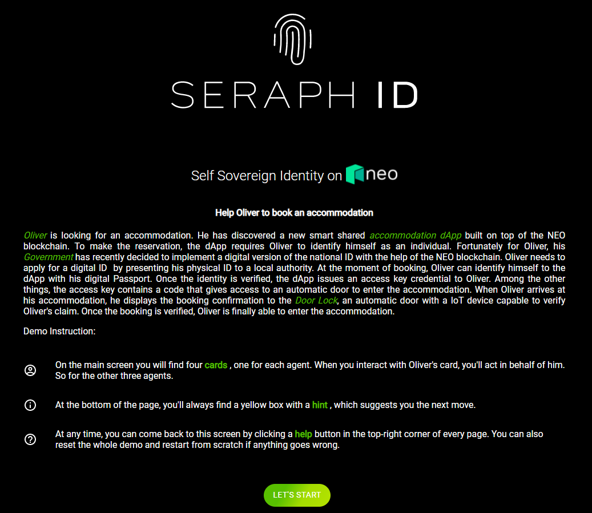

## Demonstrating the dApp

In the demo, we will play the role of four distinct network participants to demonstrate the use of the digital identity system from the following perspectives:

- A normal user named Oliver who generates a decentralized identifier, applies for credentials, then books and accesses the chosen accommodation
- A government entity that will issue verifiable credentials to Oliver
- An accommodation agency that will verify credentials and issue an access key
- An IoT-enabled smart door lock that will allow entry to the accommodation after verifying the access key

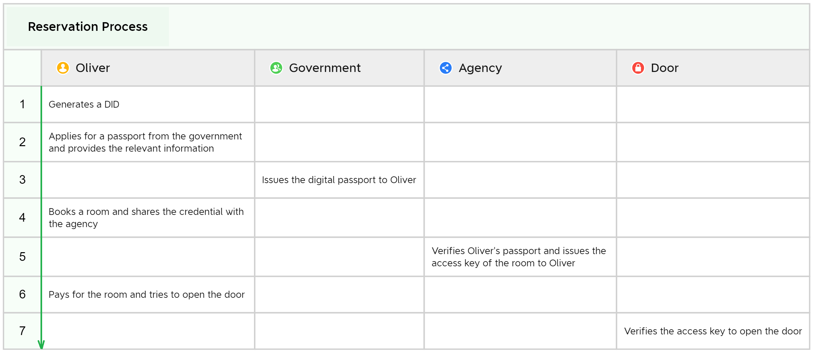

In the following sections we will walk through the reservation process and explain the related codes behind.

### 1. Generate DID

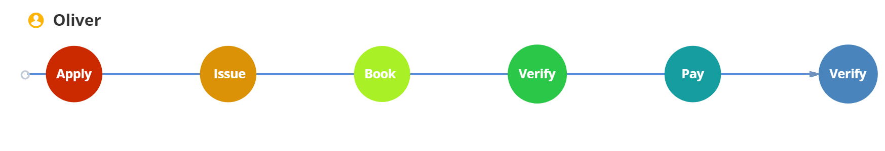

In Oliver's card, click the button to generate a DID. At this time the dApp connects with the [Neoline wallet](https://neoline.io/) accordingly. If your browser does not install the extension Neoline, it will switch to the installation page.

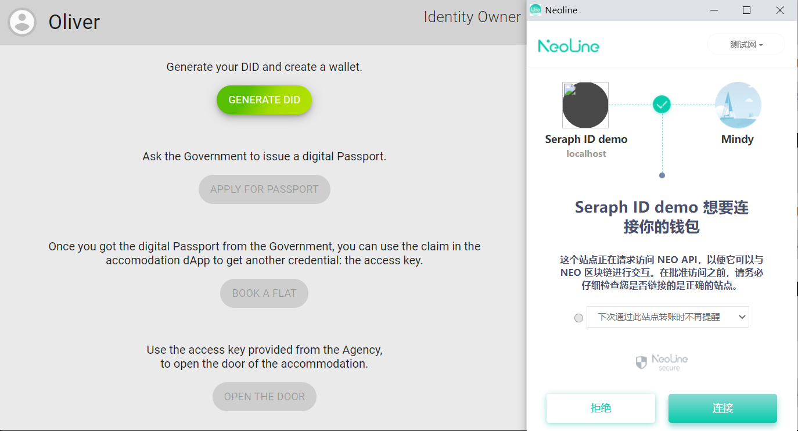

When DID is successfully generated, you can click on the icon   to see the generated DID. 

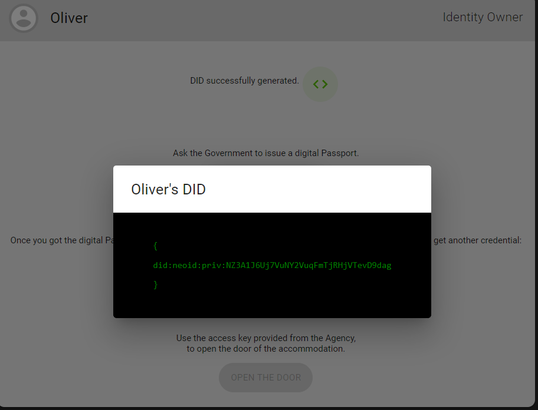

#### The codes

```typescript
// seraph-id-demo/demo/src/components/IdentityOwner/Owner.tsx
// Line 454
  generateDID = async (value: any) => {
   var neo3Dapi; 
        try{
             neo3Dapi=(await getNeoDapiInstances()).neo3Dapi;           
        }catch
        {
            alert("You have not installed the browser plugin \"neoline\". \nPlease run this demo in a chrome browser with the extension neoline installed.\nRedirecting to chrome webstore...");
            window.location.href = "https://neoline.io/";
        }
        
        const neo3Dapi = (await getNeoDapiInstances()).neo3Dapi;
        const { address, label } = await neo3Dapi.getAccount();
        console.log("address is: ", address);
        value.changeAction('demoOwnerDID', 'waiting');

        const did = this.props.ownerWallet.generateDID(configs.DID_NETWORK, address);
        localStorage.setItem('ownerDID', did);
        console.log('created DID', did);

        if (did) {
            value.changeAction('demoOwnerDID', 'success');
            value.nextTip(`Act as ${Agents.owner} and ask the digital Passport to the ${Agents.government}`);
        } else {
            value.changeAction('demoOwnerDID', 'failure');
            value.nextTip(`Error occurred while generating the DID. Please go back to the Help Page, click the reset button and try again!`);
        }

    }
```

### 2. Apply for a passport

Click on `APPLY FOR PASSPORT` to go to the government's website.

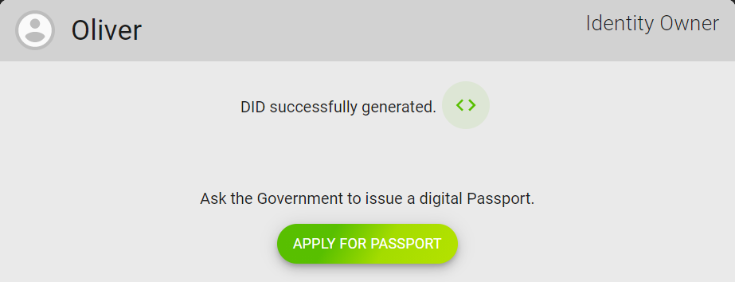

Fill in Oliver's information which can be fictitious in this demo. Note that our agency requires the flat borrower to be at least 17 years old.

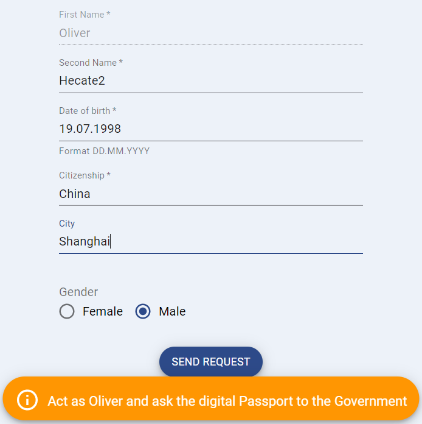

#### The codes

The button `SEND REQUEST` invokes the following codes:

```typescript
// seraph-id-demo/demo/src/containers/GovernmentPage/GovernmentPage.tsx
// Line 195
                    {this.getFormValidation() ? (
                        <div className="GetCredentialsButton">
                            <Fab onClick={() => this.getCredentials(value)} variant="extended" color="secondary"> Send Request </Fab>
                        </div>
```

```typescript
// seraph-id-demo/demo/src/containers/GovernmentPage/GovernmentPage.tsx
// Line 341
    getCredentials = (value: any) => {

        value.changeAction('govPageAsOwner', 'askForCredentials');

        setTimeout(() => {
            value.nextTip(`Play as ${Agents.government} to issue credentials to ${Agents.owner}`);

            value.changeAction('govPageAsOwner', 'waitingForCredentials');
            value.changeAction('demoOwnerCredFromGov', 'waiting');
            value.changeAction('demoGov', 'pendingRequest');
            value.changeAction('govPageAsGov', 'pendingRequest');

        }, 3000);
    }
```

Till now the codes do not really affect the operations on the blockchain. We just simulated Oliver's application for passport with the browser's local storage (using Oliver's DID and the personal information you filled in the form). In the next step, the government will issue a passport by signing a claim on the Neo blockchain, asserting that Oliver's personal information is acknowledged by the government. 

### 3. Issue the passport

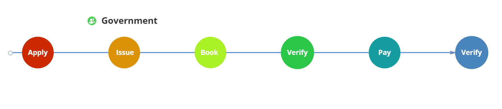

Now let's switch the role and play as the government, who is an issuer of credentials. Click `GO TO GOVERNMENT Webpage` in the government card, and check Oliver's passport application.


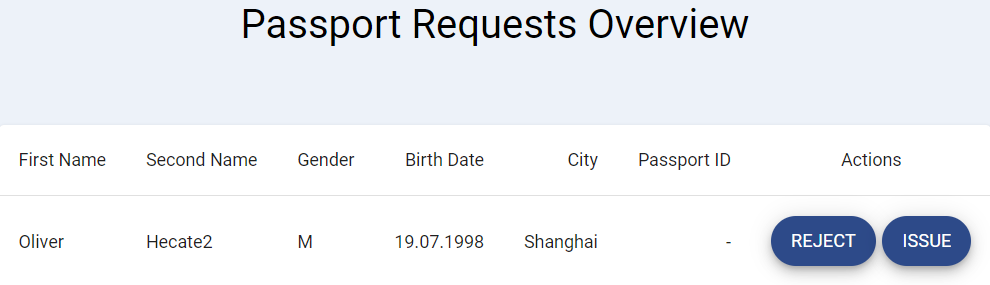

Click `ISSUE` to confirm that Oliver's personal information is correct, and issue the passport. 

#### The codes

The issue action is implemented by the following codes:

```typescript
// seraph-id-demo/demo/src/containers/GovernmentPage/GovernmentPage.tsx
// Line 263
                <div>
                    <PassportRequests
                        activeRequest={request}
                        denied={() => this.doNotIssueCredential(value)}
                        issued={() => this.issueCredential(value, request)}
                    />
                </div>
```

##### issueCredential

The function `issueCredential` operates on the blockchain, using `seraph-id-sdk`.

```typescript
// seraph-id-demo/demo/src/containers/GovernmentPage/GovernmentPage.tsx
// Line 356
    issueCredential = (value: any, request: PassportReq) => {

        value.changeAction('govPageAsGov', 'issuing');
        const govIssuer = new SeraphIDIssuer(configs.GOVERNMENT_SCRIPT_HASH, configs.NEO_RPC_URL, configs.DID_NETWORK, configs.MAGIC)
        const ownerDID = localStorage.getItem('ownerDID');

        const claimID = uuid();
        const newClaim = govIssuer.createClaim(claimID, configs.PASSPORT_SCHEMA_NAME,
            {
                'idNumber': 'J12393496',
                'firstName': request.firstName,
                'secondName': request.secondName,
                'birthDate': request.birthDate,
                'citizenship': request.citizenship,
                'address': request.address,
                'gender': request.gender
            }, ownerDID ? ownerDID : '');

        console.log('new created Claim', newClaim);
        govIssuer.issueClaim(newClaim, configs.GOVERNMENT_ISSUER_PRIVATE_KEY).then(
            res => {
                setTimeout(() => {
                    console.log('issueClaimID RES', res.id);

                    try {
                        this.props.ownerWallet.addClaim(res);
                        const addedClaim = this.props.ownerWallet.getClaim(res.id);
                        console.log('claim Added to the Wallet: ', addedClaim);

                        localStorage.setItem('passportClaimID', res.id);
                        localStorage.setItem('passportClaim', JSON.stringify(res));

                        value.changeAction('agencyPageAsOwner', 'toChooseAFlat');
                        value.nextTip(`Play as ${Agents.owner} and choose an accommodation from the ${Agents.smartAgency} Web Page.`);

                        value.changeAction('govPageAsOwner', 'success');
                        value.changeAction('demoOwnerCredFromGov', 'success');
                        value.changeAction('demoGov', 'credIssued');
                        value.changeAction('govPageAsGov', 'credIssued');
                    }
                    catch (err) {
                        console.error('issueClaim ERR', err);
                        this.handleCredIssuingError(value);
                    }
                }, 2000);
            }
        ).catch(err => {
            console.error('issueClaim ERR', err);
            this.handleCredIssuingError(value);
        });
    }
```

##### govIssuer.issueClaim & ownerWallet.addClaim

Now let's take a look at the core operations `govIssuer.issueClaim` and `ownerWallet.addClaim ` (see the codes below). 

Using `issueClaim`, the government first checks that the claim has a proper structure that fits the schema which has been registered before. The schema used here is a template for claims that only fits passports. 

Then, the government puts its digital ID (DID) into the claim, signs the claim with the government's private key, and finally inject the claim ID (that can potentially be revoked) into an issuer-contract (The function `injectClaim` at line 161 in `seraph-id-sdk/src/issuer-contract.ts`). 

To summarize, `issueClaim` helps the government register and sign a claim, store the claim ID on the blockchain, and return all the information about the claim. 

```typescript
// seraph-id-sdk/src/issuer.ts
// Line 102
  public async issueClaim(
    claim: IClaim,
    issuerPrivateKey: string,
    gas?: number,
  ): Promise<IClaim> {
    let result: IClaim = await this.validateClaimStructure(claim);
    result.issuerDID =  this.contract.getIssuerDID();
    result = await this.signClaim(claim, issuerPrivateKey);
    result.tx = await this.contract.injectClaim(claim.id, issuerPrivateKey, gas);
    // this.contract is a SeraphIDIssuerContract object
    // which had been initialized in seraph-id-sdk/src/verifier.ts
    return result;
  }
```

An important point is that, the `result` returned by `issueClaim` contains all the information about Oliver, and **cannot be modified by people who do not have the government's private key** (otherwise the signature from the government would be invalid). In this way, Oliver can take the claim `result` as his passport. 

On the Neo blockchain, only the ID and the validity (whether it has been revoked by the government) of the claim is stored:

```typescript
// seraph-id-smart-contracts/Issuer/Issuer.cs
// Line 87
        public static bool InjectClaim(string id)
        {
            if (!IsCalledByAdmin()) throw new Exception("Only SmartContract admin can call this operation");

            ClaimStatus status = ByteArray2ClaimStatus((byte[])Claims.Get(id));

            if (status != ClaimStatus.Nonexistent) throw new Exception("Claim already exists");

            Claims.Put(id, (ByteString)ClaimStatus2ByteArray(ClaimStatus.Valid));

            return true;
        }
```

Then the government should give the claim to Oliver's wallet for later use. This is implemented with the off-chain function `ownerWallet.addClaim`. Note that we do not put the claim directly in the wallet. Instead, we find Oliver's DID in his wallet, and attach the claim to the DID. 

```typescript
// seraph-id-sdk/src/wallet.ts
// Line 90
  public addClaim(claim: IClaim) {
    const acc = this.accounts2[this.didMap[claim.ownerDID]];
    if (!acc) {
      throw new SeraphIDError(`DID account ${claim.ownerDID} is not a part of this wallet. Add account first.`);
    }
    // We have found the DID in Oliver's wallet, and we actually add claim to the DID
    acc.addClaim(claim);  // This invokes seraph-id-sdk/src/account.ts
  }
```

```typescript
// seraph-id-sdk/src/account.ts
// Line 67
  public addClaim(claim: IClaim) {
    if (this.isLocked) {
      throw new SeraphIDError('Decrypt account before adding claims.');
    }
    if (!claim || !claim.id) {
      throw new SeraphIDError('This claim is invalid');
    }

    if (this.claims[claim.id]) {
      throw new SeraphIDError(`Claim with id ${claim.id} already exists`);
    }
    this.claims[claim.id] = claim;
  }
```

You must have noticed that the claim information given to Oliver's wallet is not stored on the blockchain. Remember that the government has already executed `govIssuer.issueClaim`, which can `injectClaim` to store the claim ID on the blockchain. Oliver just needs a piece of off-chain information, and others can find Oliver's passport claim ID and validity (whether revoked) on the chain. Meanwhile, the off-chain information is signed by the government, and Oliver does not know the private key of the government, so the claim information held by Oliver cannot be manipulated by Oliver for a fake identity. This is why the `result` returned by `issueClaim` can serve as a valid `passportClaim` for Oliver. 

### 4. Book a flat

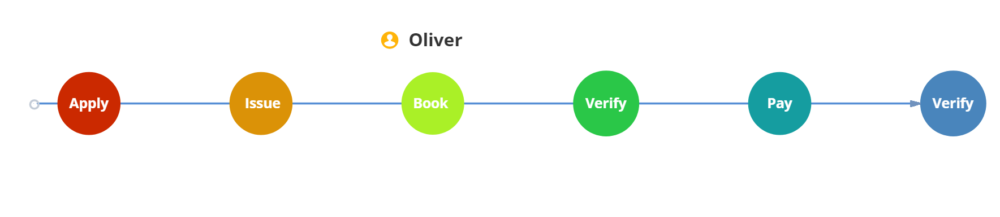

After the government successfully issued a credential, go back to the Oliver's card again and click `BOOK A FLAT` on the left. 

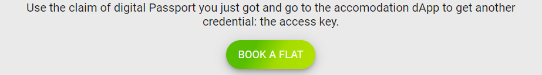

Feel free to book any flat, as long as you have enough GAS. In this page, the images of flats are loaded from HTTP gateways attached to NeoFS, and the prices are generated dynamically with Neo Oracle. The access to NeoFS is simply implemented with HTTP requests, which is not directly provided by the RPC service of Neo testnet. the URL to an image on NeoFS is consisted of the container ID and the object ID. On the other hand, the oracle is accessed through a price-feeder contract, and works by visiting public HTTP APIs on the Internet. The oracle nodes on the Neo blockchain must reach a consensus on the price to generate a valid oracle response. 


By clicking any `BOOK` button, your booking request is transmitted through the browser storage to the agency. Then click `SHARE CREDENTIAL`. You need to share Oliver's claim attached to his DID with the agency, so that the agency can read the digital passport issued by the government (returned from `issueClaim`) and check its validity (whether revoked) on the Neo blockchain. 

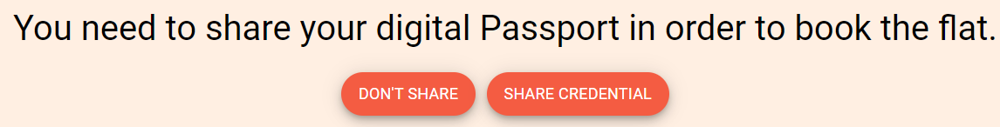

#### The codes

See the following codes that presents these flats:

```typescript
// seraph-id-demo/demo/src/components/FlatCards/FlatCards.tsx
// Line 42
    const topFlats: FlatCard[] = [
        { id: 1, pictureRef: configs.OBJECT_ID1, city: 'Florence', price: tokenPrice === 0 ? '' : GetTokenPrice(200, tokenPrice), rooms: 2, meters: 65, others: 'Bathtub' },
        { id: 2, pictureRef: configs.OBJECT_ID2, city: 'Beijing', price: tokenPrice === 0 ? '' : GetTokenPrice(280, tokenPrice), rooms: 3, meters: 110, others: 'Garden' },
        { id: 3, pictureRef: configs.OBJECT_ID3, city: 'New York', price: tokenPrice === 0 ? '' : GetTokenPrice(370, tokenPrice), rooms: 4, meters: 155, others: 'Terrace' },
    ];

    const bottomFlats: FlatCard[] = [
        { id: 4, pictureRef: configs.OBJECT_ID4, city: 'Paris', price: tokenPrice === 0 ? '' : GetTokenPrice(195, tokenPrice), rooms: 2, meters: 54, others: 'Position' },
        { id: 5, pictureRef: configs.OBJECT_ID5, city: 'Zürich', price: tokenPrice === 0 ? '' : GetTokenPrice(450, tokenPrice), rooms: 5, meters: 240, others: 'Magnific view' },
        { id: 6, pictureRef: configs.OBJECT_ID6, city: 'Madrid', price: tokenPrice === 0 ? '' : GetTokenPrice(210, tokenPrice), rooms: 2, meters: 80, others: 'Pool' },
    ];
```

```typescript
// utilizing Neo oracle to generate price
// seraph-id-demo/demo/src/components/FlatCards/FlatCards.tsx
// Line 35
        async function getPriceFunc(){
            let response = await pricefeed.getPrice();
            setPrice(response);
        }
```

```typescript
// utilizing NeoFS to present images of flats
// seraph-id-demo/demo/src/components/FlatCards/FlatCards.tsx
// Line 154
    fetch('http://172.168.3.42:4030/get/'+ configs.CONTAINER_ID + '/' + imageRef)
        .then(response => response.blob())
        .then(image => {
            // Create a local URL of that image
            const localUrl = URL.createObjectURL(image);
            setImageData(localUrl);
        });
```

See the following codes that implement `Share Credential`:

```typescript
// seraph-id-demo/demo/src/containers/AccommodationDapp/AccommodationDapp.tsx
// Line 275
                <div className="PageContainer">
                    <h1> You need to share your digital Passport in order to book the flat. </h1>
                    <Fab variant="extended" style={this.style} onClick={() => { this.doNotShareCredentials(value) }}> Don't Share </Fab>
                    <Fab variant="extended" style={this.style} className="RightButton" onClick={() => { this.shareCredentials(value) }}> Share credential </Fab>
                </div>
```

```typescript
// seraph-id-demo/demo/src/containers/AccommodationDapp/AccommodationDapp.tsx
// Line 133
    shareCredentials = (value: any) => {

        value.changeAction('agencyPageAsOwner', 'sharingCredentials');

        const passportClaimID = localStorage.getItem('passportClaimID');
        if (passportClaimID) {
            const passportClaim = this.props.ownerWallet.getClaim(passportClaimID);

            if (passportClaim) {
                value.passportClaim = passportClaim;

                console.log('passport Claim from Owner Wallet', passportClaim);

                value.nextTip(`As ${Agents.smartAgency}, you need to verify the identity of ${Agents.owner} from your Web Page`);

                value.changeAction('agencyPageAsOwner', 'waitingForValidation');
                value.changeAction('agencyPageAsAgency', 'pendingRequest');
                value.changeAction('demoOwnerCredFromAgency', 'waiting');
                value.changeAction('demoAgency', 'pendingRequest');

            } else {
                value.changeAction('agencyPageAsOwner', 'digitalIdentityNotFound');
            }
        } else {
            value.changeAction('agencyPageAsOwner', 'digitalIdentityNotFound');
        }

    }
```

The core operation is `getClaim`, which is off-chain. 

```typescript
// seraph-id-sdk/src/wallet.ts
// Line 104
  public getClaim(claimId: string): IClaim | undefined {
    for (const acc of this.accounts2) {
      var claim = acc.getClaim(claimId);  // invokes seraph-id-sdk/src/account.ts
      if (claim) return claim;
    }
  }
```

```typescript
// seraph-id-sdk/src/account.ts
// Line 67
  public addClaim(claim: IClaim) {
    if (this.isLocked) {
      throw new SeraphIDError('Decrypt account before adding claims.');
    }
    if (!claim || !claim.id) {
      throw new SeraphIDError('This claim is invalid');
    }

    if (this.claims[claim.id]) {
      throw new SeraphIDError(`Claim with id ${claim.id} already exists`);
    }
    this.claims[claim.id] = claim;
  }
```

With Oliver's off-chain claim, the agency should get Oliver's passport claim injected on the blockchain. 

### 5. Verify Oliver's passport

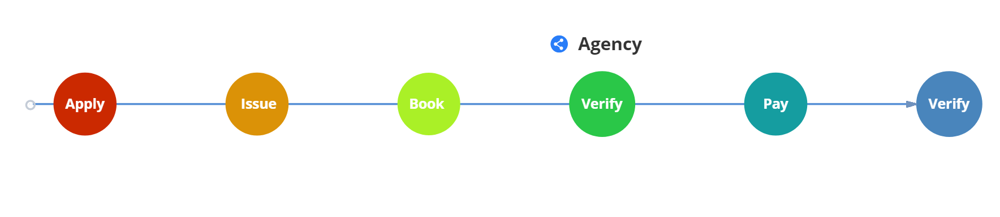

Now the agency has got Oliver's shared off-chain information `passportClaim`, let's move on to play as the agency to verify Oliver's passport. In this demo, the agency is both a consumer and an issuer of credentials, and in this step, it is consuming the credential issued by the government. 

1. In the agency card, click `GO TO ACCOMMODATION DAPP` on the right. 

   What the agency actually do is getting the claim issued by the government on the blockchain according to the information provided by Oliver. 

   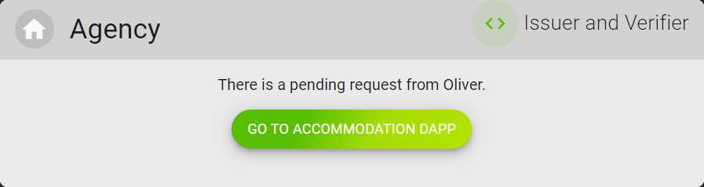

2. Click `VERIFY PASSPORT` to check the passport claim obtained from Oliver. 

   The agency will verify the credential in terms of the validity of the signature and criterions issued by the agency itself. See [codes related to step 2](#related-to-step-2).

   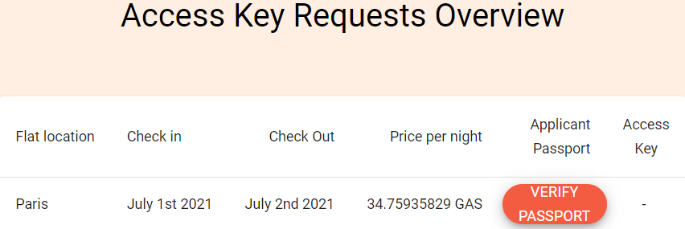

3. When the verification is passed, click `ISSUE` to issue the access key to Oliver. See [codes related to step 3](#related-to-step-3)

   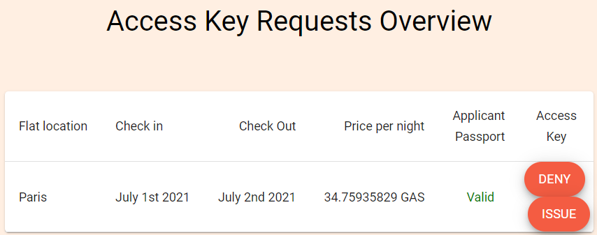

#### The codes

Let's dive into the codes behind step 2 and step 3 to figure out the logic of credential verification process.

##### Related to step 2

The following codes implements the `Verify Passport` action:

```typescript
// seraph-id-demo/demo/src/containers/AccommodationDapp/AccommodationDapp.tsx
// Line 341
        else if (value.actions.agencyPageAsAgency === 'pendingRequest') {
            return (
                <div>
                    <AccessKeyRequests
                        activeRequest={new AccessKeyReq(0, city ? city : '', checkIn, checkOut, price ? price : '', PassportStatus.toVerify, AccessKeyStatus.waitingForPassport)}
                        verified={() => this.verifyDigitalIdentity(value)}
                    />
                </div>
            ......
// function AccessKeyRequests at seraph-id-demo/demo/src/components/AccessKeyRequests/AccessKeyRequests.tsx
```

```typescript
// seraph-id-demo/demo/src/containers/AccommodationDapp/AccommodationDapp.tsx
// Line 51
    verifyDigitalIdentity = (value: any) => {

        value.changeAction('agencyPageAsAgency', 'verifying');

        const agencyVerifier = new SeraphIDVerifier(configs.GOVERNMENT_SCRIPT_HASH, configs.NEO_RPC_URL, configs.DID_NETWORK, configs.MAGIC);
        const passportClaim = value.passportClaim;
        ......
// Line 61
        if (passportClaim) {
            agencyVerifier.validateClaim(passportClaim, (passportClaim) => this.passportValidationFunc(passportClaim)).then(
        ......
```

```typescript
// seraph-id-sdk/src/verifier.ts
// Line 84
  public async validateClaim(claim: IClaim, validate: (claim: IClaim) => boolean): Promise<boolean> {
    const now = new Date().getTime();
    const from = claim.validFrom ? claim.validFrom.getTime() : now;
    const to = claim.validTo ? claim.validTo.getTime() : now;

    return (
      from <= now &&
      now <= to &&
      (await this.verify(claim)) &&
      (await this.contract.isValidClaim(claim.id)) &&
      validate(claim)
    );
  }
```

In the off-chain function `this.verify` above, by examining the signature and the validity of the signature, the agency knows that the claim is issued by the government, and that the claim is not faked or illegally modified. Given that the agency lists the government's DID as a trusted credential issuer, the content of Oliver's `passportClaim` is acknowledged by the agency. 

Then, using the on-chain function `this.contract.isValidClaim`, the agency reads the validity (whether revoked) of the `passportClaim` ID. 

```c#
// seraph-id-smart-contracts/Issuer/Issuer.cs
// Line 121
        public static bool IsValidClaim(string id)
        {
            ClaimStatus status = ByteArray2ClaimStatus((byte[])Claims.Get(id));
            return status == ClaimStatus.Valid;
        }
```

Finally, by executing `validate` in `validateClaim` (which is actually `passportValidationFunc` provided by the agency), the agency actually executes the custom function `passportValidationFunc` to check some criterions issued by the agency itself. In this demo, we require that Oliver must be older than 17. 

```typescript
// seraph-id-demo/demo/src/containers/AccommodationDapp/AccommodationDapp.tsx
// Line 89
    passportValidationFunc = (passportClaim: any) => {
        let validated = false;
        const birthDate = passportClaim.attributes.birthDate;
        if (birthDate) {
            const birthYear = birthDate.slice(-4);
            const currentYear = new Date().getFullYear();
            if (currentYear - birthYear > 17) {
                validated = true;
            }
        }
        return validated;
    }
```

Now it has been confirmed by the agency that Oliver has valid passport, is older than 17, and is eligible to book a flat. 

##### Related to step 3

When clicking on `ISSUE`, an `accessKeyClaim` is issued by the agency. 

```typescript
// seraph-id-demo/demo/src/containers/AccommodationDapp/AccommodationDapp.tsx
// Line 341
        else if (value.actions.agencyPageAsAgency === 'digitalIdentityVerified') {
            return (
                <div>
                    <AccessKeyRequests
                        activeRequest={new AccessKeyReq(0, city ? city : '', checkIn, checkOut, price ? price : '', PassportStatus.valid, AccessKeyStatus.pending)}
                        issued={() => this.issueAccesskey(value)}
                        denied={() => this.doNotIssueAccesskey(value)}
                        ......
```

```typescript
// seraph-id-demo/demo/src/containers/AccommodationDapp/AccommodationDapp.tsx
// Line 199, in function issueAccesskey
        agencyIssuer.issueClaim(newClaim, configs.AGENCY_ISSUER_PRIVATE_KEY).then(
            res => {
                setTimeout(() => {
                    console.log('issueClaimID RES', res.id);

                    try {
                        this.props.ownerWallet.addClaim(res);
                        const addedClaim = this.props.ownerWallet.getClaim(res.id);
                        ......
```

```typescript
// seraph-id-sdk/src/issuer.ts
// Line 102
  public async issueClaim(
    claim: IClaim,
    issuerPrivateKey: string,
    gas?: number,
  ): Promise<IClaim> {
    let result: IClaim = await this.validateClaimStructure(claim);
    result.issuerDID =  this.contract.getIssuerDID();
    result = await this.signClaim(claim, issuerPrivateKey);
    result.tx = await this.contract.injectClaim(claim.id, issuerPrivateKey, gas);
    
    return result;
  }
```

```typescript
// seraph-id-sdk/src/account.ts
// Line 85
  public getClaim(claimId: string): IClaim | undefined {
    if (this.isLocked) {
      throw new SeraphIDError('Decrypt account first');
    }

    return this.claims[claimId];
  }
```

In this demo, your DID is related to your browser's context. **Even if you `Reset` the demo, the `passportClaim` issued by the government still remains attached to your DID (and also valid on the blockchain).** Only if you close your browser tab and re-open the demo can the `passportClaim` be deleted, so that your browser will generate a new DID of "Oliver" for you to play with the demo again. **If you just `Reset` the demo, you can still book a flat without a new passport issued from the government, because your previous `passportClaim` is still stored in the browser's context**. 

Another important aspect to mention is that, the validity of Oliver's `passportClaim` and his age (which should be over 17) is actually verified off the blockchain, only by the agency (for example, see the function `verifyOffline` at `seraph-id-sdk/src/verifier.ts`, line 64). This seems to be a centralized operation. However, let's pay special attention to the actual preconditions for the agency to issue Oliver's `accessKeyClaim`. Evidently, the only requirements for the `accessKeyClaim` are that `passportClaim` is valid (not revoked) and truly issued by the government, and that Oliver is old enough. Particularly, we do not need to let everyone, but only the agency to believe that the three fore mentioned conditions hold firm. Now that the raw data about Oliver's passport and personal information is signed by the government, the agency can certainly trust these raw data. Then, another hidden condition is that the agency trusts its own local computing environment and the codes in `seraph-id-sdk` (you can write your own codes if you do not really trust `seraph-id-sdk`). Therefore, all the results deduced from the agency's running codes can be trusted by the agency, without further on-chain operations. 

In other words, all the computation and storage on the blockchain is intended for consensus (common trust) among all the participants of the blockchain. When trust is needed only for a single participant, we do not have to spend extra GAS for consensus computation on the blockchain. 

### 6. Pay for the flat and try to open the door

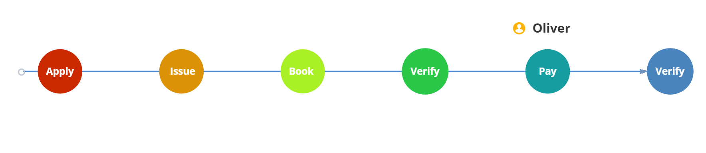

In Oliver's card click on "PAY THE FLAT" to transfer GAS to the accommodation dApp. 

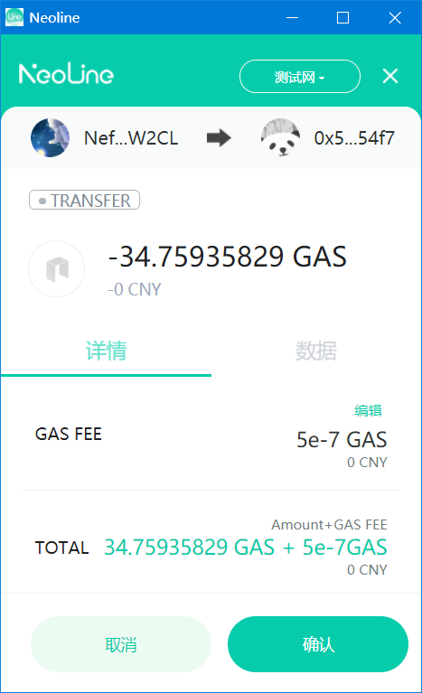

Then click "OPEN THE DOOR" on the bottom left to share the `accessKeyClaim` issued by the agency with the landlord.

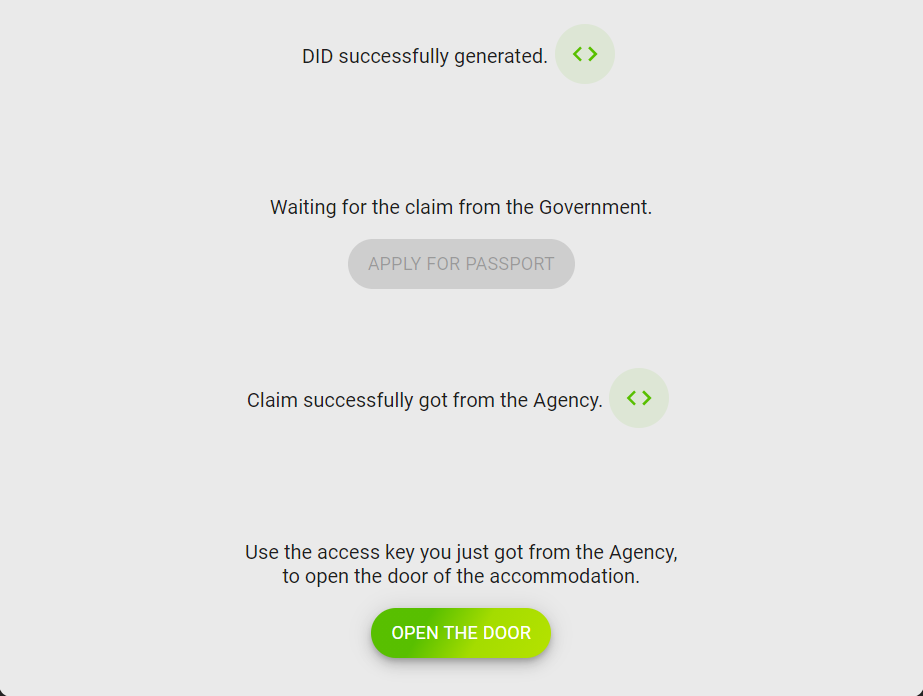

#### The codes

```typescript
// seraph-id-demo/demo/src/components/IdentityOwner/Owner.tsx
// Line 330
<Fab onClick={() => this.openDoor(value)} variant="extended" color="primary">
    {OWNER_DOOR_BTN_LABEL}
</Fab>
```

```typescript
// seraph-id-demo/demo/src/components/IdentityOwner/Owner.tsx
// Line 330
    openDoor = (value: any) => {

        value.changeAction('demoOwnerOpenDoor', 'sharingCredentials');

        const accessKeyClaimID = localStorage.getItem('accessKeyClaimID');
        console.log('accessKeyClaimID', accessKeyClaimID);
        if (accessKeyClaimID) {
            const accessKeyClaim = this.props.ownerWallet.getClaim(accessKeyClaimID);
```

### 7. Verify the access key

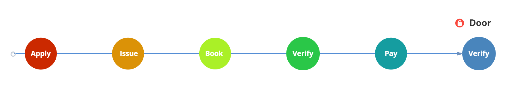

The door (owned by the landlord) is the consumer of the credential `accessKeyClaim` issued by the agency. Click `VERIFY ACCESS KEY` on the bottom right to let the door verify the claim:

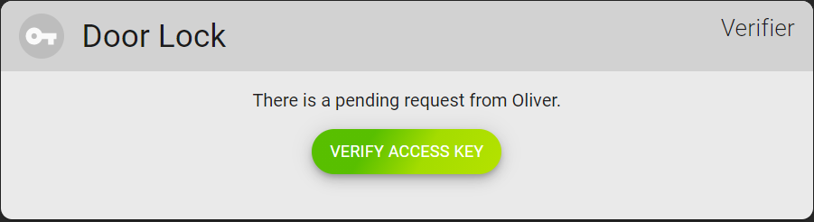

#### The codes

```typescript
// seraph-id-demo/demo/src/components/LandLord/LandLord.tsx
// Line 30
        } else if (value.actions.demoLandlord === 'pendingRequest') {
            return (
                <div>
                    <p> There is a pending request from {Agents.owner}. </p>
                    <div>
                        <Fab variant="extended" color="primary" onClick={() => verifyAccessKey(value)}> Verify Access Key </Fab>
                    </div>
                </div>
            );
```

```typescript
// seraph-id-demo/demo/src/components/LandLord/LandLord.tsx
// Line 66
    const verifyAccessKey = (value: any) => {

        value.changeAction('demoLandlord', 'verifying');

        const landLordVerifier = new SeraphIDVerifier(configs.AGENCY_SCRIPT_HASH, configs.NEO_RPC_URL, configs.DID_NETWORK, configs.MAGIC);
        const accessKeyClaim = value.accessKeyClaim;
        console.log('access key Claim to Verify: ', value.accessKeyClaim);

        if (accessKeyClaim) {

            landLordVerifier.validateClaim(accessKeyClaim, (accessKeyClaim) => { return true; }).then(
            ...
```

