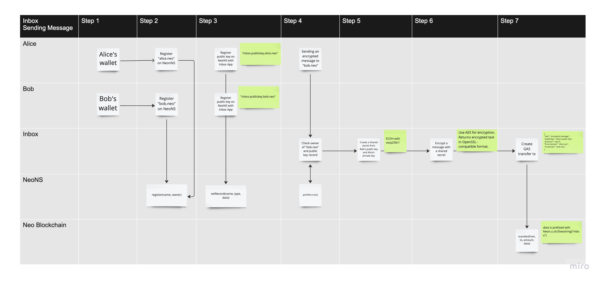
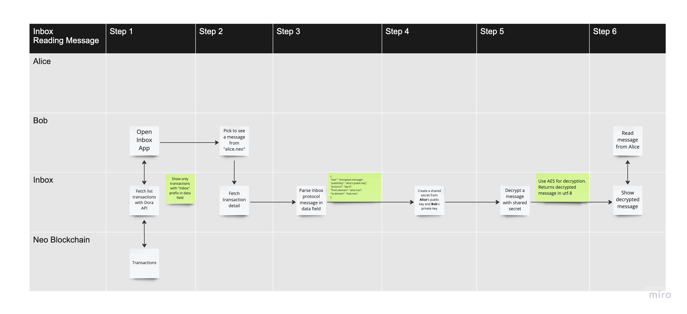

If you are familiar with ECDH, You know that you need to exchange public keys between two parties to generate a shared secret to encrypt and decrypt the data. Exchanging a public key relies on having a centralized server to store your public key and the ability to retreive it.

With the new NeoNS recently launched, one of a great features about NeoNS is the ability to add multiple records to your .neo domain. Similar to what you are doing with a normal web domain name. i.e. CNAME, TXT, IP, etc. 
And the best part about this is — It's **decentralized** and is available for you to use today!

Let's dive in on how NeoNS can help make storing public key and exchanging key easier.

Here is the flows explaining how it works.

Alice is sending Bob an encrypted message.   

Bob is reading a message from Alice.

First you need to set a record on you .neo domain with a [`setRecord`](/docs/n3/neons/api/setRecord) method. 

To retreive all records from a particular .neo domain, you will need [`getAllRecords`](/docs/n3/neons/api/getAllRecords) method.
Then you can check whether an owner of particular .neo domain has a public key registered in their records or not.

There you have it. Multiple records on NeoNS is a very powerful feature. Hope this can inspire you to build something!

You can read more about NeoNS API [here](/docs/n3/neons/index).

