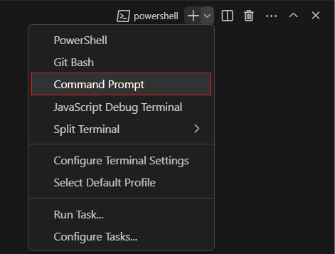
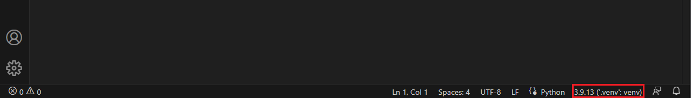
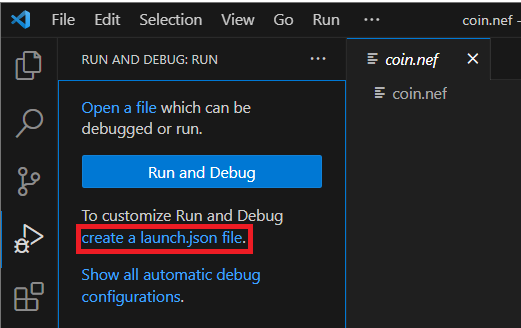

## 0. Introduction

This tutorial will show you how to create a fungible token using [Neo3-boa](https://github.com/CityOfZion/neo3-boa), the
tool to compile Python scripts into NeoVM compatible code. The token will be compliant with the NEP-17 standard.

### What is the NEP-17 Standard?

The [NEP-17 standard](https://github.com/neo-project/proposals/blob/master/nep-17.mediawiki) defines a set of rules that
a token contract must follow to be considered a valid fungible token on the Neo blockchain.
The standard defines methods, events and callbacks that the contract must implement. The NEP-17 standard is the
equivalent of the ERC-20 standard in Ethereum.

### Why follow a standard?

When a contract follows a standard, other contracts and applications can interact with it without having to know the
implementation details. This allows other developers to easily create interoperable contracts and applications.

## 1. Prerequisites

This tutorial assumes that you have [Python 3.7](https://www.python.org/) or any higher version,
[Visual Studio Code](https://code.visualstudio.com/), the
[Python VS Code extension](https://marketplace.visualstudio.com/items?itemName=ms-python.python) and the
[Neo Blockchain Toolkit VS Code extension](https://marketplace.visualstudio.com/items?itemName=ngd-seattle.neo-blockchain-toolkit)
installed and properly configured.

> To properly configure Neo Blockchain Toolkit you should follow their [tutorial](https://developers.neo.org/tutorials/2021/05/27/getting-started-with-the-neo-blockchain-toolkit).

## 2. Create a virtual environment using VS Code and install Neo3-boa

Create a new folder for your project and open it in VS Code, then create a file named `requirements.txt` and write
`neo3-boa==1.0.0` inside it.

Press `Ctrl+Shift+P` to open the Command Palette and type `Python: Create Environment`, select `Venv`, your Python
version, select the `requirements.txt` file, and press `Ok`, so that the virtual environment can be created.

Create a new terminal by pressing `Ctrl+Shift+P` and typing `Terminal: Create New Terminal`. You should see `(.venv)`
at the beginning of the terminal line. You'll only be able to compile your contract if the virtual environment is
active.

> Note: if you are using a powershell terminal you might get an error stating that
> the `Activate.ps1 cannot be loaded because running scripts is disabled on this system`, you can just use a cmd
> terminal instead by clicking on the **⌄** icon on right side of the **+** symbol on the terminal tab and selecting
> `Command Prompt`. If everything is alright you should see `(.venv)` at the beginning of the terminal line.
> 

Also, if you have a Python file open, you can check the lower right corner of VS Code to verify that the virtual environment
is active, and it's using Python 3.


## 3. Create the Coin contract file

Create a new file called `coin.py` and add the following method to indicate that a hundred million tokens will exist in
the contract:

```python
from boa3.builtin.compile_time import public

@public(name='totalSupply', safe=True)
def total_supply() -> int:
    return 10 ** 8
```

## 4. Compiling the contract

Open the VS Code terminal and run the following command to compile the contract:

```bash
neo3-boa compile coin.py --debug
```

Be sure to include the `--debug` flag to generate the debug information required by the Neo Blockchain Toolkit.

If the compilation is successful, you should see 3 new files:

- `coin.nef`: The contract binary file (bytecode);
- `coin.manifest.json`: The contract manifest file. This file is required to deploy the contract and is automatically
generated by the compiler alongside the nef.
- `coin.nefdbgnfo`: The debug information file. This file is required by the Neo Blockchain Toolkit to debug the contract.

## 5. Running the contract using the Neo Blockchain Toolkit

Click on the `.nef` or `.manifest.json` generated file and press `Ctrl+Shift+D` to open the Run and Debug panel.
Click on `create a launch.json file` and select `Neo Contract` as the environment.


This will generate a `.vscode/launch.json` file inside the project folder. Open the file and replace the `operation`
field value with `totalSupply`:

```json
...
"invocation": {
    "operation": "totalSupply",
    "args": []
}
...
```

Next, press `F5` to start debugging. The Neo Blockchain Toolkit will simulate a contract deploy so that you can invoke the
`totalSupply` method in a test environment. This environment will not be persisted after the debug session ends. So, if
you want to test a method that changes the contract storage, you will need to deploy the contract to a local neo-express
instance or the testnet.

Debugging the `totalSupply` method will not be very useful, but it's a good way to test if your environment is working
properly. After debugging, you should get a message on the debug console showing the GAS consumed and the return value of the method.

## 6. Contract Initialization

To test some methods that we will implement, having some data on the storage will be important. So we will save some
information on the storage when the contract is deployed.

Neo has some methods that are automatically called by the Virtual Machine, for example, there is the `_deploy` method
that is called whenever a contract is deployed or updated, and is often used in all kinds of smart contracts.

### _deploy

We will be using this method to initialize the contract storage, giving all tokens to the one who deployed the smart
contract. To do so, we will be using the `runtime.script_container` to get the script hash of the sender.

Then, save the sender as the owner of the whole total supply on the storage with the `storage.put` method. Our strategy
is to have the owner as the key and the quantity of tokens they own as the value of the storage.

```python
# update coin.py adding the following code:
from typing import Any
from boa3.builtin.contract import Nep17TransferEvent
from boa3.builtin.interop import runtime, storage
from boa3.builtin.interop.blockchain import Transaction


@public
def _deploy(data: Any, update: bool):
    # if the contract is being deployed for the first time, add all tokens to the contract deployer
    if not update:
        container: Transaction = runtime.script_container
        storage.put(container.sender, total_supply())

        # trigger the Transfer event to notify that the tokens were minted, it's a NEP-17 requirement
        # check out more about NEP-17 events here: https://github.com/neo-project/proposals/blob/master/nep-17.mediawiki#events
        Nep17TransferEvent(None, container.sender, total_supply())
```

Methods that start with an underscore are not callable by the user. In this example, the `_deploy` method is called
automatically when the contract is deployed.

## 7. NEP-17 Methods

The NEP-17 standard defines 5 mandatory methods that a token contract must implement:

### symbol

Returns the token symbol. In this example, we will return the string `COIN`.

```python
# update coin.py adding the following code:

@public(safe=True)
def symbol() -> str:
    return "COIN"
```

When writting methods that will be used by other contracts or users, you need to use the `public` decorator.
The `safe` parameter indicates that when calling the method it won't change the contract storage and can be safely
called by other contracts or users.

If you want to run one of the new methods that will be added, you need to recompile the smart contract using
Neo3-boa again and change the operation in the `.vscode/launch.json` file to the name of the method you want to run.

Strings returned by the contract are shown as a hex string by default, that's why if you try to run the test by just
changing the operation to `symbol`, the return is `434f494e` instead of `COIN`. But you can add the
[`"return-types"`](https://github.com/neo-project/neo-debugger/blob/master/docs/debug-config-reference.md#return-types)
configuration to cast it into a legible string.

```json
...
"invocation": {
    "operation": "symbol",
    "args": []
},
"return-types": [
    "string",
],
...
```

### decimals

Returns the number of decimals used by the token.
This is used to provide decimal precision when displaying token balances because Neo doesn't support floating types as
they are often unreliable. In this example, we will return **2**, but in a real situation you'd want a bigger decimal number.

```python
# update coin.py adding the following code:

@public(safe=True)
def decimals() -> int:
    return 2
```

### totalSupply

Returns the total supply of the token. We already implemented this method before, but, since we just defined that there will be
2 decimals, we need to multiply the supply by 10 ** 2.

```python
# update coin.py by overwriting the total_supply method with the following code:

@public(name='totalSupply', safe=True)
def total_supply() -> int:
    return (10 ** 8) * 10 ** decimals()
```

The `name` parameter is used to define how this method will be called. Since Neo's first supported languages were C#, VB.Net, F#,
Java, and Kotlin, the naming convention of the Neo standards methods is not snake_case. However, Neo3-boa allows you to write a
more pythonic code with snake_case methods as long as you add the `name` parameter to the `public` decorator when necessary.

### balanceOf

Returns the balance of a token for a specific address. Every token should be stored and linked to an address in the
contract storage, and to access the storage we will be using the `storage.get` method.

In this smart contract, we made it so that the key to accessing the number of tokens an address has is just the script hash
of the address (represented by the `UInt160` type).

The `storage.get` method returns a `bytes` value, so we need to convert it to an `int` before returning it.

```python
# update coin.py adding the following code:
from boa3.builtin.type import UInt160, helper as type_helper

@public(name='balanceOf', safe=True)
def balance_of(account: UInt160) -> int:
    assert len(account) == 20   # NEP-17 requires the address to be 20 bytes long

    amount_in_bytes = storage.get(account)
    return type_helper.to_int(amount_in_bytes)
```

To run methods that require parameters, you need to add the parameters to the `args` list in the `.vscode/launch.json`
file. For example, to run the `balanceOf` method, you need to add the address you want to check the balance of.
Since we didn't define [a signer](https://github.com/neo-project/neo-debugger/blob/master/docs/debug-config-reference.md#signers),
the account that will deploy the smart contract is `0x0000000000000000000000000000000000000000` and that is the
only account that will have a balance that is not zero.

```json
...
"invocation": {
    "operation": "balanceOf",
    "args": [ "0x0000000000000000000000000000000000000000" ]
},
...
```

### transfer

Transfers a number of tokens from the sender to the specified address, passing an optional data parameter.

We won't be using the data parameter in this example, but it's required by the NEP-17 standard. This method has a lot
of peculiarities detailed in the comments in the code below.

```python
# update coin.py adding the following code:

from boa3.builtin.interop import blockchain, contract

@public
def transfer(from_address: UInt160, to_address: UInt160, amount: int, data: Any) -> bool:
    # NEP-17 requires the address to be 20 bytes long
    assert len(from_address) == 20   
    assert len(to_address) == 20
    # it also requires the amount to be greater than or equal to 0
    assert amount >= 0

    tokens_sender = balance_of(from_address)
    tokens_receiver = balance_of(to_address)

    # to transfer tokens, the sender must be authenticated. 
    # We will use the `check_witness` method to verify that the sender is the owner of the tokens.
    if not runtime.check_witness(from_address):
        return False

    if tokens_sender < amount:
        return False

    # if `amount` is 0 or the sender is also the receiver, there is no need to change the storage
    if amount != 0 and from_address != to_address:
        # use the `storage.put` method to change the storage
        storage.put(from_address, type_helper.to_bytes(tokens_sender - amount))
        storage.put(to_address, type_helper.to_bytes(tokens_receiver + amount))
    
    # if the method succeeds, it must fire the Transfer event
    # check out more details here: https://github.com/neo-project/proposals/blob/master/nep-17.mediawiki#transfer-1
    Nep17TransferEvent(from_address, to_address, amount)
    # if the to_address is a smart contract, it must call the onNEP17Payment
    if blockchain.get_contract(to_address) is not None:
        contract.call_contract(to_address, 'onNEP17Payment', [from_address, amount, data])

    return True
```

Since the `transfer` method changes values on the storage, it can not be flagged as `safe`.

The `transfer` method is the most complex method of the NEP-17 standard. It's the method you should debug the most.
However, to reach the end of the function and return `True`, you need to pass through the `check_witness` function.
So, you can either add a [signer](https://github.com/neo-project/neo-debugger/blob/master/docs/debug-config-reference.md#signers)
when invoking or add a [runtime property](https://github.com/neo-project/neo-debugger/blob/master/docs/debug-config-reference.md#runtime)
to always return `True` when doing a `check_witness`.

In the example below, we are transfering 5.00 tokens from the `0x00000...` address to the `0x99999...` address.

```json
...
"invocation": {
    "operation": "transfer",
    "args": [
        "0x0000000000000000000000000000000000000000",
        "0x9999999999999999999999999999999999999999",
        500,
        null
    ]
},
"runtime": {
    "witnesses": {
        "check-result": true
    }
}
...
```

Since the debugger is just simulating an invocation, the changes made to the storage won't persist after the debug
session has ended. So, trying to check the balance of the `0x99999...` address later will not return `500`.

## 8. NEP-17 Callbacks

The NEP-17 standard defines a single callback called `onNEP17Payment` that must be called if the recipient is a contract.
This callback is used to notify the recipient that it has received tokens. It's up to the recipient to implement this
callback. The recipient can reject the transfer by raising an exception.

```python
# update coin.py adding the following code:
from boa3.builtin.contract import abort

@public(name='onNEP17Payment')
def on_nep17_payment(from_address: UInt160, amount: int, data: Any):
    abort()     # in this example, the smart contract is rejecting all transfers made to it
```

## 9. Manifest Metadata

Neo3-boa allows you to define the contract metadata using the `metadata` decorator. This information is used to generate
the contract manifest file. You can check the `coin.manifest.json` before and after adding the method to see the changes
made into the file.

In our example, we will define the contract name and the supported standards, but you can add any information you want
to. We are also adding permissions to allow our contract to call the `onNEP17Payment` method. The compiler automatically
does this step, but it's a good practice to define the permissions in the contract code.

```python
from boa3.builtin.compile_time import metadata, NeoMetadata

@metadata
def manifest_metadata() -> NeoMetadata:
    meta = NeoMetadata()
    meta.name = 'Coin Contract'
    meta.supported_standards = ['NEP-17']
    meta.add_permission(methods=['onNEP17Payment'])
    return meta
```

## 10. Other examples

Check out this [simple NEP-17](https://github.com/CityOfZion/neo3-boa/blob/v1.0.0/boa3_test/examples/simple_nep17.py)
example to see a smart contract that is as simple as the one in this example, but is more cohesive and uses some more
features in its implementation.

Also, check out this [more complex NEP-17](https://github.com/CityOfZion/neo3-boa/blob/v1.0.0/boa3_test/examples/nep17.py)
example to examine a smart contract that can also mint and burn tokens.

## 11. What's next

To test your smart contract in a more realist environment, you might want to create a private network with neo-express
and deploy your smart contract into it, or deploy your smart contract into a testnet.
