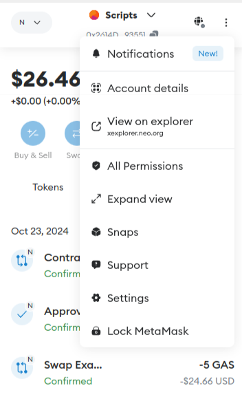
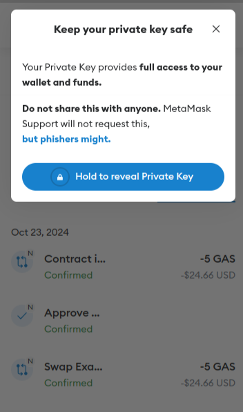
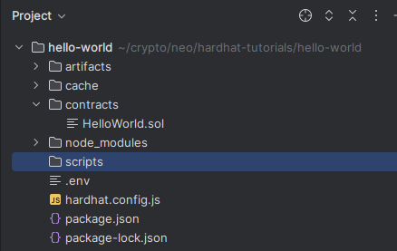

If you are new to blockchain development and don’t know where to start, or if you just want to understand how to deploy and interact with smart contracts on NeoX blockchain,
this guide is for you. We will walk through creating and deploying a simple smart contract on the NeoX test network using a virtual wallet ([Metamask](https://metamask.io/)),
[Solidity](https://docs.soliditylang.org/en/v0.8.0/) and [Hardhat](https://hardhat.org/)
(don’t worry if you don’t understand what any of this means yet, we will explain it!).

## Step 1: Get you NeoX private key on Metamask

First we will need a private key to interact with NeoX testnet chain. If you are using Metamask It's really simple just do
as follow.

Go on `Account details` on our Metamask wallet.


Then enter your password and click on `Hold to reveal Private Key`.


## Step 2: Use faucet to get some testnet tokens

You have 2 options to get some NeoX testnet tokens:

- You can claim It on the [NeoX faucet website](https://neoxwish.ngd.network/)
- Or you can join [NeoX Discord server](https://discord.gg/neosmarteconomy) and go to the `#dev-resources` channel to interact
  with the faucet bot

You can then verify your balance by connectiong on [NeoX testnet explorer](https://xt4scan.ngd.network/)

## Step3: Initialize your project

First, we'll need to create a folder for our project. Navigate to your command line and input the following.

```
mkdir hello-world./assets
cd hello-world
```

Now that you are inside your project folder, you will use npm init to initialize the project.

If you don’t have npm installed yet, [follow these instructions to install Node.js and npm](https://docs.npmjs.com/downloading-and-installing-node-js-and-npm).

Now you are ready to initialize your project just type `npm init` and fill information. Here is what we choose for our test:

```
package name: (hello-world)
version: (1.0.0)
description: My Neox Hello World contract
entry point: (index.js)
test command:
git repository:
keywords:
author: NeoDashboard
license: (ISC)
About to write to /home/valentin/crypto/neo/hardhat-tutorials/hello-world/package.json:

{
  "name": "hello-world",
  "version": "1.0.0",
  "description": "My Neox Hello World contract",
  "main": "index.js",
  "scripts": {
    "test": "echo \"Error: no test specified\" && exit 1"
  },
  "author": "NeoDashboard",
  "license": "ISC"
}


Is this OK? (yes)
```

## Step 4: Install Hardhat

We will use Hardhat to compile, deploy, test, and debug our Neox smart contract. To install It type this command `npm install --save-dev hardhat` inside your hello-world project.

Once It's done we will create the Hardhat project by running this command `npx hardhat` (choose `create an empty hardhat.config.js` option for this tutorial).

This step will generate a `hardhat.config.js` file in the project. We'll use this later in the tutorial to specify the setup for our project.

## Step 5: Write your contract

We will start by creating a `contracts` folder on our projects. This is the folder that will contain our contract files.

We will now add the following `HelloWorld.sol` file in this contracts folder:

```sol filename="HelloWorld.sol"
// SPDX-License-Identifier: MIT
// Specifies the version of Solidity, using semantic versioning.
// Learn more: https://solidity.readthedocs.io/en/v0.5.10/layout-of-source-files.html#pragma
pragma solidity >=0.7.3;
// Defines a contract named `HelloWorld`.
// A contract is a collection of functions and data (its state). Once deployed, a contract resides at a specific address on the Ethereum blockchain. Learn more: https://solidity.readthedocs.io/en/v0.5.10/structure-of-a-contract.html
contract HelloWorld {
   //Emitted when update function is called
   //Smart contract events are a way for your contract to communicate that something happened on the blockchain to your app front-end, which can be 'listening' for certain events and take action when they happen.
   event UpdatedMessages(string oldStr, string newStr);
   // Declares a state variable `message` of type `string`.
   // State variables are variables whose values are permanently stored in contract storage. The keyword `public` makes variables accessible from outside a contract and creates a function that other contracts or clients can call to access the value.
   string public message;
   // Similar to many class-based object-oriented languages, a constructor is a special function that is only executed upon contract creation.
   // Constructors are used to initialize the contract's data. Learn more:https://solidity.readthedocs.io/en/v0.5.10/contracts.html#constructors
   constructor(string memory initMessage) {
      // Accepts a string argument `initMessage` and sets the value into the contract's `message` storage variable.
      message = initMessage;
   }
   // A public function that accepts a string argument and updates the `message` storage variable.
   function update(string memory newMessage) public {
      string memory oldMsg = message;
      message = newMessage;
      emit UpdatedMessages(oldMsg, newMessage);
   }
}
```

This is a basic smart contract that stores a message upon creation. It can be updated by calling the update function and emits an event
showing old and new message when updated.

## Step 6: Complete project configuration

Every transaction sent from your wallet requires a signature using your unique private key (the one we retrieve in first step). To provide our program with this permission, we can safely store our private key in an environment file.

We will install the dotenv package in your project directory allowing to use environment variables from a `.env` file:

```
npm install dotenv --save
```

And then create our `.env` file with the private key variable named `NEOX_PK`. This file will look like this

```
PRIVATE_KEY = "your-metamask-private-key"
```

Now we will install the Hardhat recommended plugin

```
npm install --save-dev @nomicfoundation/hardhat-toolbox
```

And then change our `hardhat.config.js` with the one below:

```js
require("dotenv").config();
require("@nomicfoundation/hardhat-toolbox");

const { NEOX_PK } = process.env;

module.exports = {
  solidity: {
    version: "0.8.26",
    settings: {
      optimizer: {
        enabled: true,
        runs: 200,
        details: {
          yul: false,
        },
      },
    },
  },
  networks: {
    "neox-t4": {
      url: "https://neoxt4seed1.ngd.network",
      accounts: [`${NEOX_PK}`],
      gasPrice: 40e9,
      gas: 50e6,
    },
  },
  etherscan: {
    apiKey: {
      "neox-t4": "empty",
    },
    customChains: [
      {
        network: "neox-t4",
        chainId: 12227332,
        urls: {
          apiURL: "https://xt4scan.ngd.network/api",
          browserURL: "https://neoxt4scan.ngd.network",
        },
      },
    ],
  },
};
```

## Step 7: Compile your contract

Now that everything is configured you just need to run this command to compile your contract `npx hardhat compile`.

You should see this message indicating everything worked as expected.

```
Compiled 1 Solidity file successfully (evm target: paris).
```

## Step 8: Deploy your contract

For deploying our contract we will need to write a script for doing It. First let's create a `scripts` folder. At this point your
Hello World project should look like this:


Now we are creating a `deploy.js` file in this folder with the following code:

```js filename="deploy.js"
async function main() {
  const HelloWorld = await ethers.getContractFactory("HelloWorld");
  // Start deployment, returning a promise that resolves to a contract object
  const hello_world = await HelloWorld.deploy("Hello World!");
  console.log("Contract deployed to address:", hello_world.target);
}
main()
  .then(() => process.exit(0))
  .catch((error) => {
    console.error(error);
    process.exit(1);
  });
```

We can start the deployment by running this command

```
npx hardhat run scripts/deploy.js --network neox-t4
```

You should see this message indicating everything worked as expected.

```
Contract deployed to address: 0x769427b5A043b4aB2f4c31A7Da819526F3B0d181
```

You can now verify on the explorer you contract have been deployed (for [our example](https://neoxt4scan.ngd.network/address/0x769427b5a043b4ab2f4c31a7da819526f3b0d181))

## Step 9: Interact with the deployed contract

Our contract is now deployed so we will write a first script to read the message stored in It. It should be `Hello World!` as this is
what we initialize our contract with in the deployment step.

For doing It let's add this new script `read.js`:

```js
async function main() {
  const contractAddress = "0x769427b5A043b4aB2f4c31A7Da819526F3B0d181";
  const helloWorldContract = await hre.ethers.getContractAt(
    "HelloWorld",
    contractAddress
  );

  const message = await helloWorldContract.message();

  console.log("Message is:", message);
}

main()
  .then(() => process.exit(0))
  .catch((error) => {
    console.error(error);
    process.exit(1);
  });
```

Running the command `npx hardhat run scripts/read.js --network neox-t4` you should see the following message showing the current stored message

```
Message is: Hello World!
```

We will now make a new script to update the message `update.js`

```js
async function main() {
  const contractAddress = "0x769427b5A043b4aB2f4c31A7Da819526F3B0d181";
  const helloWorldContract = await hre.ethers.getContractAt(
    "HelloWorld",
    contractAddress
  );

  const tx = await helloWorldContract.update("NeoX is the best chain.");
  await tx.wait();
  console.log("Changing the message on transaction:", tx.hash);
}

main()
  .then(() => process.exit(0))
  .catch((error) => {
    console.error(error);
    process.exit(1);
  });
```

Running the command `npx hardhat run scripts/update.js --network neox-t4` you should see the following message

```
Changing the message on transaction: 0x61b9b275547e34c1d83a132ba39376bed80f6d1e8f56905f1e8de97d7aca7e77
```

Going on the explorer you should see an event for the [following transaction](https://neoxt4scan.ngd.network/tx/0x61b9b275547e34c1d83a132ba39376bed80f6d1e8f56905f1e8de97d7aca7e77)
and if you read the read script again you will see the message changed.

## Conclusion

Congratulations you successfully manage to deploy your NeoX Hello World contract on NeoX chain. To recap you learnt how to:

- Compile a smartcontract on NeoX chain
- Deploy a smartcontract on NeoX chain
- Interact with your deployed smartcontract on NeoX

Now you're fully equiped to apply the skills from this tutorial to build out your own custom dApp project! As always if you have
any questions don't hesitate to reach out on the [NeoX Discord server](https://discord.gg/neosmarteconomy).
