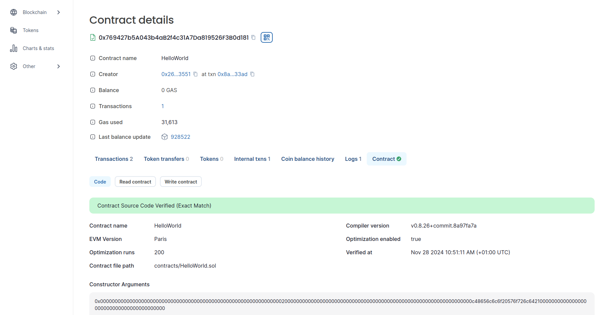
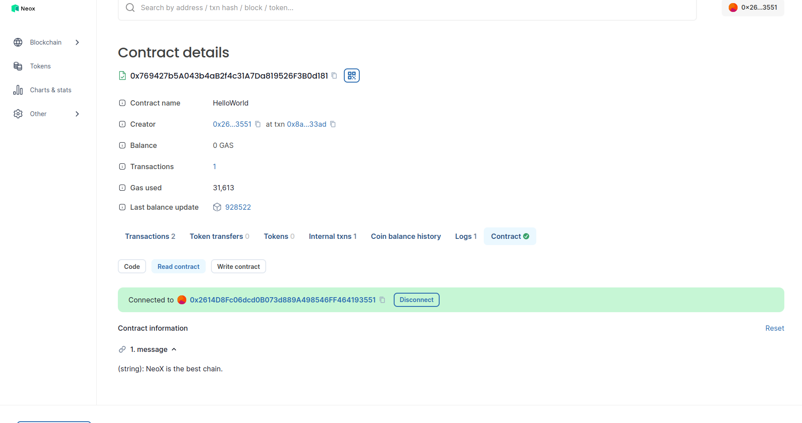
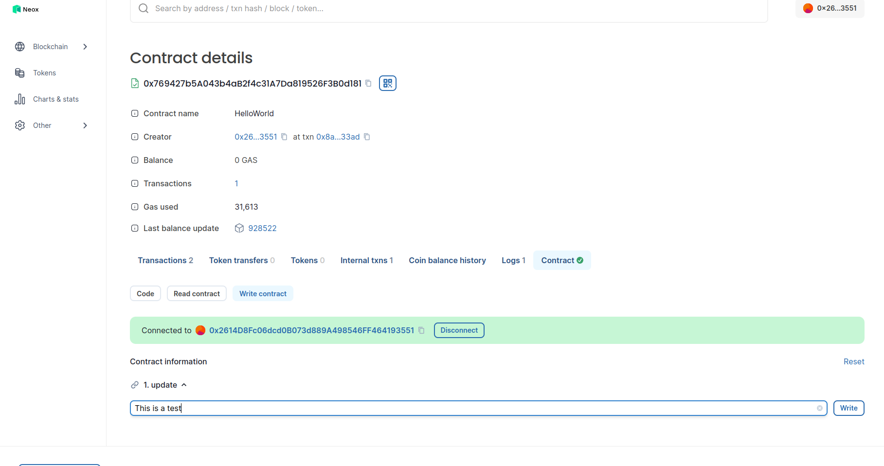
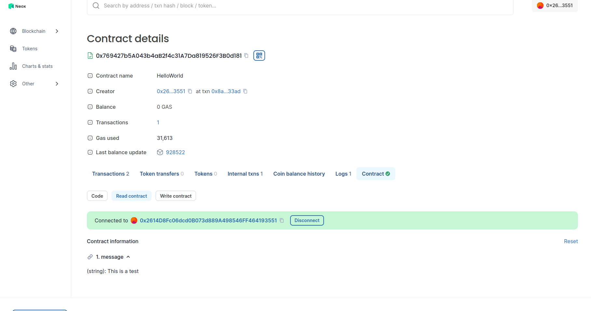

If you follow the first tutorial for [deploying a Hello World Smart Contract on Neox](https://neo-dashboard.com/blog/hardhat-hello-world)
and are now wondering how to make It verify on NeoX explorer this guide is for you.

## Step 1: Get previous work

If you follow the previous tutorial you just need to go in the same folder you use for It.

If you want to skip this part you can just pull [this repository](https://github.com/NeoDashboard/Hardhat-tutorials) containing the work.
Then deploy this Hello World smartcontract on NeoX.

Now you should keep the contract hash of this Hello World contract we deployed on NeoX as we will use It for the next steps.
For our example we will be using `0x769427b5A043b4aB2f4c31A7Da819526F3B0d181`.

## Step 2: Verify using hardhat-verify

For this method we will need to install a new dependency using this command `npm install --save-dev @nomicfoundation/hardhat-verify`.
After adding the dependency we just need to add this import in top of our `hardhat.config.js` file.

```
require("@nomicfoundation/hardhat-verify");
```

Once It's done It's super simple we just need our contract hash and then run the following command:

```
npx hardhat verify --network neox-t4 0x769427b5A043b4aB2f4c31A7Da819526F3B0d181 "Hello World!"
```

You should see a similar output showing the verification succeed:

```
Successfully submitted source code for contract
contracts/HelloWorld.sol:HelloWorld at 0x769427b5A043b4aB2f4c31A7Da819526F3B0d181
for verification on the block explorer. Waiting for verification result...

Successfully verified contract HelloWorld on the block explorer.
https://neoxt4scan.ngd.network/address/0x769427b5A043b4aB2f4c31A7Da819526F3B0d181#code
```

Note that we put at the end of the command the argument we used to initialize the contract during deployment.
If you have more than one constructor argument you can put them in Javascript file and use the `--constructor-args` parameter
instead. In our example It would look like this `npx hardhat verify --constructor-args arguments.js --network neox-t4 0x769427b5A043b4aB2f4c31A7Da819526F3B0d181`
with a an `arguments.js` containing this code

```
module.exports = [
  "Hello World!"
];
```

## Step 3: Interact with our verified contract

Now that our contract is verified the contract tab should look like It in the [explorer](https://xt4scan.ngd.network/address/0x769427b5A043b4aB2f4c31A7Da819526F3B0d181?tab=contract)

You can see there is now 2 tabs `Read Contract` and `Write Contract`.

On the Read part we will be able to see what is the current message stored in the contract. It's the one we put at the end of the previous tutorial `NeoX is the best chain.`.

On the Write part we are able to change the message but typing a message and clicking on `write` button so the explorer will create the transaction we need to sign on our
Metamask wallet.

If we go back on the Read part we will be able to see the message changed.


So we can now understand having our contract verified on the explorer is really important as It allows people to have more trust in It and also allow
everyone to easily interact with It without needing to write some code.

## Step 4: Time to switch to mainnet

If we want to do the same for a contract on mainnet we just need to add NeoX mainnet chain as another chain in our configuration like this:

```
require("dotenv").config();
require("@nomicfoundation/hardhat-toolbox");
require("@nomicfoundation/hardhat-verify");

const { NEOX_PK, NEOX_MAINNET_PK } = process.env;

module.exports = {
    solidity: {
      version: "0.8.26",
      settings: {
        optimizer: {
          enabled: true,
          runs: 200,
          details: {
            yul: false,
          },
        },
      }
    },
    networks: {
        'neox-t4': {
            url: 'https://neoxt4seed1.ngd.network',
            accounts: [`${NEOX_PK}`],
            gasPrice: 40e9,
            gas: 50e6,
        },
        'neox': {
            url: 'https://mainnet-1.rpc.banelabs.org'',
            accounts: [`${NEOX_MAINNET_PK}`],
            gasPrice: 40e9,
        },
    },
    etherscan: {
        apiKey: {
            'neox-t4': 'empty',
            'neox': 'empty'
        },
        customChains: [
            {
                network: 'neox-t4',
                chainId: 12227332,
                urls: {
                    apiURL: 'https://xt4scan.ngd.network/api',
                    browserURL: 'https://neoxt4scan.ngd.network'
                }
            },
            {
                network: 'neox',
                chainId: 47763,
                urls: {
                    apiURL: 'https://xexplorer.neo.org/api',
                    browserURL: 'https://xexplorer.neo.org'
                }
            }
        ]
    }
};
```

Note that in this configuration we are using a different Private Key for mainnet and so we also need to add this in our `.env`
file. Having different wallets for testnet and mainnet can avoid making mistake by choosing the wrong chain.

And now we can do everything the same way we did on testnet except than we will change the network parameter replacing `neox-t4` (the testnet chain) by
`neox` (the mainnet chain):

```
npx hardhat verify --network neox 0x769427b5A043b4aB2f4c31A7Da819526F3B0d181 "Hello World!"
```

## Conclusion

Congratulations you successfully manage to verify your Hello World contract on NeoX chain. To recap you learnt how to:

- Create the flatten code for your contract
- Use the explorer to verify your contract
- Use hardhat-verify plugin to verify your contract
- Interact with your contract on the explorer once It's verified
- Adding the mainnet configuration
