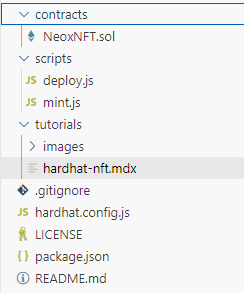

## Intro

Deploying an NFT on an EVM (Ethereum Virtual Machine) compatible chain using Hardhat involves several steps. Here's a step-by-step guide to help you deploy an ERC-721 NFT smart contract.

## Step 1: Get you NeoX private key on Metamask
First we will need a private key to interact with NeoX testnet chain. If you are using Metamask It's really simple just do
as follow.

Go on `Account details` on our Metamask wallet.


Then enter your password and click on `Hold to reveal Private Key`.


## Step 2: Use faucet to get some testnet tokens
You have 2 options to get some NeoX testnet tokens:

- You can claim It on the [NeoX faucet website](https://neoxwish.ngd.network/)
- Or you can join [NeoX Discord server](https://discord.gg/neosmarteconomy) and go to the `#dev-resources` channel to interact
with the faucet bot

You can then verify your balance by connectiong on [NeoX testnet explorer](https://xt4scan.ngd.network/)

## Step3: Initialize your project
First, we'll need to create a folder for our project. Navigate to your command line and input the following.
```
mkdir neox-nft-tutorial
cd neox-nft-tutorial
```
Now that you are inside your project folder, you will use npm init to initialize the project.

If you don’t have npm installed yet, [follow these instructions to install Node.js and npm](https://docs.npmjs.com/downloading-and-installing-node-js-and-npm).

Now you are ready to initialize your project just type `npm init` and fill information. Here is what we choose for our test:
```

"name": "NeoX NFT",
  "version": "1.0.0",
  "description": "My Neox NFT using harthat",
  "main": "index.js",
  "scripts": {
    "test": "echo \"Error: no test specified\" && exit 1"
  },
  "author": "Snakeyrob",
  "license": "ISC"
}


Is this OK? (yes)
```

## Step 4: Install Hardhat
We will use Hardhat to compile, deploy, test, and debug our Neox smart contract. To install It type this command `npm install --save-dev hardhat` inside your voting project.

Once It's done we will create the Hardhat project by running this command `npx hardhat` (choose `create an empty hardhat.config.js` option for this tutorial).

This step will generate a `hardhat.config.js` file in the project. We'll use this later in the tutorial to specify the setup for our project.

## Step 5. Install Dependencies
Install the required dependencies:

```
npm install @openzeppelin/contracts dotenv @nomiclabs/hardhat-ethers ethers
```

- @openzeppelin/contracts: Provides prebuilt ERC standards.
- dotenv: For managing environment variables.

## Step 6. Write the NFT Smart Contract
First create a folder contracts.
In the contracts folder create a new file called NeoxNFT.sol

```sol filename="NeoxNFT .sol"
// SPDX-License-Identifier: MIT
pragma solidity ^0.8.0;
import "@openzeppelin/contracts/token/ERC721/ERC721.sol";
import "@openzeppelin/contracts/access/Ownable.sol";

contract NeoxNFT is ERC721, Ownable(msg.sender) {
    uint256 public tokenCounter;
    constructor() ERC721("NeoxNFT", "XNFT") {
        tokenCounter = 0;
    }
    function mintNFT(address recipient) public onlyOwner returns (uint256) {
        uint256 newItemId = tokenCounter;
        _safeMint(recipient, newItemId);
        tokenCounter++;
        return newItemId;
    }
}
```

## Step 7: Complete project configuration
Every transaction sent from your wallet requires a signature using your unique private key (the one we retrieve in first step). To provide our program with this permission, we can safely store our private key in an environment file.

We will install the dotenv package in your project directory allowing to use environment variables from a `.env` file:
```
npm install dotenv --save
```
And then create our `.env` file with the private key variable named `PRIVATE_KEY`. This file will look like this
```
PRIVATE_KEY = "your-metamask-private-key"
```

Now we will install the Hardhat recommended plugin
```
npm install --save-dev @nomicfoundation/hardhat-toolbox
```
And then change our `hardhat.config.js` with the one below:
```js
require("dotenv").config();
require("@nomicfoundation/hardhat-toolbox");

module.exports = {
    solidity: {
      version: "0.8.26",
      settings: {
        optimizer: {
          enabled: true,
          runs: 200,
          details: {
            yul: false,
          },
        },
      }
    },
    networks: {
        'neox-t4': {
            url: 'https://neoxt4seed1.ngd.network',
            accounts: [`${process.env.PRIVATE_KEY}`],
            gasPrice: 40e9,
            gas: 50e6,
        },
    },
    etherscan: {
        apiKey: {
            'neox-t4': 'empty'
        },
        customChains: [
            {
                network: 'neox-t4',
                chainId: 12227332,
                urls: {
                    apiURL: 'https://xt4scan.ngd.network/api',
                    browserURL: 'https://neoxt4scan.ngd.network'
                }
            }
        ]
    }
};
```


## Step 8: Compile your contract
Now that everything is configured you just need to run this command to compile your contract `npx hardhat compile`.

You should see this message indicating everything worked as expected.
```
Compiled 1 Solidity file successfully (evm target: paris).
```

## Step 9: Deploy your contract
For deploying our contract we will need to write a script for doing It. First let's create a `scripts` folder. At this point your
Voting project should look like this:


Now we are creating a `deploy.js` file in this folder with the following code:
```js filename="deploy.js"
const hre = require("hardhat");

async function main() {
    const NeoxNFT = await hre.ethers.getContractFactory("NeoxNFT");
    const neoxNFT = await NeoxNFT.deploy(); // No arguments needed here
    await neoxNFT.deployed();

    console.log("NeoxNFT deployed to:", neoxNFT.address);
}

main().catch((error) => {
    console.error(error);
    process.exitCode = 1;
});
```
We can start the deployment by running this command
```
npx hardhat run scripts/deploy.js --network neox-t4
```
You should see this message indicating everything worked as expected.
```
NeoxNFT deployed to: 0x666d90fEA0dd17BD18eAa8Cb5E9c366Fbc3D72f7
```
You can now verify on the explorer you contract have been deployed (for [our example](https://neoxt4scan.ngd.network/address/0x666d90fEA0dd17BD18eAa8Cb5E9c366Fbc3D72f7))

## Step 10: Mint an NFT
Now we are creating a mint.js file in this folder with the following code:
Make sure that your .env file contains the variables and the NFT Contract you created is set as CONTRACT_ADDRESS and the recipiet is set as RECIPIENT_ADDRESS.

Note: The script has the recipient in the code and needs to be replaced.
An improvement would obviously be to take that as input.

```js filename="mint.js"
require("dotenv").config();
const { ethers } = require("ethers");

// Load environment variables
const PRIVATE_KEY = process.env.PRIVATE_KEY;
const RPC_URL = process.env.RPC_URL;
const CONTRACT_ADDRESS = process.env.CONTRACT_ADDRESS;
const RECIPIENT_ADDRESS = process.env.RECIPIENT_ADDRESS;

if (!PRIVATE_KEY || !RPC_URL || !CONTRACT_ADDRESS) {
  throw new Error("Please set PRIVATE_KEY, RPC_URL, and CONTRACT_ADDRESS in the .env file");
}

// ABI of the MyNFT contract
const CONTRACT_ABI = [
  "function mintNFT(address recipient) public returns (uint256)",
  "function tokenCounter() public view returns (uint256)"
];

async function main() {
  // Connect to Neo X network
  const provider = new ethers.providers.JsonRpcProvider(RPC_URL);
  const wallet = new ethers.Wallet(PRIVATE_KEY, provider);

  // Connect to the deployed MyNFT contract
  const myNFT = new ethers.Contract(CONTRACT_ADDRESS, CONTRACT_ABI, wallet);

  // Specify recipient address
  const recipientAddress = RECIPIENT_ADDRESS; // Replace with the recipient's address

  console.log("Minting NFT...");

  // Call mintNFT function
  const tx = await myNFT.mintNFT(recipientAddress, {
        gasLimit: 5000000, // Adjust the gas limit as needed
        maxPriorityFeePerGas: ethers.utils.parseUnits("20", "gwei"), // Minimum miner tip
        maxFeePerGas: ethers.utils.parseUnits("150", "gwei"), // Maximum gas fee
      });
  console.log("Transaction submitted:", tx.hash);

  // Wait for the transaction to be mined
  const receipt = await tx.wait();
  console.log("Transaction mined:", receipt.transactionHash);

  // Check the new tokenCounter
  const newTokenCounter = await myNFT.tokenCounter();
  console.log(`New token minted! Token ID: ${newTokenCounter - 1}`);
}

main()
  .then(() => console.log("Minting complete!"))
  .catch((error) => {
    console.error("Error minting NFT:", error);
    process.exit(1);
  });

```
Running the command `npx hardhat run scripts/mint.js --network neox-t4` you should see the nft is created.
```
Minting NFT...
Transaction submitted: 0x595b2349459eae6adf0e95bcb2cd65f0b5c85160ab3ac212f944fd1d45e630bf
Transaction mined: 0x595b2349459eae6adf0e95bcb2cd65f0b5c85160ab3ac212f944fd1d45e630bf
Minting complete! 
```
Going on the explorer you should see an event for the [following transaction](https://neoxt4scan.ngd.network/tx/0x595b2349459eae6adf0e95bcb2cd65f0b5c85160ab3ac212f944fd1d45e630bf)

## Conclusion
Congratulations you successfully managed to deploy your NFT on chain. To recap you learnt how to:

Compile an NFT Contract on the NeoX chain
Deploy an NFT Contract on the NeoX chain
Mint an NFT on the NeoX chain
Next steps would be apply traits and metadata to the NFT which I will cover in one of my next tutorials.

You can find the source of this example on my github: [snakeyrob/neox-nft-tutorial](https://github.com/snakeyrob/neox-nft-tutorial)

Now you're fully equiped to apply the skills from this tutorial to build out your own custom dApp project! As always if you have
any questions don't hesitate to reach out on the [NeoX Discord server](https://discord.gg/neosmarteconomy).