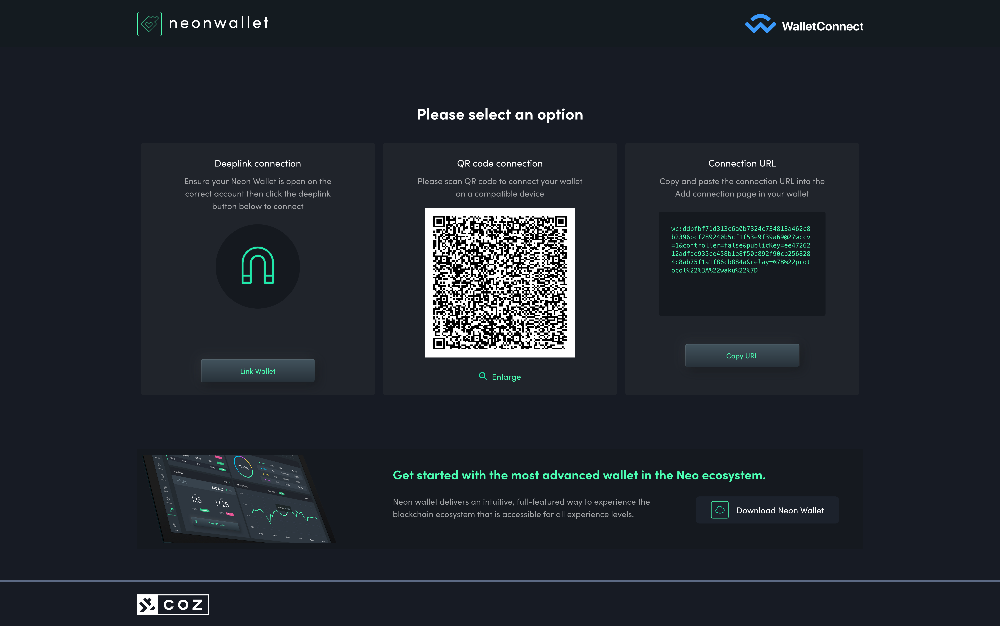
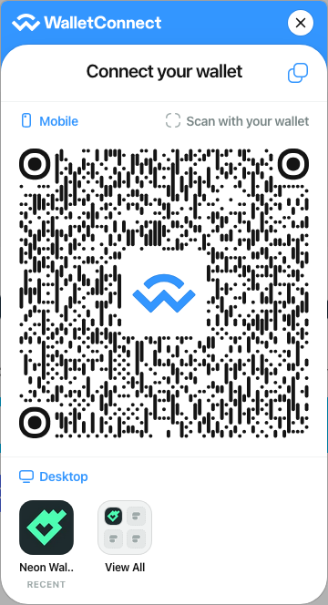
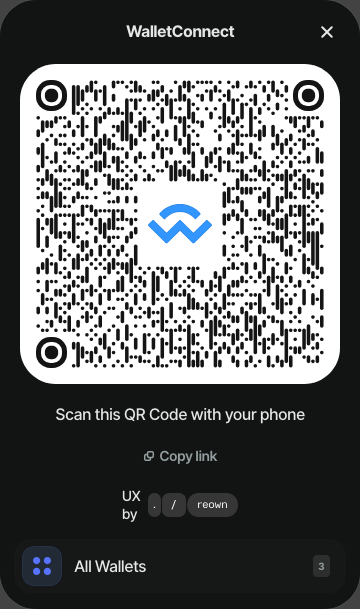

import Tabs from '@theme/Tabs';
import TabItem from '@theme/TabItem';

# NeonWallet - How to Connect to a dApp Using Universal Provider

NeonWallet uses the WalletConnect protocol, an open-source standard for connecting crypto wallets to dApps. It uses QR codes or deep-links to establish secure, encrypted sessions, enabling users to interact with dApps without exposing their private key.

## 1. Prerequisites

- A dApp project
- A WalletConnect/Reown [Project ID](https://docs.reown.com/appkit/vue/cloud/relay#project-id)

## 2. Setup

Add the following dependency to your project:

- [`@walletconnect/universal-provider`](https://www.npmjs.com/package/@walletconnect/universal-provider): since WalletConnect doesn't provide a solution for Neo, we'll use the Universal Provider to connect to it;

```bash
npm i @walletconnect/universal-provider
```

## 3. Initializing Universal Provider

Universal Provider has a lot of initialization options, but the ones you'll need to use are:

- `projectId`: a valid project ID, otherwise you won't be able to use WalletConnect;
- `metadata`: information about your dApp and what will be shown on the wallet.

```ts
import UniversalProvider from "@walletconnect/universal-provider";

let provider: UniversalProvider;

async function initProvider() {
  provider = await UniversalProvider.init({
    projectId: "Project ID from https://cloud.reown.com/",
    metadata: {
      // Replace with actual dApp metadata
      name: "dApp name",
      description: "dApp description",
      url: "https://link.to.your/project/",
      icons: ["https://link.to.your/icon/"],
    },
  });
}
```

## 4. Connecting to Neo blockchain

Connecting the provider is quite easy, use the `connect` method and specify the following namespace:

```ts
async function startConnection() {
  await provider.connect({
    namespaces: {
      neo3: {
        methods: [
          "invokeFunction",
          "testInvoke",
          "signMessage",
          "verifyMessage",
        ],
        // If you want to connect to the testnet, then use `"neo3:testnet"` chain instead
        chains: ["neo3:mainnet"],
        events: ["connect", "disconnect"],
      },
    },
  });
}
```

This method should emit the `display_uri` event that provides the WalletConnect URI needed to initiate a connection with a wallet.
To facilitate the experience we recommend using the NeonWallet connect page, but if you wish, you could use another solution or create your own.

```ts
provider.on("display_uri", (uri: string) => {
  window.open(`https://neon.coz.io/connect?uri=${uri}`, "_blank")?.focus();
});
```

Using the NeonWallet connect page, the user can connect the dApp in 3 different ways: deep-link, QR Code, or copy and paste URI.



After the user accepts the connection, the `connect` event will be emitted with the session information. You'll likely want to update your UI to reflect that the user is connected, and you can do that by listening to the event:

```ts
provider.on("connect", (connection: any) => {
  console.log("Connected:", connection);

  // Here you can update your UI to reflect that the user is connected
  changeUIToConnectedState();
});
```

## 5. Invoking smart contracts with requests

Now that you are connected, you can start making requests to the blockchain. To interact with a smart contract, you can use the `testInvoke` and `invokeFunction` methods.

### testInvoke:

If you want to get a value from the smart contract without persisting a transaction, you can use the `testInvoke` method. This method is useful for checking the state of a smart contract or getting a value without modifying the blockchain. This method doesn't cost any GAS, so you can use it freely.

```ts
async function testInvokeExample() {
  if (!provider.session) {
    console.error("Provider session is not initialized.");
    return;
  }

  // This should be something like: "neo3:mainnet:NNLi44dJNXtDNSBkofB48aTVYtb1zZrNEs"
  const sessionNamespace = provider.session.namespaces.neo3.accounts[0];
  const currentChain =
    sessionNamespace.split(":")[0] + ":" + sessionNamespace.split(":")[1];
  const currentAccount = sessionNamespace.split(":")[2];

  const testInvokeResponse = await provider.request(
    {
      method: "testInvoke",
      params: {
        invocations: [
          {
            scriptHash: "0xd2a4cff31913016155e38e474a2c06d08be276cf",
            operation: "balanceOf",
            args: [
              {
                type: "Hash160",
                value: currentAccount,
              },
            ],
          },
        ],
      },
    },
    currentChain
  );

  console.log(testInvokeResponse);
}
```

### invokeFunction:

If you want to invoke a smart contract and persist the transaction on the blockchain, you can use the `invokeFunction` method. This method will cost GAS, so make sure that the user has enough GAS in their wallet to cover the transaction fees.

```ts
async function invokeFunctionExample() {
  if (!provider.session) {
    console.error("Provider session is not initialized.");
    return;
  }

  // This should be something like: "neo3:mainnet:NNLi44dJNXtDNSBkofB48aTVYtb1zZrNEs"
  const sessionNamespace = provider.session.namespaces.neo3.accounts[0];
  const currentChain =
    sessionNamespace.split(":")[0] + ":" + sessionNamespace.split(":")[1];
  const currentAccount = sessionNamespace.split(":")[2];

  const invokeTxId = await provider.request(
    {
      method: "invokeFunction",
      params: {
        invocations: [
          {
            scriptHash: "0xd2a4cff31913016155e38e474a2c06d08be276cf",
            operation: "transfer",
            args: [
              {
                type: "Hash160",
                value: currentAccount,
              },
              {
                type: "Hash160",
                value: currentAccount,
              },
              {
                type: "Integer",
                value: "100",
              },
              {
                type: "String",
                value: "Test transfer from WalletConnect Universal Provider",
              },
            ],
          },
        ],
      },
    },
    currentChain
  );

  console.log(invokeTxId);
}
```

> It's a good practice to check if the dApp has an account connected to it by checking if the provider session is not undefined before making requests, as shown in the examples above.

The parameters for the `invokeFunction` and `testInvoke` methods are structured the same way, both of them expect a [ContractInvocationMulti](https://github.com/CityOfZion/neon-dappkit/blob/29fbcc2acfc5a273a9b13cf3d468ae0b74bbb73b/packages/neon-dappkit-types/src/Neo3Invoker.ts#L144-L172) from the [NeonDappKitTypes package](https://www.npmjs.com/package/@cityofzion/neon-dappkit-types).

<details>
  <summary>`invokeFunction` and `testInvoke` method parameters</summary>

```ts
export type ContractInvocationMulti = {
  signers?: Signer[]
  invocations: ContractInvocation[]
  extraSystemFee?: number
  systemFeeOverride?: number
  extraNetworkFee?: number
  networkFeeOverride?: number
}
```

`ContractInvocationMulti` type is used to define one or multiple invocations that can be made in a single request. It allows you to specify multiple invocations, signers, and fees.

Fields like: `signers`, `extraSystemFee`, `systemFeeOverride`, `extraNetworkFee`, and `networkFeeOverride` are optional and can be used to customize the invocation. If not provided, the default values will be used based on the wallet's configuration and the network.

The only required field is `invocations`, which is an array of `ContractInvocation` objects. Each `ContractInvocation` object defines a single invocation to a smart contract.

```ts
export type ContractInvocation = {
  scriptHash: string
  operation: string
  abortOnFail?: boolean
  args?: Arg[]
}
```

`ContractInvocation` has the following fields:

- `scriptHash`: the hash of the smart contract to invoke;
- `operation`: the name of the method to invoke on the smart contract;
- `abortOnFail`: a boolean that indicates whether the invocation should abort if it fails.
- `args`: an array of arguments to pass to the smart contract operation. Each argument is of type `Arg`, which represents the data types supported by the smart contract defined by [NEP-25](https://github.com/neo-project/proposals/blob/master/nep-25.mediawiki#parametertype);

```ts
export type AnyArgType = { type: "Any"; value: any }
export type StringArgType = { type: "String"; value: string }
export type BooleanArgType = { type: "Boolean"; value: boolean }
export type PublicKeyArgType = { type: "PublicKey"; value: string }
export type Hash160ArgType = { type: "Hash160"; value: string }
export type Hash256ArgType = { type: "Hash256"; value: string }
export type IntegerArgType = { type: "Integer"; value: string }
export type ArrayArgType = { type: "Array"; value: Arg[] }
export type MapArgType = { type: "Map"; value: { key: Arg; value: Arg }[] }
export type ByteArrayArgType = { type: "ByteArray"; value: string }

export type Arg =
  | AnyArgType
  | StringArgType
  | BooleanArgType
  | PublicKeyArgType
  | Hash160ArgType
  | Hash256ArgType
  | IntegerArgType
  | ArrayArgType
  | MapArgType
  | ByteArrayArgType
```

These types represent the different data types that can be used as arguments in the smart contract invocation. You can use them to define the arguments for the `args` field in the `ContractInvocation` object.

</details>

## 6. Disconnecting the wallet

You can disconnect the wallet in two ways: using the `disconnect` method from the provider or listening to the `disconnect` event emitted by the wallet.
You should treat both cases, as you can't be sure how the user will be disconnecting from the dApp.

```ts
async function disconnectWalletFromDapp() {
  await provider.disconnect();

  // Here you can update your UI to reflect that the user is disconnected
  changeUIToDisconnectedState();
}

provider.on("disconnect", (payload: any) => {
  console.log("Disconnected:", payload);

  // Here you can update your UI to reflect that the user is disconnected
  changeUIToDisconnectedState();
});
```

## 7. Extra - Integrating with other connection UIs

The dApp can now connect and interact with the Neo blockchain using WalletConnect Universal Provider, but you might want to use a different UI for connecting to the dApp, such as a modal.

Reown provides packages that you can use to connect to the dApp if you don't want to use the NeonWallet connect page.
For example: `@walletconnect/modal` or `@reown/appkit`.

<Tabs groupId="connection-ui-examples" defaultValue="modal">

<TabItem value="modal" label="WalletConnect Modal">
WalletConnect Modal is a simple and easy to use component that allow users to connect to the dApp with a QR code or a deep-link. With minimal changes, you can use it together with the Universal Provider to connect to the Neo blockchain.
<br/>
<br/>
Initialize the WalletConnect Modal:

```ts
import { WalletConnectModal } from "@walletconnect/modal";
const modal = new WalletConnectModal({
  projectId: "Project ID from https://cloud.reown.com/",
  chains: ["neo3:testnet", "neo3:mainnet"],
  explorerRecommendedWalletIds: [
    "f039a4bdf6d5a54065b6cc4b134e32d23bed5d391ad97f25aab5627de26a0784",
  ],
  themeMode: "dark",
});
```

And then you can use the `openModal` method to open the modal and connect to the dApp by listening to the `display_uri` event:

```ts
provider.on("display_uri", (uri: string) => {
  modal.openModal({ uri });
});

provider.on("connect", (payload: any) => {
  // Close the modal after the user connects to a wallet
  modal.closeModal();
  changeUIToConnectedState();
});
```

The other methods can stay the same as in the previous examples, such as `invokeFunction`, `testInvoke`, and `disconnect`.



</TabItem>

<TabItem value="appkit" label="Reown AppKit">
AppKit is a SDK that has a lot of functionalities, including the ability to connect to dApps using WalletConnect. However, most functionalities are exclusive to the blockchains that are supported by Reown's adapters, such as Ethereum, Solana, and others.
<br/>
<br/>
It still can be used to connect to Neo dApps, but a lot of tweaks will need to be made and the configuration is a tad more complex.
<br/>
<br/>
Initialize the AppKit with the Neo network configuration:

```ts
import { createAppKit } from "@reown/appkit";
import { defineChain } from "@reown/appkit/networks";
import UniversalProvider from "@walletconnect/universal-provider";

// This example will use the Neo3 testnet, but you can change it to the mainnet by using the equivalent values
const neoTestnetNetwork = defineChain({
  id: "neo3",
  // @ts-expect-error A EVM-based, Solana or Bitcoin network was expected here
  caipNetworkId: "neo3:testnet",
  // @ts-expect-error A EVM-based, Solana or Bitcoin network was expected here
  chainNamespace: "neo3",
  name: "Neo",
  nativeCurrency: {
    decimals: 8,
    name: "Neo",
    symbol: "NEO",
  },
  rpcUrl: "https://testnet1.neo.coz.io:443",
  rpcUrls: {
    default: {
      http: [
        "https://testnet1.neo.coz.io:443",
        "https://testnet2.neo.coz.io:443",
        "http://seed1t5.neo.org:20332",
        "http://seed2t5.neo.org:20332",
        "http://seed3t5.neo.org:20332",
        "http://seed4t5.neo.org:20332",
        "http://seed5t5.neo.org:20332",
      ],
    },
  },
  testnet: true,
  blockExplorers: {
    default: { name: "Dora", url: "https://dora.coz.io/" },
  },
  contracts: {},
});

// You can choose to create AppKit create one UniversalProvider instance, or you can create it yourself
// and pass it to the AppKit.
// Note: that if you need to create the UniversalProvider yourself if you wish to set the dApp metadata.
let provider: UniversalProvider;

async function initProvider() {
  const appkit = createAppKit({
    projectId: "Project ID from https://cloud.reown.com/",
    networks: [neoTestnetNetwork],
    defaultNetwork: neoTestnetNetwork,
    allWallets: "SHOW",
    includeWalletIds: [
      "f039a4bdf6d5a54065b6cc4b134e32d23bed5d391ad97f25aab5627de26a0784",
    ],
    universalProviderConfigOverride: {
      methods: {
        "neo3:testnet": [
          "invokeFunction",
          "testInvoke",
          "signMessage",
          "verifyMessage",
        ],
        "neo3:mainnet": [
          "invokeFunction",
          "testInvoke",
          "signMessage",
          "verifyMessage",
        ],
      },
    },
    // Use this if you want to create the UniversalProvider yourself
    // universalProvider: provider,
  });

  // Assign the UniversalProvider instance to the provider variable if you let AppKit create it for you
  provider = await appkit.getUniversalProvider();
}
```

AppKit `open` method simplifies the connection process, so you don't need to listen to the `display_uri` event, as it will automatically open and close the modal for you, but you still might need to change other UI elements in your application.

```ts
async function startConnection() {
  await appkit.open();
}

provider.on("connect", (payload: any) => {
  console.log("Connected:", payload);

  // Here you can update your UI to reflect that the user is connected
  changeUIToConnectedState();
});

async function disconnectWalletFromDapp() {
  await appkit.disconnect();

  // Here you can update your UI to reflect that the user is disconnected
  changeUIToDisconnectedState();
}

provider.on("disconnect", (payload: any) => {
  console.log("Disconnected:", payload);

  // Here you can update your UI to reflect that the user is disconnected
  changeUIToDisconnectedState();
});
```

The `testInvoke` and `invokeFunction` methods can be used in the same way as shown in the previous examples.



</TabItem>

</Tabs>
